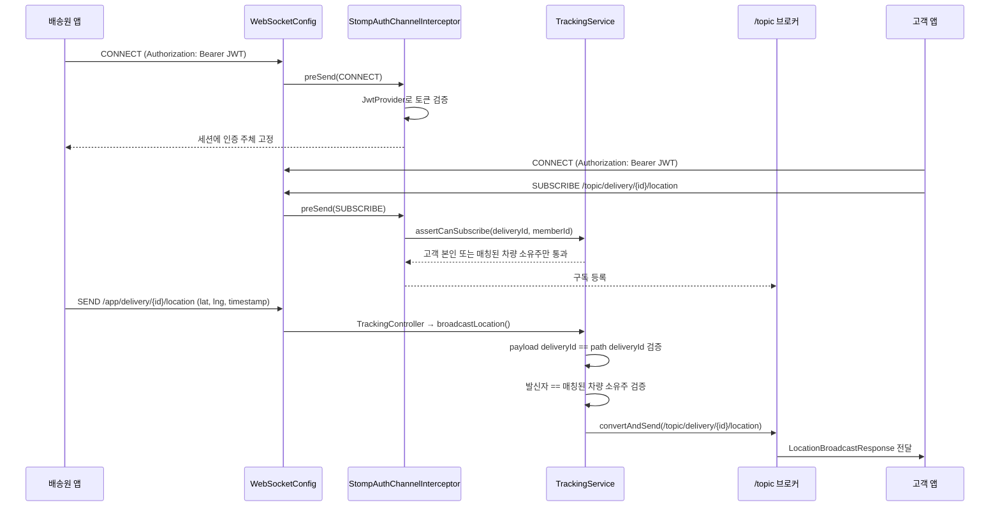

# 설계서: 실시간 위치 추적 (Tracking)

이 문서는 매칭이 확정된 배송 건에 대해, 배송원의 실시간 위치를 WebSocket(STOMP)으로 수신해 해당 배송의 고객에게 즉시 브로드캐스트하는 기능에 대한 설계 문서입니다.

---

## 1. 요구사항 정의서 (User Story)

* **User Story:**
  우리는 **고객(Customer)**으로서, 배송 진행 상황을 실시간으로 확인하기 위해 **매칭된 배송원의 현재 위치를 지도 위에서 실시간으로 추적**하기를 원한다. 배송원 위치는 이력을 남기지 않고 최신 좌표만 실시간 전달되며, 관계없는 제3자는 이 위치를 볼 수도, 위조해서 보낼 수도 없어야 한다.
* **성공 기준 (Acceptance Criteria):**
  1. 배송원이 매칭된 배송 건에 대해 위치를 발행하면, 그 배송의 고객(또는 매칭된 차량 소유주 본인)만 실시간으로 좌표를 수신한다. 위치는 DB에 저장하지 않고 브로드캐스트만 한다.
  2. 그 배송의 고객도 매칭된 차량 소유주도 아닌 제3자는 `/topic/delivery/{deliveryId}/location`을 구독해도 아무 메시지도 받지 못한다.
  3. 매칭된 차량의 소유주가 아닌 회원이 위치를 발행해도 아무에게도 브로드캐스트되지 않는다. 발행 payload의 `deliveryId`가 목적지 경로의 `deliveryId`와 다르면 같은 방식으로 거부된다.
  4. 모든 인증되지 않은 WebSocket 연결(CONNECT)은 거부된다 — REST의 `JwtAuthenticationFilter`와 동일하게 JWT를 검증한다.

---

## 2. 아키텍처 설계 (STOMP 메시지 흐름)

이 기능은 신규 테이블/컬럼이 없어 ERD 대신, 인증부터 브로드캐스트까지의 STOMP 프레임 흐름을 시퀀스 다이어그램으로 정리합니다.



---

## 3. API 명세서 (STOMP 메시지 명세)

REST가 아니라 STOMP라 Swagger가 이 계약을 문서화하지 못하므로, 여기 명세가 유일한 계약 문서입니다.

### 3.1 연결 (CONNECT)
* **엔드포인트:** `ws://<host>/ws`
* **CONNECT 헤더:** `Authorization: Bearer <accessToken>` (REST와 동일한 JWT)
* **실패 시:** 토큰이 없거나 유효하지 않으면 연결이 거부된다.

### 3.2 위치 구독 (SUBSCRIBE)
* **목적지:** `/topic/delivery/{deliveryId}/location`
* **권한:** 해당 배송의 고객 본인이거나, 매칭된 차량의 소유주만 구독이 유지된다. 그 외 회원은 구독이 무시된다.
* **수신 payload (`LocationBroadcastResponse`):**
  ```json
  {
    "deliveryId": 1,
    "vehicleId": 3,
    "latitude": 37.501,
    "longitude": 127.001,
    "timestamp": "2026-07-29T10:00:00"
  }
  ```

### 3.2-1 상태 구독 (SUBSCRIBE) — `matching-wait.html`에서도 재사용
* **목적지:** `/topic/delivery/{deliveryId}/status` (`DeliveryStatusBroadcastResponse`, `DeliveryStatusBroadcastListener`가 발행)
* **권한:** `TrackingService.assertCanSubscribe`는 매칭 여부와 무관하게 배송 요청 소유주(고객 본인)를 항상 통과시키므로, 매칭 전 대기 화면(`matching-wait.html`)에서도 이 채널을 그대로 구독할 수 있다. 매칭 후에는 매칭된 차량 소유주도 통과한다.
* **활용:** 기존에는 `realtime-tracking.html`(매칭 후 화면)만 이 채널을 구독했으나, issue #328부터 `matching-wait.html`(매칭 전 대기 화면)도 5초 간격 REST 폴링 대신 이 채널을 구독해 `MATCHED`/`PICKED_UP`/`COMPLETED`/`CANCELLED` 전이를 지연 없이 수신한다.

### 3.3 위치 발행 (SEND)
* **목적지:** `/app/delivery/{deliveryId}/location`
* **권한:** 해당 배송에 매칭된 차량의 소유주만 발행이 브로드캐스트로 이어진다.
* **요청 payload (`LocationUpdateRequest`):**
  ```json
  {
    "deliveryId": 1,
    "latitude": 37.501,
    "longitude": 127.001,
    "timestamp": "2026-07-29T10:00:00"
  }
  ```
* **실패 시(`UnauthorizedTrackingAccessException`, ErrorCode `A001`):** 브로드캐스트가 발생하지 않고, 발행자 본인에게만 `/user/queue/errors`로 에러 메시지가 전달된다.
  ```json
  "해당 배송의 위치 추적 채널에 접근할 권한이 없습니다: deliveryId=1, memberId=5"
  ```

---

## 4. 작업 분할 목록 (WBS)

- [x] `spring-boot-starter-websocket` 의존성 추가
- [x] `MatchingRepository`/`MatchingService`에 `deliveryRequestId` 기준 매칭 조회 기능 추가 (소유권 검증에 필요)
- [x] 위치 요청/응답 DTO(`LocationUpdateRequest`, `LocationBroadcastResponse`) 작성
- [x] `WebSocketConfig`(STOMP 엔드포인트/브로커) 및 `StompAuthChannelInterceptor`(CONNECT 인증, SUBSCRIBE 인가) 구현 — 순환 빈 생성 방지를 위한 `@Lazy` 적용 포함
- [x] `TrackingService`(구독 인가·발행 검증·브로드캐스트) 및 `UnauthorizedTrackingAccessException` 구현
- [x] `TrackingController`(`@MessageMapping`, `@MessageExceptionHandler`) 구현
- [x] `WebSocketStompClient` 기반 통합 테스트로 정상 브로드캐스트 및 권한 없는 구독·발행 차단 검증
- [x] **(2026-08-18, issue #327)** `delivery-in-progress.html`에 STOMP 발행 클라이언트 연결 — `navigator.geolocation.watchPosition`으로 좌표를 추적하고 5초 간격으로 `/app/delivery/{deliveryId}/location`에 발행(`offer-subscription.js` 연결 패턴 재사용). 위치 권한 거부 시 토스트 안내, 화면 이탈(`pagehide`) 시 watch·발행 인터벌·STOMP 연결 정리
