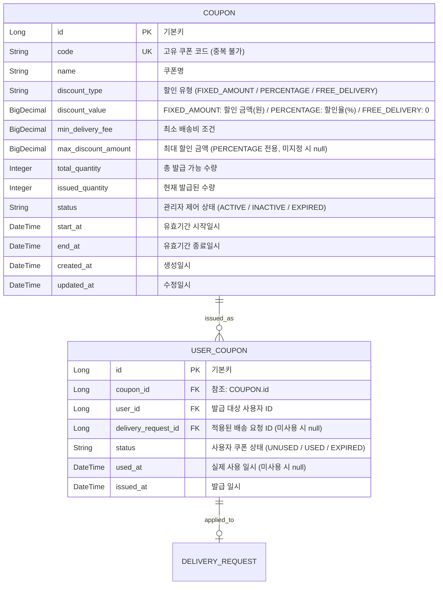

# 설계서: 쿠폰 관리 (Coupon Management)

이 문서는 관리자가 배송비 할인 프로모션 목적으로 배송 쿠폰을 발급, 수정 , 조회, 비활성화(삭제)하고 배송 요청 시 쿠폰이 정상 적용될 수 있도록 상태와 조건 정책을 관리하는 기능에 대한 설계 문서입니다.

---

## 1. 요구사항 정의서 (User Story)

### 1.1 개요 및 목적
* **개요:** 관리자가 고객의 배송비 부담을 낮추고 서비스 이용을 촉진하기 위해 배송 전용 할인 쿠폰을 등록, 조회, 상태 관리(비활성화)하는 관리자 전용 기능
* **주요 대상:** 시스템 관리자(Admin)

---

### 1.2 관리자 기능 요구사항 (Functional Requirements)

| 요구사항 ID | 기능명 | 상세 내용 및 비즈니스 규칙 | 우선순위 |
|---------------|-------------|------------------|--------------------------|
| ADM-COUPON-01 | 배송 쿠폰 신규 등록 | 관리자는 쿠폰 조건(쿠폰명, 할인 유형, 할인 값, 최소 배송비 조건, 최대 할인 금액, 총 발급 수량, 유효기간)을 입력하여 신규 배송 쿠폰을 등록한다. | High |
| ADM-COUPON-02 | 할인 정책 유형 설정 | 등록 시 할인 유형을 정액 할인(FIXED_AMOUNT), 정률 할인(PERCENTAGE), 무료 배송(FREE_DELIVERY) 중 하나로 지정할 수 있어야 한다. | High |
| ADM-COUPON-03 | 쿠폰 코드 중복 검증 | 등록 시 입력한 쿠폰 코드가 시스템 내에 이미 존재하는 경우 등록을 차단하고  `409 Conflict (DuplicateCouponCodeException) ` 예외를 발생시킨다. | High |
| ADM-COUPON-04 | 쿠폰 기본 상태 관리 | 신규 생성되는 모든 쿠폰의 기본 상태는  `ACTIVE(활성) `로 등록되어 즉시 발급 가능한 상태가 된다. | High |
| ADM-COUPON-05 | 쿠폰 목록 조회 및 필터링 | 관리자는 등록된 전체 쿠폰 목록을 상태별(활성, 비활성, 만료) 및 조건별로 조회하고, 검색/페이징할 수 있어야 한다. | Medium |
| ADM-COUPON-06 | 쿠폰 상세 정보 조회| 관리자는 특정 쿠폰의 상세 설정 값과 현재 발급/사용 현황 수치를 확인할 수 있어야 한다. | Medium |
| ADM-COUPON-07 | 쿠폰 비활성화 (삭제/정지) | 관리자는 특정 쿠폰을  `INACTIVE(비활성화) ` 상태로 즉시 변경하여 신규 발급 및 기존 발급 쿠폰의 사용을 중단시킬 수 있어야 한다. | High |

---

### 1.3 관리자 제약 및 예외 요구사항 (Constraints & Exceptions)
* **ADM-NFR-01 (입력값 유효성 검증):** 
* 유효기간 설정 시 종료일시는 시작일시보다 미래여야 한다.
* 정률 할인(PERCENTAGE) 선택 시 할인율은 1% ~ 100% 사이여야 한다.
* 총 발급 수량 및 최소 배송비 조건은 0 이상의 숫자여야 한다.

---

### 1.4. 관리자 기능 성공 기준 (Acceptance Criteria)
  1. 관리자가 필수 제원 및 조건을 유효하게 입력하면 ACTIVE 상태의 배송 쿠폰이 성공적으로 저장된다.
  2. 기존에 이미 사용 중인 쿠폰 코드로 등록을 시도하면 등록에 실패하며 409 Conflict 오류 안내 메시지가 표시된다.
  3. 관리자는 쿠폰 상태(활성/비활성/만료)에 따라 필터링하여 쿠폰 목록을 확인할 수 있다.
  4. 관리자가 활성 상태인 쿠폰을 비활성화 처리하면, 쿠폰 상태가 INACTIVE로 즉시 변경되며 발급 상태가 차단된다.

---

## 2. ERD 설계 (Entity-Relationship Diagram)



---

## 3. API 명세서 (API Specification)

### 3.1 배송 쿠폰 생성 (등록)
* **엔드포인트:** `POST /api/v1/admin/coupons`
* **설명:** 시스템에서 난수 쿠폰 코드가 자동으로 생성된다.
  * **요청 바디 (Request Body):**
    ```json
    {
    "name": "자동 생성 배송비 할인 쿠폰",
    "discountType": "FIXED_AMOUNT",
    "discountValue": 3000,
    "minDeliveryFee": 10000,
    "maxDiscountAmount": 3000,
    "totalQuantity": 500
    }
    ```
  
    * **응답 바디 및 상태 코드 (Response Body & Status):**
        * **Success (201 Created):**
          ```json
          {
          "id": 1,
          "code": "DLV-X8K2M9P4",
          "name": "자동 생성 배송비 할인 쿠폰",
          "discountType": "FIXED_AMOUNT",
          "discountValue": 3000,
          "minDeliveryFee": 10000,
          "maxDiscountAmount": 3000,
          "totalQuantity": 500,
          "issuedQuantity": 0,
          "status": "ACTIVE",
          "startAt": "2026-08-10T16:18:37",
          "endAt": "2026-09-09T23:59:59",
          "createdAt": "2026-08-10T16:18:37"
          }
          ```
        
        * **Failure (409 Conflict - 중복된 쿠폰 코드, ErrorCode `C001`):**
          ```json
          {
          "code": "DUPLICATE_COUPON_CODE",
          "message": "이미 존재하는 쿠폰 코드입니다."
          }
          ```

        * **Failure (409 Conflict / 400 Bad Request - 수량 초과, ErrorCode `C004`):**
          ```json
          {
            "status": 409,
            "code": "C004",
            "message": "쿠폰 발급 수량이 모두 소진되었습니다.",
            "timestamp": "2026-08-10T11:40:00"
          }
          ```

        * **Failure (400 Bad Request - 입력값 검증 오류, ErrorCode `C006`):**
          ```json
          {
          "code": "INVALID_INPUT_VALUE",
          "message": "할인 값 및 최소 배송비 조건을 확인해 주세요."
          }
          ```

        

### 3.2 배송 쿠폰 목록 조회 (관리자용)
* **엔드포인트:** `GET /api/v1/admin/coupons?status={status}&page=0&size=10`
* **설명:** 관리자가 등록된 배송 쿠폰 목록을 검색 조건(상태 등)과 페이징 처리를 거쳐 조회한다. (status 생략 시 전체 상태 조회)
* **응답 바디 및 상태 코드 (Response Body & Status):**
    * **Success (200 OK):**
```json
{
  "content": [
    {
      "id": 1,
      "code": "DLV-X8K2M9P4",
      "name": "자동 생성 배송비 할인 쿠폰",
      "discountType": "FIXED_AMOUNT",
      "discountValue": 3000,
      "minDeliveryFee": 10000,
      "maxDiscountAmount": 3000,
      "totalQuantity": 500,
      "issuedQuantity": 150,
      "status": "ACTIVE",
      "startAt": "2026-08-10T16:18:37",
      "endAt": "2026-09-09T23:59:59"
    }
  ],
  "pageNumber": 0,
  "pageSize": 10,
  "totalElements": 1,
  "totalPages": 1
}
```

### 3.3 배송 쿠폰 단건 상세 조회
* **엔드포인트:** `GET /api/v1/admin/coupons/{id}`
* * **설명:** 지정한 쿠폰 ID의 상세 정보 및 발급 현황을 조회한다.
  * * **응답 바디 및 상태 코드 (Response Body & Status):**
    * **Success (200 OK):**
      ```json
    {
    "id": 1,
    "code": "DLV-X8K2M9P4",
    "name": "자동 생성 배송비 할인 쿠폰",
    "discountType": "FIXED_AMOUNT",
    "discountValue": 3000,
    "minDeliveryFee": 10000,
    "maxDiscountAmount": 3000,
    "totalQuantity": 500,
    "issuedQuantity": 150,
    "status": "ACTIVE",
    "startAt": "2026-08-10T16:18:37",
    "endAt": "2026-09-09T23:59:59",
    "createdAt": "2026-08-10T16:18:37",
    "updatedAt": "2026-08-10T16:18:37"
  }
    ```
    
* **Failure (404 Not Found - 존재하지 않는 쿠폰, ErrorCode `C002`):**
```json
{
  "status": 404,
  "code": "C002",
  "message": "존재하지 않는 쿠폰입니다: id=99",
  "timestamp": "2026-08-10T11:40:00"
}
  ```
    
### 3.4 배송 쿠폰 정보 수정
* **엔드포인트:** `PUT /api/v1/admin/coupons/{id}`
* **설명:** 등록된 배송 쿠폰의 이름, 발급 수량, 상태 및 유효 종료일(endAt)을 수정한다. (단, 이미 발급/사용 내역이 존재하는 쿠폰의 할인 정책(discountType, discountValue 등) 수정 시 실패)
* **요청 바디 (Request Body):**
```json
{
  "name": "[시즌2] 자동 생성 배송비 할인 쿠폰",
  "totalQuantity": 1000,
  "status": "ACTIVE",
  "endAt": "2026-09-30T23:59:59"
}
  ```

* * **응답 바디 및 상태 코드 (Response Body & Status):**
* **Success (200 OK):**
  ```json
{
  "id": 1,
  "code": "DLV-X8K2M9P4",
  "name": "[시즌2] 자동 생성 배송비 할인 쿠폰",
  "discountType": "FIXED_AMOUNT",
  "discountValue": 3000,
  "minDeliveryFee": 10000,
  "maxDiscountAmount": 3000,
  "totalQuantity": 1000,
  "issuedQuantity": 150,
  "status": "ACTIVE",
  "startAt": "2026-08-10T16:18:37",
  "endAt": "2026-09-30T23:59:59"
}
  ```

* **Failure (400 Bad Request - 사용 내역이 있어 수정 불가, ErrorCode `C003`):**
```json
{
  "status": 400,
  "code": "C003",
  "message": "이미 발급되거나 사용된 내역이 존재하는 쿠폰은 수정할 수 없습니다.",
  "timestamp": "2026-08-10T11:40:00"
}
  ```

### 3.5 배송 쿠폰 비활성화(삭제/중단 처리)
* **엔드포인트:** `DELETE /api/v1/admin/coupons/{id}`
* **설명:** 쿠폰 상태를 INACTIVE로 전환하여 더 이상 신규 발급 및 배송 적용이 불가능하도록 비활성화 처리한다.
* **응답 코드:** 204 No Content

---

## 4. 작업 분할 목록 (WBS)

- [x] 배송 쿠폰 및 사용자 쿠폰 관리 테이블 생성 스크립트 작성 (`V1__create_coupon_tables.sql`)
- [x] Coupon 및 UserCoupon 도메인 Entity 설계, `CouponDiscountType`, `CouponStatus`, `UserCouponStatus` 매핑
- [x] `DuplicateCouponCodeException`, `CouponNotFoundException`, `UnmodifiableCouponException`, `InvalidDeliveryCouponException(모두 BusinessException 상속)` 예외 클래스 및 ErrorCode 매핑
- [x] 배송 쿠폰 생성/조회/수정/비활성화(삭제) 관리자용 CRUD 비즈니스 로직 구현 및 단위 테스트 작성
- [x] 쿠폰 상태 전환(유효기간 만료 체크 및 `유효기간이 만료된 상태(EXPIRED)` 자동 업데이트) 헬퍼 메서드 및 검증 로직 구현
- [x] 쿠폰 정보 수정 시 이미 발급/사용된 내역 존재 여부 검증 기능 구현
- [x] `AdminCouponController` 엔드포인트 연동 및 관리자 쿠폰 CRUD API E2E 검증 테스트 구현
