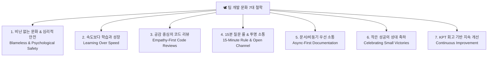

---
metadata:
  version: "1.0.0"
  ssot_owner: "docs/engineering-culture-and-working-style.md"
  last_updated: "2026-07-28"
  status: "APPROVED (SSOT Primary)"
---

# 🕊️ 팀 개발 문화(Development Culture) & 일하는 방식 7대 철학

이 문서는 `shinhan-gaecheokja` 프로젝트에서 **팀장과 5명의 초급 개발자가 상호 존중하며 함께 성장하고 무결점 결과를 만들어내기 위한 팀 개발 문화 및 일하는 방식(How We Work)**에 관한 단일 원본(SSOT) 가이드북입니다.

> [!NOTE]
> 본 가이드북은 [docs/ssot-documentation-policy.md](./ssot-documentation-policy.md) 전문 기술 문서화 표준 규격과 [docs/team-operating-model-guide.md](./team-operating-model-guide.md) 리더십 프레임워크를 100% 반영합니다.

---

## 🏛️ 팀 개발 문화 7대 핵심 철학 (7 Principles of Working Style)



---

## 🤝 1. 비난 없는 문화 & 심리적 안전 (Blameless Culture)

* **사람을 비난하지 않고 시스템을 개선합니다:**  
  버그나 실패가 발생했을 때 *"누가 실수를 했는가?"*를 따지지 않고, *"우리 테스트 하네스가 왜 이 실수를 사전에 잡지 못했는가?"*에 집중하여 `./scripts/verify.sh` 하네스를 강화합니다.
* **실수 공개를 권장합니다:**  
  실수를 숨기면 더 큰 장애로 이어집니다. 자신의 실수를 솔직하게 공유하는 팀원을 격려합니다.

---

## 🚀 2. 속도보다 학습과 성장 (Learning Over Speed)

* **단순 코드 복붙(Copy-Paste) 금지:**  
  코드가 왜 이렇게 동작하는지(WHY) 이해하지 못하면 제출하지 않습니다.
* **코드는 팀 전체의 공동 지식 자산입니다:**  
  본인이 개발한 도메인 지식은 타 팀원이 읽고 배울 수 있도록 [docs/](./) 가이드북과 PR 3분 족보 가이드로 남깁니다.

---

## 💬 3. 공감 중심의 성장을 돕는 코드 리뷰 (Empathy-First Reviews)

* **지적하는 투 지양, 질문과 제안의 투 사용:**  
  - ❌ *"왜 코드를 이렇게 작성했나요? 수정하세요."*
  - ⭕ *"이 부분은 A 방식을 사용할 경우 동시성 면에서 더 안전해 보이는데, 혹시 어떻게 생각하시나요?"*
* **P1 ~ P5 리뷰 태그 문화:**  
  - **P1:** 필수 수정 (보안/버그/하네스 위반)
  - **P3:** 제안/의견 (성능이나 가독성 개선 아이디어)
  - **P5:** 단순 칭찬 및 감탄 ("코드 구조가 정말 명쾌합니다! 👍")

---

## ⏰ 4. 15분 질문 룰 & 공개 채널 소통 (15-Minute Rule)

* **15분 질문 룰:**  
  개발 중 막히는 문제가 발생하면 **15분 동안만 스스로 시도**해 보고, 해결되지 않으면 지체 없이 릴레이 질문합니다.
* **1:1 귓속말 대신 공개 채널 질문:**  
  질문과 답변은 슬랙/이슈 공개 채널에서 진행하여, 동일한 문제로 고민하는 다른 팀원도 함께 배울 수 있게 합니다.

---

## ☀️ 5. 문서 및 비동기 우선 소통 (Async-First Documentation)

* **말/구두로 정한 의사결정은 무효입니다:**  
  회의나 대화로 결정된 아키텍처나 방침은 반드시 **GitHub Issue, PR, ADR 문서**로 수록하여 기록을 남깁니다.
* **시간을 존중하는 비동기 소통:**  
  상대방이 코딩 몰입(Flow) 상태를 깨지 않도록 비동기 메시지(Issue/PR)를 주 소통 수단으로 활용합니다.

---

## 🏆 6. 작은 성공의 성대 축하 (Celebrating Small Victories)

* **첫 PR 머지, 테스트 하네스 통과 축하:**  
  초급 팀원이 첫 PR을 머지하거나 어려운 테스트를 통과했을 때 팀 전체가 축하 이모지(🎉, 🚀, 👏)와 칭찬 메시지를 남깁니다.

---

## 🔄 7. KPT 회고 기반 지속 개선 (Continuous Improvement)

* **매 스프린트 마감 30분 회고:**  
  - **Keep:** 잘해서 유지할 좋은 문화
  - **Problem:** 발생했던 불편함과 아쉬운 점
  - **Try:** 다음 스프린트에서 당장 시도할 1가지 액션 플랜

---

## 🧪 실증 검증 명령어 (Verification Commands)

```bash
# 로컬 하네스 및 개발 문화 검증 구동
./scripts/verify.sh
```
