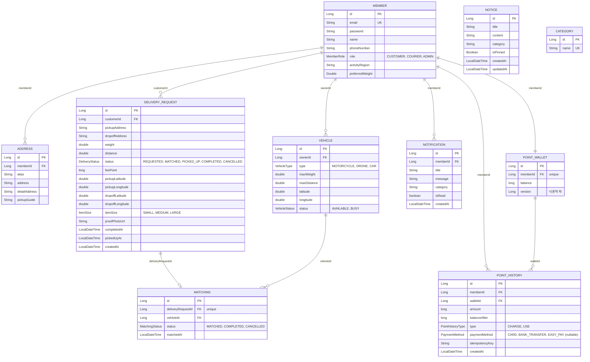

---
metadata:
  ssot_owner: "docs/erd.md"
  last_updated: "2026-08-05"
  status: "APPROVED (SSOT Primary)"
---

# 프로젝트 ERD (Entity-Relationship Diagram)

이 문서는 `shinhan-delivery`의 **전체 테이블 컬럼과 FK 기반 연관관계도에 대한 단일 원본(SSOT) 문서**입니다. Entity를 추가하거나 필드·FK·연관관계를 변경하면 같은 PR 안에서 이 문서도 함께 갱신합니다 ([code-convention.md](../code-convention.md) §4, §15, §17 참고).

- 컬럼 타입·제약조건의 정확한 원본은 `src/main/resources/db/migration/`의 Flyway 마이그레이션 파일입니다. 이 문서는 그것을 사람이 한눈에 보기 좋게 요약한 것이며, 상충하면 마이그레이션 파일이 우선합니다.
- 연관관계 표기(`||--o{` 등)는 FK 컬럼을 기준으로 그린 것이지, 반드시 양방향 JPA 연관관계를 의미하지는 않습니다. 이 저장소는 FK Long 필드를 쓰기 경로로 유지하고 읽기 전용 `@ManyToOne`만 추가하는 정책을 쓰므로([code-convention.md](../code-convention.md) §4), `@OneToMany` 컬렉션이 실제 코드에 있는지는 각 Entity 클래스를 직접 확인하세요.

---

## ER 다이어그램

---

## 도메인 참고 (다른 도메인 FK가 없는 Entity)

- **`NOTICE`**: 공지사항. 다른 도메인을 참조하지 않는 독립 콘텐츠 테이블.
- **`CATEGORY`**: 물품 카테고리 참조 테이블. 다른 도메인과 FK 연관관계 없이 조회 전용으로 쓰인다.

## 관계 요약

| 관계 | 종류 | 설명 |
|---|---|---|
| `Member` → `Address` | 1:N | 회원 한 명이 여러 자주 쓰는 주소를 가질 수 있다 |
| `Member` → `Vehicle` | 1:N | 회원(배송원)이 여러 차량을 소유할 수 있다 |
| `Member` → `DeliveryRequest` | 1:N | 회원(고객)이 여러 배송을 요청할 수 있다 |
| `Member` → `Notification` | 1:N | 회원이 여러 알림을 받는다 |
| `Member` → `PointWallet` | 1:1 | 회원 한 명이 지갑 하나를 가진다 (`member_id` unique) |
| `Member` → `PointHistory` | 1:N | 회원의 포인트 충전/사용 이력 |
| `DeliveryRequest` → `Matching` | 1:0..1 | 배송 요청 하나에 매칭은 최대 하나 (`delivery_request_id` unique) |
| `Vehicle` → `Matching` | 1:N | 차량 한 대가 여러 매칭(배송 이력)에 등장할 수 있다 |
| `PointWallet` → `PointHistory` | 1:N | 지갑 하나에 여러 충전/사용 이력이 쌓인다 |
