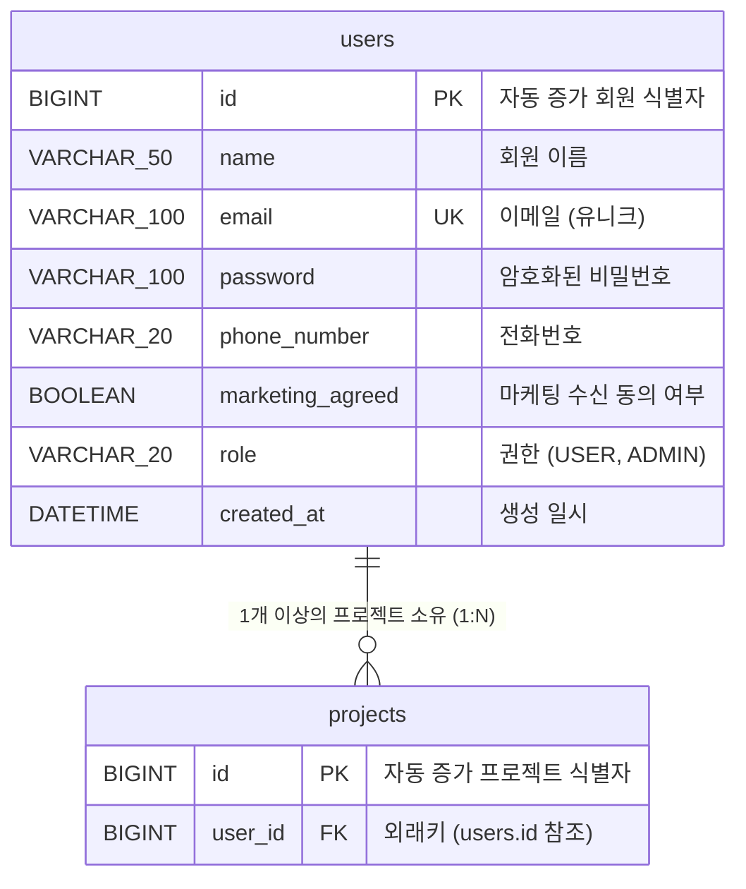

# 데이터베이스 ERD (Entity Relationship Diagram)

현재 프로젝트의 JPA 엔티티(`User`, `Project`) 및 마이그레이션 스키마([V1__init_schema.sql](file:///C:/java/shinhanproject/shinhan-gaecheokja/src/main/resources/db/migration/V1__init_schema.sql))를 기반으로 정돈된 ERD 문서입니다.

---

## 1. ERD Mermaid 다이어그램

---

## 2. 테이블 상세 명세

### 2.1 `users` (회원 테이블)
- **Entity**: [User.java](file:///C:/java/shinhanproject/shinhan-gaecheokja/src/main/java/com/example/shinhangaecheokja/entity/User.java)
- **SQL File**: [V1__init_schema.sql](file:///C:/java/shinhanproject/shinhan-gaecheokja/src/main/resources/db/migration/V1__init_schema.sql#L1-L10)

| 컬럼명 | 타입 | 제약 조건 | 설명 |
| :--- | :--- | :--- | :--- |
| `id` | BIGINT | PRIMARY KEY, AUTO_INCREMENT | 회원 식별자 ID |
| `name` | VARCHAR(50) | NOT NULL | 사용자 이름 |
| `email` | VARCHAR(100) | NOT NULL, UNIQUE | 사용자 이메일 (로그인 ID) |
| `password` | VARCHAR(100) | NOT NULL | 비밀번호 |
| `phone_number` | VARCHAR(20) | NOT NULL | 전화번호 |
| `marketing_agreed` | BOOLEAN | NOT NULL | 마케팅 수신 동의 여부 |
| `role` | VARCHAR(20) | NOT NULL | 사용자 권한 (`USER`, `ADMIN`) |
| `created_at` | DATETIME | | 계정 생성 일시 |

---

### 2.2 `projects` (프로젝트 테이블)
- **Entity**: [Project.java](file:///C:/java/shinhanproject/shinhan-gaecheokja/src/main/java/com/example/shinhangaecheokja/entity/Project.java)
- **SQL File**: [V1__init_schema.sql](file:///C:/java/shinhanproject/shinhan-gaecheokja/src/main/resources/db/migration/V1__init_schema.sql#L12-L16)

| 컬럼명 | 타입 | 제약 조건 | 설명 |
| :--- | :--- | :--- | :--- |
| `id` | BIGINT | PRIMARY KEY, AUTO_INCREMENT | 프로젝트 식별자 ID |
| `user_id` | BIGINT | NOT NULL, FOREIGN KEY (`users.id`) | 소유 회원 ID (1:N 관계) |

---

## 3. 엔티티 관계 요약

- **`users` ↔ `projects` (1 : N)**
  - `User` 1명은 여러 개의 `Project`를 가질 수 있습니다 (`Project` 엔티티에서 `@ManyToOne`으로 `User` 참조).
  - Foreign Key Constraint: `fk_projects_user` (`projects.user_id` → `users.id`)
