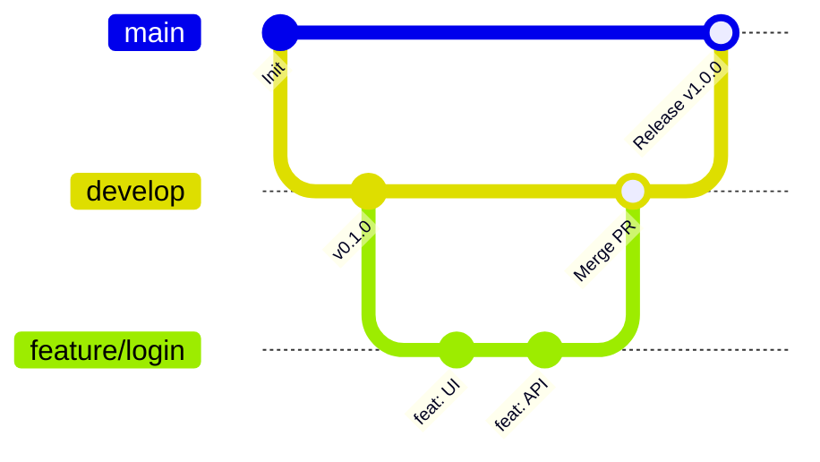

# Git Flow 협업 가이드라인

이 프로젝트는 효율적인 협업과 안정적인 배포를 위해 **Git Flow** 브랜치 전략과 **Conventional Commits** 규칙을 따릅니다. 

---

## 1. 브랜치 전략 (Branch Strategy)

프로젝트는 크게 5가지 유형의 브랜치로 나누어 관리합니다.

| 브랜치 유형 | 설명 | 이름 규칙 | 대상 상위 브랜치 |
| :--- | :--- | :--- | :--- |
| **`main`** | 제품으로 출시될 수 있는 가장 안정적인 배포용 브랜치 | `main` | - |
| **`develop`** | 다음 버전을 위한 기능들이 모이는 핵심 개발 브랜치 | `develop` | `main` |
| **`feature`** | 신규 기능 개발 또는 버그 수정을 진행하는 작업 브랜치 | `feature/<이슈번호>-<요약>` 또는 `feat/<요약>` | `develop` |
| **`release`** | 배포를 준비하며 버그 수정 및 최종 QA를 수행하는 브랜치 | `release/<버전>` (예: `release/1.0.0`) | `develop` |
| **`hotfix`** | 배포된 실서버(`main`)에 발생한 긴급 장애를 패치하는 브랜치 | `hotfix/<이슈번호>-<요약>` | `main` |

---

## 2. 기본 작업 프로세스 (Work Process)

신규 기능을 개발할 때 진행하는 표준 작업 순서입니다.



1. **로컬 최신화**
   * 작업을 시작하기 전, `develop` 브랜치를 원격 저장소(`origin`) 기준으로 최신화합니다.
     ```bash
     git checkout develop
     git pull origin develop
     ```
2. **작업 브랜치 생성**
   * `develop` 브랜치로부터 작업 성격에 맞게 브랜치를 분기합니다.
     ```bash
     git checkout -b feature/123-user-login
     ```
3. **코드 개발 및 로컬 커밋**
   * 작업 단위별로 잘게 나누어 커밋 컨벤션에 맞춰 커밋합니다.
4. **원격 저장소 푸시 및 Pull Request(PR) 생성**
   * 작업을 마치면 원격에 푸시한 뒤, GitHub에서 **`develop` 브랜치를 대상**으로 PR을 생성합니다.
     ```bash
     git push -u origin feature/123-user-login
     ```
5. **코드 리뷰 및 머지(Merge)**
   * 팀원들의 코드 리뷰를 거친 뒤 승인(Approve)을 받으면 `develop` 브랜치로 머지합니다.
   * 머지 후 로컬 작업 브랜치는 삭제합니다.

---

## 3. 커밋 메시지 규칙 (Commit Message Convention)

명확하고 일관된 이력 관리를 위해 **Conventional Commits** 스타일을 따릅니다.

### 커밋 메시지 기본 구조
```text
<type>(<scope>): <subject>  # 제목 (최대 50자, 마침표 생략)

<body>                       # 본문 (생략 가능, 어떻게보다 '왜' 변경했는지 상세히 서술)

<footer>                     # 바닥글 (생략 가능, 연관된 이슈 번호 등 기재)
```

### 주요 태그 타입 (Type)

| 타입 | 의미 | 예시 |
| :--- | :--- | :--- |
| **`feat`** | 새로운 기능 추가 | `feat: 로그인 기능 구현` |
| **`fix`** | 버그 및 에러 수정 | `fix: 로그인 API 예외 처리 누락 수정` |
| **`docs`** | 문서 파일 수정 및 가이드 추가 | `docs: Git Flow 협업 가이드라인 문서 추가` |
| **`style`** | 코드 스타일 수정 (포맷팅, 세미콜론 누락 등 코드 변경 없음) | `style: 줄바꿈 및 인덴트 정리` |
| **`refactor`** | 기능 추가나 버그 수정이 없는 순수 코드 구조 리팩토링 | `refactor: 로그인 서비스 클래스 분리` |
| **`test`** | 테스트 코드 작성 및 수정 | `test: 로그인 API 단위 테스트 코드 추가` |
| **`chore`** | 빌드 설정, 의존성 패키지 관리, 설정 파일 변경 등 | `chore: build.gradle 의존성 버전 업데이트` |

### 좋은 예시
```text
feat(member): 이메일 중복 체크 API 구현

- 회원가입 프로세스에서 사용할 이메일 중복 검사 비즈니스 로직 추가
- 중복 발견 시 DuplicateMemberException 예외 발생 처리

Resolves: #45
```

### 💡 Git 커밋 메시지 템플릿 설정 (.gitmessage)
매번 이 컨벤션 규격을 수동으로 입력하기 어려우므로, 프로젝트 루트에 포함된 `.gitmessage` 파일을 템플릿으로 연동하여 사용하는 것을 권장합니다. 로컬 저장소 터미널에서 다음 명령어를 실행하여 등록할 수 있습니다:
```bash
git config --local commit.template .gitmessage
```
설정 후 터미널에서 `git commit`을 실행하면 템플릿 가이드라인이 자동으로 커밋 작성 화면에 로드되어 쉽게 규격에 맞춰 커밋을 작성할 수 있습니다.

---

## 3-1. GitHub Issue 생성 수칙 (Issue Rules)

작업의 투명성과 작업 분담(Assignee), 그리고 PR 자동 연결(`Resolves: #이슈번호`)을 위해 모든 작업은 이슈를 먼저 생성한 후 진행합니다.

### 🏷️ 이슈 제목 명명 규칙 (Issue Title Convention)
*   **포맷:** `[카테고리] 요약 설명`
*   **카테고리 키워드:**
    - `[Feature]` : 신규 기능 개발
    - `[Security]` : 보안 / 인증 / 인가 체계 구축
    - `[Concurrency]` : 동시성 및 락(Lock) 제어
    - `[Testing]` : 단위 / 통합 / E2E 테스트 구축
    - `[Observability]` : 분산 로깅 및 트레이싱
    - `[Ops]` : CI/CD 및 모니터링
    - `[Bug]` : 버그 및 이상 동작 수정
    - `[Docs]` : 문서 작성 및 최신화
*   **예시:** `[Security] Spring Security 및 JWT 기반 REST API 인증/인가 체계 구축`

### 📄 이슈 템플릿 사용 및 필수 포함 항목
GitHub 이슈 생성 시 `.github/ISSUE_TEMPLATE/`에 정의된 표준 템플릿이 적용됩니다:
1. **📌 기능/버그 개요 (Overview):** 배경 및 왜 작업해야 하는지에 대한 가치 설명
2. **🛠️ 세부 요구사항 (Detailed Requirements):** 도메인 및 스펙별 구현 요구사항 목록
3. **✅ 완료 정의 (Definition of Done):** `./scripts/verify.sh` 및 문서 동기화 자가 체크리스트

---

## 4. Pull Request 규칙 및 템플릿 (PR Rules)

원활한 코드 리뷰와 히스토리 추적을 위해 GitHub에서 Pull Request를 작성할 때 다음 규칙을 준수해야 합니다.

### PR 작성 기본 수칙
1. **리뷰어(Reviewers) 및 담당자(Assignees) 지정:** 최소 1명 이상의 리뷰어를 지정해야 합니다.
2. **연관 이슈 연결:** 본문 하단에 관련 이슈 번호를 명시하여 자동으로 닫히도록 설정합니다. (예: `Resolves: #45`)
3. **Swagger API 문서화 필수:** API 엔드포인트의 추가, 변경, 삭제가 발생하는 모든 작업은 반드시 관련 Controller 및 DTO에 Swagger 어노테이션 설정을 포함해야 합니다.
4. **작업 증빙 첨부:** UI 작업은 스크린샷, API 작업은 테스트 수행 로그 또는 API 호출 결과를 반드시 본문에 첨부합니다.
5. **초급자 눈높이 설명 문서 필수화:** 새로 개발하는 기능, 도입한 기술 및 아키텍처 개념은 개발 초급자가 이해할 수 있도록 쉽게 풀어서 작성한 가이드라인 문서(마크다운 형식)를 `docs/` 하위 경로에 편입하거나 메인 `README.md`에 반드시 추가/업데이트해야 합니다. (도입하지 않으면 기습 장애가 터졌을 때 대처할 수 없습니다.)
6. **코드 작성 컨벤션 문서(code-convention.md) 동기화:** 프로젝트 전반의 클래스 작성 규격, 예외 처리 아키텍처, DTO 패턴 등 전체 패턴이 변경되는 작업은 반드시 `code-convention.md` 문서를 함께 동기화하여 전체 팀원이 일관된 수칙을 유지할 수 있도록 합니다.

### 🔀 브랜치 병합 전략: Squash and Merge 의무화
프로젝트의 메인 Git 히스토리를 깨끗하게 유지하고 기능 단위 추적을 쉽게 만들기 위해, 모든 Pull Request는 **오직 `Squash and Merge` 방식으로만 병합**해야 합니다.
* **적용 사양:** 저장소 설정으로 일반 머지 커밋(Create a merge commit) 및 리베이스 머지(Rebase and merge) 기능은 비활성화되어 있습니다.
* **동작 원리:** PR 내에 쌓여 있는 여러 개의 작업 커밋들이 병합되는 순간 **단 1개의 깨끗한 커밋으로 스쿼시(압축)**되어 대상 브랜치에 반영됩니다.
* **🔗 PR 제목과의 연계:** Squash and Merge 특성상 병합 시 생성되는 최종 커밋 메시지는 **GitHub PR의 제목과 설명**을 기반으로 자동 작성됩니다. 즉, **"PR 제목 = 메인 히스토리에 남는 최종 커밋 메시지"**가 되므로, 로컬 커밋은 자유롭게 작성하더라도 **PR 생성 시 제목과 내용을 양식에 맞게 명확하게 작성해 주는 것이 깔끔한 히스토리를 유지하는 핵심**입니다.
* **💡 개발 팁:** 따라서 작업 중 커밋 메시지가 다소 지저분하더라도 최종 PR 머지 시점에 제목과 설명을 깔끔히 정리해 주면 되므로, 세부 커밋 작성에 대한 심리적 부담을 덜고 개발을 편하게 진행하실 수 있습니다.

### PR 템플릿 사용 (AI 및 인간 공통 규칙)
GitHub의 기본 PR 템플릿 파일이 `[pull_request_template.md](../.github/pull_request_template.md)`에 정의되어 있습니다. 
* PR 작성 시 자동으로 해당 템플릿 폼이 적용되며, 요약 / 주요 변경사항 / 리뷰 포인트 / 테스트 결과를 빠짐없이 작성해야 합니다.
* **AI 에이전트(코드 자동 생성 봇) 수칙:** AI 에이전트가 자동으로 PR을 생성하는 작업을 수행할 경우, 반드시 `.github/pull_request_template.md` 파일의 마크다운 서식을 그대로 파싱하여 각 항목에 맞게 상세한 작업 명세서를 자동 작성하도록 합니다.

### 🤖 Gemini AI 자동 코드 리뷰 (CI/CD 연동)
이 레포지토리에는 PR 제출 시 코드 품질을 유지하고 교육을 보완하기 위해 **Gemini AI 자동 코드 리뷰**가 연동되어 있습니다.

1. **작동 및 호출 방식 (중요):**
   * **최초 1회 자동 실행:** 새로운 PR을 **처음 생성(Opened)**하거나 **다시 열었을(Reopened)** 때 최초 1회는 자동으로 AI 리뷰가 가동되어 피드백을 작성합니다.
   * **수동 추가 리뷰 호출:** 이후 코드 수정본을 커밋/푸시(Synchronize)할 때는 API 한도(Quota) 절약을 위해 자동으로 돌지 않습니다. 코드를 수정하고 재리뷰를 받고 싶다면, **PR 본문 댓글로 `/review`를 작성하여 등록**해 주세요. GitHub Actions가 이를 감지하여 실시간으로 코드 리뷰 작업을 구동시킵니다.
2. **주의 사항 (저장소 설정):** 본 자동화가 정상 작동하려면, 저장소 관리자가 GitHub 레포지토리의 **Settings ➔ Secrets and variables ➔ Actions** 메뉴에 들어가 Google AI Studio 등에서 발급받은 Gemini API 키를 `GEMINI_API_KEY`라는 이름의 Action Secret으로 등록해 주어야 합니다.


