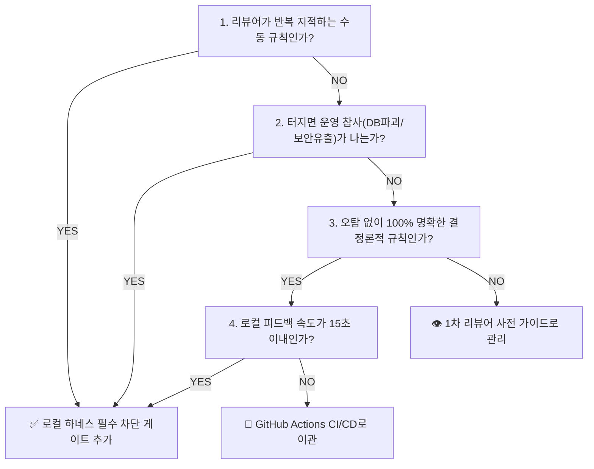

# 🛡️ 테스트 하네스(Test Harness) 구축 및 검증 항목 판단 정책 가이드북

이 문서는 `shinhan-gaecheokja` 프로젝트에서 **무결점 결함 0개(Zero-Defect Quality Gate)를 사수하고 개발자와 AI의 코드 품질을 자동 검증하기 위해 구축하는 테스트 하네스(`./scripts/verify.sh`)의 의사결정 판단 정책 및 초엄격 하네스 수칙**을 정리한 팀 가이드북입니다.

---

## 🏛️ 1. 하네스 검증 항목 결정 4대 프레임워크 (Framework)

어떤 검증 수칙을 하네스(`./scripts/verify.sh`)에 추가하여 자동 차단할지 결정할 때 아래 **4대 판단 프레임워크**를 적용합니다.

### ① 🗣️ 리뷰 피로도 지수 (Review Friction Metric)
- **질문:** PR 코드 리뷰 시 사람이 매번 눈으로 지적하고 피로도를 느끼는 수칙인가?
- **판단:** **➔ 100% 하네스 자동 검사로 집행!** (예: Google Java Format 코드 스타일, 수동 Getter 작성 금지, Entity 직접 반환 금지)

### ② 💣 운영 장애 참사 방지 지수 (Post-Mortem Metric)
- **질문:** 실수로 `main`에 병합되었을 때 DB 파괴, 개인정보/Secret 유출, 서비스 다운을 유발하는가?
- **판단:** **➔ 100% 하네스 하드 게이트(Hard Gate) 지정!** (예: Flyway 스크립트 파일명 규칙, MariaDB 무중단 Online DDL 차단, 평문 비밀번호 노출 차단)

### ③ 🎯 오탐 0% 결정론 규칙 (Zero False-Positive Metric)
- **질문:** 규칙의 결과가 100% 명확하여 정당한 개발자의 코드가 억울하게 차단될 가능성이 0%인가?
- **판단:** **➔ 100% 명확한 컴파일/린트/ArchUnit/테스트 규칙만 하네스 게이트로 지정.**

### ④ ⚡ 피드백 속도 예산 지수 (Fast Feedback Budget)
- **질문:** 검증 실행 시 로컬에서 15초 이내에 완료되어 개발 흐름(Flow State)을 방해하지 않는가?
- **판단:**
  - ⚡ **15초 이내:** 로컬 하네스 `./scripts/verify.sh`에 배치하여 커밋/PR 전 피드백 수집.
  - 🐢 **15초 초과:** 부하 테스트 및 heavy E2E 테스트는 **GitHub Actions CI/CD 파이프라인**으로 이관.

---

## 🏆 2. 무결점 결함 0개를 위한 초엄격 6대 하네스 통제 정책 (Strict Rules)

우리 프로젝트의 하네스는 단순한 테스트 실행기가 아닙니다. **세계 최고 IT 기업(Google, Meta, Netflix) 수준의 6대 초엄격 통제 정책**이 구동됩니다.

### 1️⃣ 🔒 다층 방어 보안 게이트 (Defense-in-Depth Security)
* **평문 Secret 노출 차단:** `application.yaml` 및 소스 코드 내 AWS Access Key, DB 비밀번호, JWT Secret Key의 평문 하드코딩 금지. (환경변수 주입 의무화)
* **민감정보 로그 노출 차단:** `System.out.println` 및 로깅(`log.info`)에 비밀번호, JWT 토큰, 주민등록번호 등 개인정보 출력 전면 차단.

### 2️⃣ 🏛️ 코딩 컨벤션 단일 원본(SSOT) 자동 집행 게이트
* **단일 원본(SSOT) 참조:** 모든 코딩 규약(Lombok 100% 사용 수칙, Controller Entity 직접 반환 금지, 단방향 의존성 레이어링)의 **단일 원본은 [`code-convention.md`](../code-convention.md) 문서**입니다.
* **하네스 자동 집행 역할:** 하네스는 `code-convention.md`에 정의된 규약을 인간 리뷰어 대신 **ArchUnit 및 Spotless**를 통해 100% 자동 검사하여, 위반 시 exit code 1로 즉시 빌드를 차단하는 집행 기관 역할을 수행합니다.

### 3️⃣ 📊 지속적 커버리지 래칫 게이트 (JaCoCo Coverage Ratchet)
* **현재 최소 커버리지 게이트:** **라인 커버리지 60%+**
* **래칫(Ratchet) 정책:** 신규 도메인 코드 추가 시 전체 커버리지를 하락시키는 코드는 하네스 0 exit code 패스를 받을 수 없으며, 단계적으로 **80% 커버리지 목표**를 향해 상향 조정됨.

### 4️⃣ 🚨 비활성화 테스트(Ignored Test) 차단 게이트
* **우회 시도 금지:** 테스트 실패를 모피하기 위해 `@Disabled`나 `@Ignore` 어노테이션을 붙여 테스트를 건너뛰는 행위를 엄격히 금지하고 하네스에서 검출.

### 5️⃣ 🔄 자동 자가 치유 피드백 루프 (Self-Healing Loop)
* `./scripts/verify.sh` 구동 시 코드 포맷팅 오류로 개발자의 시간을 뺏지 않도록, **`./gradlew spotlessApply`를 1차로 자동 실행한 뒤 린트와 테스트를 수행하는 자가 치유 메커니즘** 작동.

### 6️⃣ 🛠️ 무중단 DB 마이그레이션 방어 게이트 (Flyway Safety)
* Flyway 파일명 템플릿(`V{버전}__{설명}.sql`) 검사 및 MariaDB 운영 락(Lock)을 유발하는 위험한 `DROP COLUMN`, `ALTER TABLE` 직접 실행 차단.

---

## 📋 3. 하네스 검증 규칙 체크리스트 및 구성표

| 검증 단계 (Step) | 하네스 검증 항목 | 검사 도구 / 스크립트 | 실패 시 동작 |
| :--- | :--- | :--- | :--- |
| **Step 1** | Flyway 마이그레이션 스크립트 파일명 규칙 검사 | `verify.sh` shell script | 즉시 빌드 차단 |
| **Step 2** | MariaDB 무중단 Online DDL 안전성 검사 | `verify.sh` shell script | 즉시 빌드 차단 |
| **Step 3** | Java 코드 스타일 & 린트 자동 교정 | Spotless (`spotlessApply`) | 100% 자가 치유 후 진행 |
| **Step 4** | 단위/통합 테스트 및 ArchUnit 아키텍처 검사 | Gradle Test (55개 전수 패스) | 즉시 빌드 차단 |
| **Step 5** | JaCoCo 커버리지 60%+ 커버리지 게이트 | JaCoCo Coverage Verification | 커버리지 미달 시 차단 |

---

## 🛠️ 4. 하네스 수칙 변경 및 승인 절차

새로운 검증 수칙을 하네스에 추가하거나 변경할 때에는 다음 절차를 따릅니다:
1. `docs/harness-decision-framework.md` 가이드북에 4대 프레임워크 기준 충족 여부 기재.
2. `./scripts/verify.sh` 및 `build.gradle`에 검증 구문 추가.
3. PR 오픈 시 리뷰어 가이드에 하네스 변경 영향 범위 명시 및 팀 승인 후 병합.
