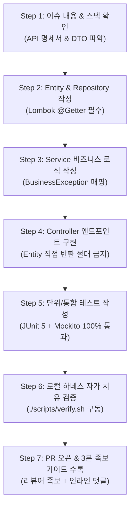

---
metadata:
  version: "1.0.0"
  ssot_owner: "docs/junior-developer-task-guide.md"
  last_updated: "2026-07-28"
  status: "APPROVED (SSOT Primary)"
---

# 🔰 초급 개발자를 위한 7단계 초상세 태스크 분할 & 작업 수행 가이드

이 문서는 `shinhan-gaecheokja` 프로젝트에 참여하는 **초급/입문 개발자가 막연함 없이 100% 무결점 코드를 완성하고 PR을 생성할 수 있도록 제공하는 7단계 표준 작업 분할 가이드북**입니다.

> [!NOTE]
> 본 가이드북은 [docs/ssot-documentation-policy.md](./ssot-documentation-policy.md) 전문 기술 문서화 표준 규격과 [code-convention.md](../code-convention.md) 코딩 수칙을 준수합니다.

---

## 🏛️ 초급자 7단계 태스크 실행 워크플로우



---

## 📝 7단계 상세 가이드라인 (Step-by-Step Guide)

### 📌 Step 1: 이슈 내용 & 스펙 확인 (10분)
* 할당받은 GitHub Issue의 **요구사항, API 엔드포인트(URL, HTTP 메서드), Request/Response DTO 스펙**을 파악합니다.
* 참조 가이드: [docs/rest-api-guide.md](./rest-api-guide.md)

### 📌 Step 2: Entity & Repository 작성 (15분)
* JPA Entity 생성 시 **수동 Getter/Setter 작성을 금지하고 무조건 Lombok `@Getter`, `@Setter`를 적용**합니다.
* DB 테이블 PK 및 컬럼 제약조건(`@Column(nullable = false)`)을 명시합니다.
* 참조 가이드: [code-convention.md](../code-convention.md)

### 📌 Step 3: Service 비즈니스 로직 및 예외 작성 (30분)
* 비즈니스 예외 발생 시 custom exception 대신 공통 `BusinessException(ErrorCode.XXX)`을 던집니다.
* 서비스 클래스는 상태를 가지지 않는 무상태(Stateless)로 구현합니다.
* 참조 가이드: [docs/exception-handling-guide.md](./exception-handling-guide.md)

### 📌 Step 4: Controller 엔드포인트 구현 (20분)
* **초급자 자주 하는 실수 차단:** Controller에서 JPA Entity를 직접 반환하지 않고 반드시 응답 DTO로 변환하여 반환합니다.
* DTO에 Lombok `@Getter`를 부착합니다.

### 📌 Step 5: 단위 및 통합 테스트 작성 (30분)
* 성공 케이스뿐만 아니라 **예외/실패 케이스(404, 400)**를 반드시 테스트 코드로 작성합니다.
* `@SpringBootTest` 또는 `@ExtendWith(MockitoExtension.class)` 기반으로 작성합니다.

### 📌 Step 6: 로컬 하네스 자가 치유 검증 (5분)
* 코드 작성이 끝나면 터미널에서 다음 명령어를 실행하여 린트/포맷팅/테스트 통과 여부를 스스로 검증합니다:
```bash
# 코드 포맷팅 자동 교정 및 전체 테스트/JaCoCo 커버리지 자동 검사
./scripts/verify.sh
```

### 📌 Step 7: PR 오픈 & 3분 족보 가이드 수록 (5분)
* `git push` 후 PR을 오픈할 때, GitHub PR 템플릿의 **[1분 퀵 서머리 + 추천 읽기 순서(Mermaid) + 체크리스트]**를 작성합니다.
* 리뷰어(팀장)의 빠른 검토를 위해 `Files changed` 탭에서 핵심 3곳에 인라인 댓글을 작성합니다.
* 참조 가이드: [docs/pr-review-guide.md](./pr-review-guide.md)

---

## 📋 초급자용 GitHub Issue 표준 템플릿 (초상세 가이드 포함)

이슈 생성 시 아래 표준 템플릿을 사용하여 초급 개발자가 체크리스트를 하나씩 지워가며 개발할 수 있도록 구성합니다:

```markdown
## 📌 기능 개요
* **기능명:** [예: 이메일 로그인 API 구현]
* **담당자:** [팀원 1]
* **목표 모듈:** [모듈 2: 인증 & 회원가입]

---

## 🛠️ 초급 개발자 7단계 체크리스트

- [ ] **Step 1:** API 명세 (`POST /api/members/login`) 및 DTO 규격 파악
- [ ] **Step 2:** Entity/DTO 작성 시 Lombok `@Getter` 100% 적용
- [ ] **Step 3:** Service 구현 시 `BusinessException` + `ErrorCode` 매핑
- [ ] **Step 4:** Controller 구현 시 Entity 반환 금지 (DTO 반환)
- [ ] **Step 5:** 정상 발급 및 비밀번호 불일치(401) 단위 테스트 작성
- [ ] **Step 6:** 로컬 하네스 `./scripts/verify.sh` 0 exit code 검증
- [ ] **Step 7:** PR 오픈 시 3분 족보 가이드 수록 및 인라인 댓글 3개 달기

---

## 📖 참고할 SSOT 가이드북
* [코딩 컨벤션 수칙 (code-convention.md)](../code-convention.md)
* [PR 리뷰어 3분 족보 가이드 (docs/pr-review-guide.md)](./pr-review-guide.md)
* [테스트 하네스 가이드 (docs/harness-and-llm-guide.md)](./harness-and-llm-guide.md)
```

---

## 🧪 실증 검증 명령어 (Verification Commands)

```bash
# 로컬 전체 하네스 검증
./scripts/verify.sh
```
