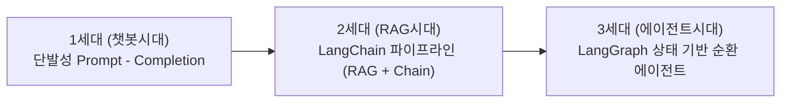
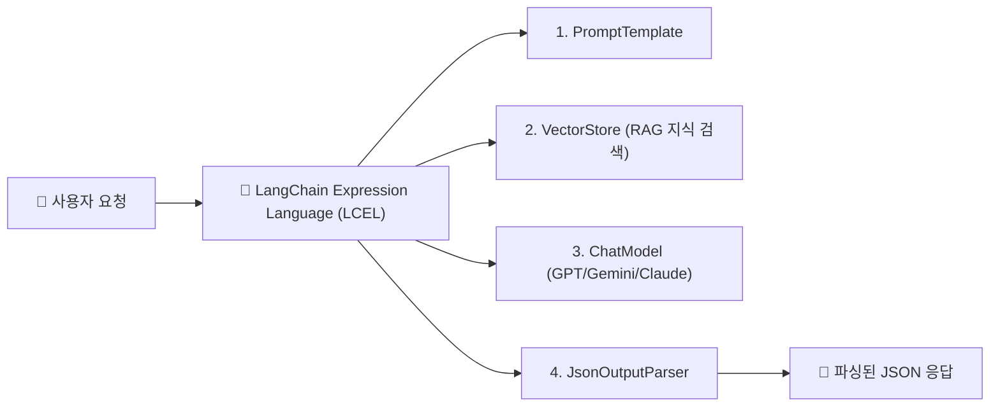
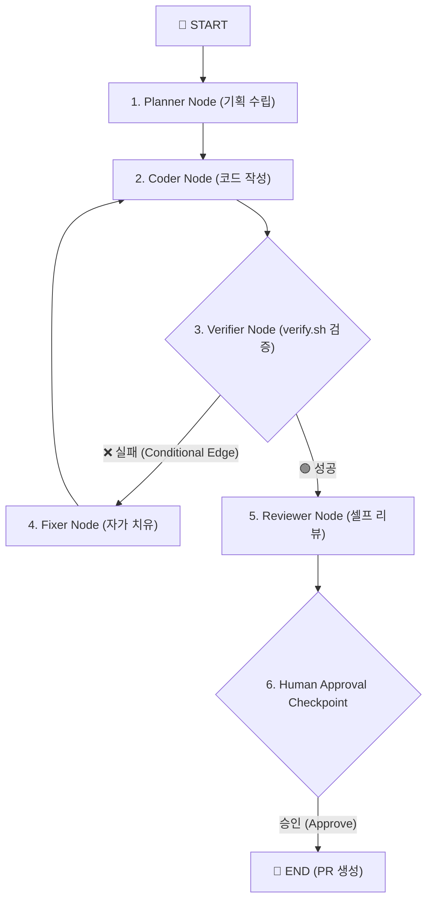

---
metadata:
  version: "1.0.0"
  ssot_owner: "docs/langchain-langgraph-deepdive.md"
  last_updated: "2026-07-31"
  status: "APPROVED"
---

# 🤖 LangChain vs LangGraph 딥다이브 & 차세대 AI 에이전틱 엔지니어링 가이드북

이 문서는 `shinhan-gaecheokja` 프로젝트 개발진 및 채용 준비자를 위해 **LangChain과 LangGraph의 구조적 차이, 채용 공고에서의 중요성, AI 에이전트(Agentic AI) 오케스트레이션 설계 기법**을 초상세히 기술한 전문 가이드북입니다.

---

## 📌 1. 왜 IT 채용 공고에 LangChain과 LangGraph가 필수 급부상했는가? (WHY)

과거의 AI 서비스는 단순히 "사용자가 질문을 넣으면 답변을 출력하는" 1:1 대화형 챗봇(Chatbot)에 불과했습니다.

그러나 현대 기업 환경에서는 **"AI가 스스로 목표(Task)를 기획하고, 데이터베이스와 API 도구를 실행하며, 오류가 나면 자가 치유(Self-Healing)하고, 사람의 승인을 받아 업무를 완성하는 자율형 AI 에이전트(Agentic AI)"**로 대전환되었습니다.



- **LangChain:** 다양한 AI 모델과 외부 도구(Vector DB, API, Search)를 연결해 주는 **"조립식 파이프라인 프레임워크"**.
- **LangGraph:** 에이전트가 예외 발생 시 이전 상태로 복구하거나 루프를 돌며 문제를 스스로 해결하는 **"상태 기반 순환 그래프 엔진"**.

---

## 🔗 2. LangChain (랭체인) 딥다이브

### 💡 핵심 역할
LangChain은 LLM(Large Language Model)을 외부 데이터 및 도구와 결합하여 **일직선 형태의 파이프라인(Chain)**을 빠르게 구축할 수 있도록 돕는 프레임워크입니다.



### 🧱 LangChain 4대 핵심 컴포넌트

1. **Model I/O:** OpenAI, Gemini, Ollama 등 다양한 LLM을 통일된 인터페이스로 호출 (`ChatGoogleGenerativeAI`, `ChatOpenAI`).
2. **Retrieval (RAG):** 문서 분할(TextSplitter), 임베딩(Embeddings), 벡터 DB 저장소(FAISS, Chroma, Pinecone) 연동.
3. **Tools & Agents:** 날씨 API, SQL DB 실행기, 계산기 등 LLM이 필요할 때 호출할 도구(Tool) 바인딩.
4. **LCEL (LangChain Expression Language):** 파이프 파이프라인 연산자(`|`)를 사용해 `prompt | model | output_parser` 형태의 명쾌한 가독성 제공.

---

## 🕸️ 3. LangGraph (랭그래프) 딥다이브

### 💡 핵심 역할
LangChain의 일직선 파이프라인(DAG)만으로는 **"코드를 수정하고 빌드를 돌린 뒤, 에러가 나면 3번까지 자가 치유(Loop)하고 사람에게 검토 요청(Human Checkpoint)을 남기는"** 복잡한 순환 로직을 표현하기 어렵습니다.

LangGraph는 에이전트의 상태를 **노드(Node), 엣지(Edge), 상태(State)**로 이루어진 그래프로 관리하여 **안전한 루프와 상태 보존**을 가능하게 해줍니다.



### 🧱 LangGraph 4대 핵심 요소

1. **Shared State (공유 상태):** 모든 노드가 공통으로 접근하고 updates를 쌓아가는 TypedDict 객체.
2. **Nodes (노드):** 특정 개별 작업을 수행하는 독립적 파이썬 함수/에이전트.
3. **Edges & Conditional Edges (엣지 및 조건부 엣지):** 노드와 노드 사이의 이동 경로. 조건 판단 로직에 따라 자가 치유 루프 또는 종료 노드로 분기.
4. **Checkpointer & Human-in-the-loop:** 그래프 실행 중 특정 지점에서 실행을 정지(Pause)하고, 사용자의 승인/피드백을 받은 후 재개(Resume)하거나 이전 상태로 Rollback할 수 있는 스냅샷 기능.

---

## 📊 4. LangChain vs LangGraph 1:1 비교표

| 구분 | **LangChain (랭체인)** | **LangGraph (랭그래프)** |
| :--- | :--- | :--- |
| **흐름 구조 (Topology)** | 일직선 단방향 흐름 (DAG) | **순환 그래프 (Cyclic Graph / Loop 가능)** |
| **상태 관리 (State)** | 단발성 데이터 전달 중심 | **상태(State) 객체 영속 관리 & 오버라이드 지원** |
| **에러 대응** | 예외 발생 시 실행 중단 | **자가 치유(Auto-Fix) 복구 루프 설계 가능** |
| **인간 연동** | 어려움 | **Human-in-the-loop 승인 대기 지원** |
| **적합한 사용처** | RAG 문서 검색 챗봇, 단순 API 바인딩 | **자동 코딩 에이전트, 다중 에이전트 오케스트레이션** |

---

## 💻 5. 우리 프로젝트 실전 적용 코드 예시 (`scripts/langgraph/issue_plan_graph.py`)

우리 프로젝트에서는 공식 PyPI `langgraph.graph` 패키지를 도입하여 **`/plan <이슈번호>` 커맨드 실행 시 GitHub Issue와 연동된 8단계 자가 기획 엔진**을 정식 구동하고 있습니다:

```python
from langgraph.graph import StateGraph, START, END

# 1. StateGraph 정의
workflow = StateGraph(PlanGraphState)

# 2. 노드 등록
workflow.add_node("fetch_issue", fetch_issue_node)
workflow.add_node("graphrag_search", graphrag_search_node)
workflow.add_node("generate_plan", generate_plan_node)
workflow.add_node("human_approval", human_approval_node)

# 3. 엣지 연결 (순서 및 조건부 전이)
workflow.add_edge(START, "fetch_issue")
workflow.add_edge("fetch_issue", "graphrag_search")
workflow.add_edge("graphrag_search", "generate_plan")
workflow.add_edge("generate_plan", "human_approval")
workflow.add_edge("human_approval", END)

# 4. 앱 컴파일
app = workflow.compile()
```

---

## 🧪 6. 실증 검증 명령어 (Verification)

프로젝트에 탑재된 LangGraph 기획 파이프라인의 정상 구동을 테스트합니다:

```bash
# LangGraph 이슈 기획 오케스트레이션 실행 (이슈 번호 168 예시)
python3 scripts/langgraph/issue_plan_graph.py 168
```
