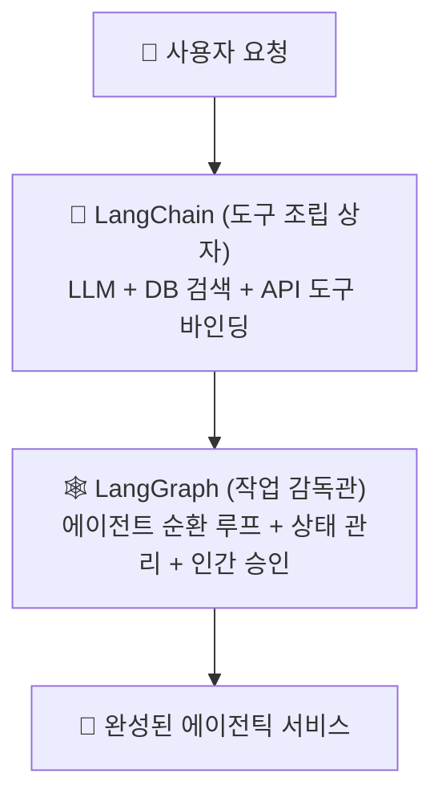
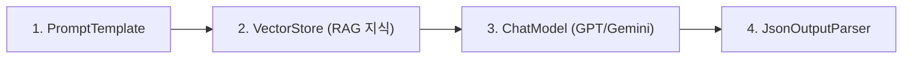
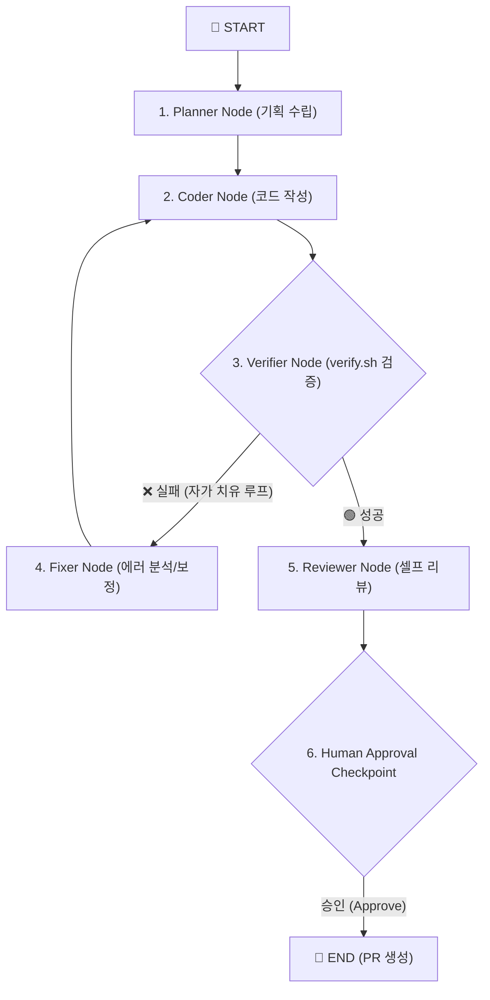

---
metadata:
  version: "1.1.0"
  ssot_owner: "docs/langchain-langgraph-deepdive.md"
  last_updated: "2026-07-31"
  status: "APPROVED (SSOT Primary)"
---

# 🤖 LangChain & LangGraph 도구 해설 및 에이전틱 엔지니어링 가이드북

이 문서는 `shinhan-gaecheokja` 프로젝트 개발진을 위해 **LangChain과 LangGraph 각 도구의 기본 개념, 주요 기능, 실무 쓰임새 및 우리 프로젝트의 구현 사례**를 체계적으로 정리한 전문 가이드북입니다.

---

## 📌 1. 개요: 두 도구가 등장한 배경

과거의 AI 활용은 단순히 "질문을 던지고 답변을 받는" 단발성 챗봇(Chatbot) 수준이었습니다.

그러나 실무 환경에서는 **"외부 데이터베이스를 조회하고, 외부 API를 실행하며, 에러 발생 시 스스로 고치고, 사람의 승인을 받아 작업을 완성하는 차세대 AI 에이전트(Agentic AI)"**가 필요해졌습니다.



- **LangChain:** LLM에게 데이터베이스, 검색, 계산기 등의 **도구를 조립해 주는 부품 상자**.
- **LangGraph:** 그 도구들을 활용해 **복잡한 작업 프로세스와 자가 치유 루프를 감독하는 에이전트 오케스트레이션 엔진**.

---

## 🔗 2. LangChain (랭체인) 이란 어떤 도구인가요?

### 💡 한 줄 정의
> **"LLM(AI)에게 외부 세상의 도구를 쥐여주는 조립식 개발 프레임워크"**

AI 모델(GPT, Gemini 등)은 자체적으로 최근 뉴스를 찾지 못하고, 회사 내부 DB를 읽지 못합니다. LangChain은 AI 모델이 다양한 외부 도구와 결합하여 실제 일할 수 있는 애플리케이션으로 작동하도록 레고 블록처럼 연결해 주는 도구입니다.



### 🧱 LangChain의 4대 핵심 기능

1. **사내 지식 검색 (RAG - Retrieval-Augmented Generation):**
   - 사내 PDF, 마크다운 문서를 읽어 Vector DB에 저장한 뒤, 사용자 질문에 맞는 문서를 찾아 AI에게 전달하여 답변하게 합니다. (예: "우리 회사 휴가 규정 알려줘")
2. **외부 도구 연결 (Tools & Agents):**
   - AI가 상황을 판단하여 구글 검색, 날씨 API, SQL 데이터베이스 조회, 파이썬 코드 실행기 등 **외부 도구를 직접 실행**하게 만듭니다.
3. **대화 기억 관리 (Memory):**
   - 이전 대화 내용을 기억하여 문맥이 이어지는 연속 대화를 유지합니다.
4. **쉬운 파이프라인 조립 (LCEL - 표현식):**
   - `prompt | model | output_parser` 형태의 파이프 연산자(`|`)를 통해 가독성 높은 코드로 작성합니다.

---

## 🕸️ 3. LangGraph (랭그래프) 란 어떤 도구인가요?

### 💡 한 줄 정의
> **"AI가 복잡한 업무를 스스로 처리하도록 돕는 상태 기반 작업 감독관 엔진"**

LangChain만으로는 "코드를 작성하고 빌드를 돌린 뒤, 에러가 나면 3번까지 되돌아가 자가 치유(Loop)하고 사람에게 승인 요청(Human Checkpoint)을 남기는" 복잡한 순환 업무를 표현하기 어렵습니다.

LangGraph는 작업 과정을 **노드(Node: 작업 단계), 엣지(Edge: 이동 경로), 공유 상태(State: 공통 공책)**로 관리하여 안전한 자율 에이전트를 구축하게 해줍니다.



### 🧱 LangGraph의 4대 핵심 기능

1. **공유 상태 관리 (Shared State):**
   - 모든 작업 노드가 공통 공책(State)에 중간 결과, 스택 트레이스 로그, 수정 코드를 적으며 공유합니다.
2. **자가 치유 및 순환 루프 (Cyclic Loop):**
   - 빌드가 실패하면 "다시 Coder 노드로 돌아가서 에러 로그를 보고 코드를 고쳐!"라고 지시하는 **순환 루프**를 구현합니다.
3. **사람의 검토 및 승인 대기 (Human-in-the-loop):**
   - AI가 함부로 결제하거나 PR을 머지하지 못하도록 **특정 단계에서 실행을 일시정지(Pause)하고 사람이 '승인'을 누르면 재개(Resume)**합니다.
4. **다중 에이전트 협업 (Multi-Agent):**
   - '기획 담당 AI', '개발 담당 AI', '보안 검사 담당 AI' 등 여러 AI가 각자 역할을 맡아 대화하며 프로젝트를 완성합니다.

---

## 💻 4. 우리 프로젝트 실전 적용 사례 (`scripts/langgraph/issue_plan_graph.py`)

우리 프로젝트에서는 공식 PyPI `langgraph.graph` 패키지를 도입하여 **`/plan <이슈번호>` 커맨드 실행 시 GitHub Issue와 연동된 8단계 자가 기획 엔진**을 정식 구동하고 있습니다:

```python
from langgraph.graph import StateGraph, START, END

# 1. StateGraph 정의
workflow = StateGraph(PlanGraphState)

# 2. 노드 등록 (각 작업 단계)
workflow.add_node("fetch_issue", fetch_issue_node)
workflow.add_node("graphrag_search", graphrag_search_node)
workflow.add_node("generate_plan", generate_plan_node)
workflow.add_node("human_approval", human_approval_node)

# 3. 엣지 연결 (이동 경로)
workflow.add_edge(START, "fetch_issue")
workflow.add_edge("fetch_issue", "graphrag_search")
workflow.add_edge("graphrag_search", "generate_plan")
workflow.add_edge("generate_plan", "human_approval")
workflow.add_edge("human_approval", END)

# 4. 컴파일
app = workflow.compile()
```

---

## 🧪 5. 실증 검증 명령어 (Verification)

프로젝트에 탑재된 LangGraph 기획 파이프라인의 정상 구동을 테스트합니다:

```bash
# LangGraph 이슈 기획 오케스트레이션 실행 (이슈 번호 168 예시)
python3 scripts/langgraph/issue_plan_graph.py 168
```
