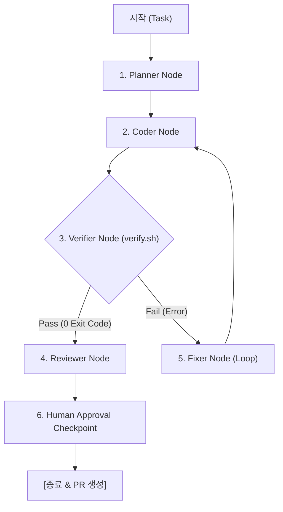

# 🤖 LangGraph 기반 에이전트 오케스트레이션 가이드 (LangGraph Guide)

> **`shinhan-gaecheokja` 프로젝트의 LangGraph StateGraph 에이전트 오케스트레이터 구현 및 활용 가이드북**

---

## 📑 목차
- [1. 개요 및 왜 LangGraph인가?](#1-개요-및-왜-langgraph인가)
- [2. LangGraph StateGraph 파이프라인 구조](#2-langgraph-stategraph-파이프라인-구조)
- [3. 노드(Node) 및 조건부 엣지(Edge) 정의](#3-노드node-및-조건부-엣지edge-정의)
- [4. 실전 실행 명령어](#4-실전-실행-명령어)

---

## 1. 개요 및 왜 LangGraph인가?

**LangGraph**는 AI 에이전트를 단순한 순차 실행이나 자유 루프가 아닌, **명시적인 상태 기반 그래프(StateGraph)** 형태로 구현할 수 있도록 돕는 에이전트 오케스트레이션 엔진입니다.



---

## 2. LangGraph StateGraph 파이프라인 구조

본 프로젝트의 LangGraph 오케스트레이터는 [`scripts/langgraph/agent_graph.py`](../scripts/langgraph/agent_graph.py)에 구현되어 있으며, 다음과 같은 `AgentState` 매개변수로 상태(State)를 영속 관리합니다:

```python
class AgentState(TypedDict):
    task: str
    code_changes: List[str]
    verify_logs: str
    fix_attempts: int
    max_fix_attempts: int
    status: str
    current_node: str
    history: List[str]
```

---

## 3. 노드(Node) 및 조건부 엣지(Edge) 정의

| 노드명 | 역할 및 기능 | 다음 전이 조건 |
| :--- | :--- | :--- |
| **`planner_node`** | 태스크 요구사항을 분석하고 개발 계획 수립 | ➔ `coder_node` |
| **`coder_node`** | 소스 코드 작성 및 리팩토링 진행 | ➔ `verifier_node` |
| **`verifier_node`** | `./scripts/verify.sh` 5단계 하네스 검증 실행 | **Pass:** ➔ `reviewer_node`<br>**Fail:** ➔ `fixer_node` (재시도 3회 미만) |
| **`fixer_node`** | 스택 트레이스 기반 에러 자가 치유(Auto-Fix) 실행 | ➔ `coder_node` (회귀 루프) |
| **`reviewer_node`** | 6대 관점 다차원 셀프 코드 리뷰 및 컨벤션 자산화 | ➔ `human_approval_node` |
| **`human_approval_node`** | 최종 사용자/리뷰어 승인 대기 체크포인트 | ➔ 작업 완료 및 PR 생성 |

---

## 4. 실전 실행 명령어

```bash
# LangGraph StateGraph 에이전트 오케스트레이터 실행
python3 scripts/langgraph/agent_graph.py "신규 API 구현 및 하네스 검증"
```
