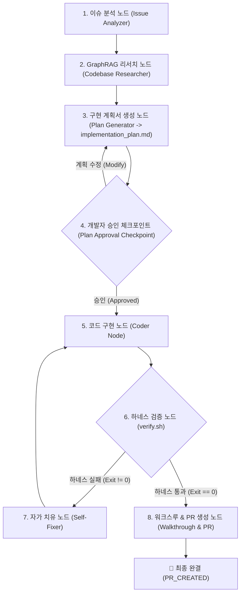

# 📋 LangGraph 기반 이슈 기획 & 자동화 워크플로우 가이드 (Planning Flow Guide)

> **`shinhan-gaecheokja` 프로젝트의 `/plan` 명령어를 LangGraph StateGraph 오케스트레이션 엔진으로 승화한 이슈 개발 파이프라인 가이드북**

---

## 📑 목차
- [1. 개요 및 구현 배경](#1-개요-및-구현-배경)
- [2. LangGraph 기획 엔진 8대 노드 다이어그램](#2-langgraph-기획-엔진-8대-노드-다이어그램)
- [3. 노드별 역할 및 체크포인트 기능](#3-노드별-역할-및-체크포인트-기능)
- [4. 실전 실행 명령어](#4-실전-실행-명령어)

---

## 1. 개요 및 구현 배경

기존 `/plan` 명령어는 단순한 단계별 프롬프트 지침에 의존했습니다. 이를 **LangGraph StateGraph 오케스트레이터([`scripts/langgraph/issue_plan_graph.py`](../scripts/langgraph/issue_plan_graph.py))**로 고도화하여 아래 4가지 혁신을 이뤄냈습니다:

1. **GraphRAG 연관 기술 자동 탐색:** 이슈 분석 시 지식 그래프를 탐색하여 파급되는 파일 및 규칙 자동 매핑
2. **계획서(`implementation_plan.md`) 자동 작성:** 기술 요구사항 및 하네스 검증 계획 자동 구조화
3. **명시적 개발자 승인 체크포인트 (Human-in-the-loop):** 계획서를 확인하고 승인(Approve)할 때까지 안전하게 대기
4. **하네스 검증 ➔ 자가치유 ➔ `walkthrough.md` & PR 자동 발행:** 0 exit code 통과 시 PR까지 완결

---

## 2. LangGraph 기획 엔진 8대 노드 다이어그램



---

## 3. 노드별 역할 및 체크포인트 기능

| 단계 | 노드명 | 주요 역할 |
| :--- | :--- | :--- |
| **1단계** | `issue_analyzer_node` | 이슈 번호 및 요구사항 범위 분석 (`Controller`, `Service` 등) |
| **2단계** | `codebase_researcher_node` | `GraphRAG` 지식 네트워크 탐색 및 `code-convention.md` 매핑 |
| **3단계** | `plan_generator_node` | `implementation_plan.md` 기술 설계 문서 자동 생성 |
| **4단계** | `plan_approval_checkpoint` | **개발자 최종 계획 승인 대기 (Human-in-the-loop)** |
| **5단계** | `coder_node` | 승인된 설계서에 따라 소스 코드 작성 및 리팩토링 |
| **6단계** | `harness_verifier_node` | `./scripts/verify.sh` 5단계 하네스 검증 실행 |
| **7단계** | `self_healing_fixer_node` | 테스트 실패 시 스택 트레이스 기반 자가 치유 (최대 3회) |
| **8단계** | `walkthrough_pr_node` | `walkthrough.md` 생성 및 GitHub PR 발행 |

---

## 4. 실전 실행 명령어

```bash
# 1. 이슈 번호만으로 GitHub Issue 정보를 자동 연동하여 LangGraph 기획 구동 (추천 ⭐)
./plan 108

# 2. 파이썬 스크립트로 구동
python3 scripts/langgraph/issue_plan_graph.py "108"
```
