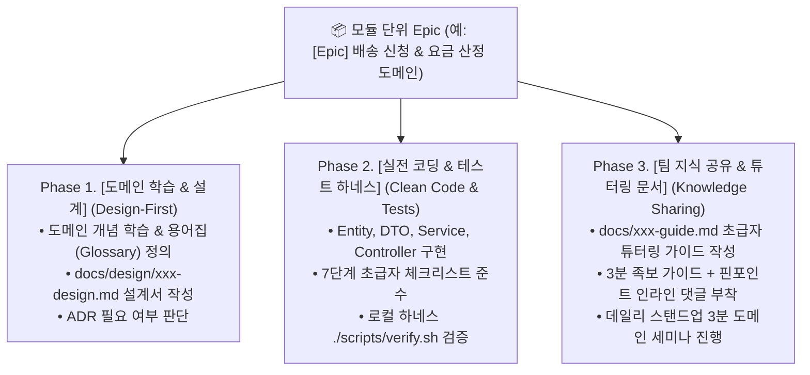

---
metadata:
  version: "1.0.0"
  ssot_owner: "docs/learning-oriented-issue-guide.md"
  last_updated: "2026-07-28"
  status: "APPROVED (SSOT Primary)"
---

# 🎓 학습 및 지식 공유형(Learning-Oriented) GitHub Issue 분할 & 관리 가이드북

이 문서는 `shinhan-gaecheokja` 프로젝트에서 **단순한 기능 구현을 넘어, 담당 팀원의 깊이 있는 기술 학습과 타 팀원들의 도메인 이해를 돕는 학습/지식 자산화 통합 이슈(Learning-Oriented Issue) 작성 규격**입니다.

> [!NOTE]
> 본 가이드북은 [docs/ssot-documentation-policy.md](./ssot-documentation-policy.md) 단일 원본 원칙과 [docs/junior-developer-task-guide.md](./junior-developer-task-guide.md) 초급자 7단계 가이드를 통합 준수합니다.

---

## 🏛️ 3단계 학습형 이슈 분할 구조 (3-Phase Issue Lifecycle)

모든 모듈 개발 이슈는 단순 코딩으로 끝나는 것이 아니라 **[설계/학습 ➔ 무결점 코딩 ➔ 지식 자산화/튜터링] 3단계**로 이슈를 분할하여 관리합니다:



---

## 📋 학습형 GitHub Issue 표준 마크다운 템플릿

앞으로 GitHub에 발급되는 모든 이슈는 타 팀원들이 읽는 것만으로도 도메인 지식을 배울 수 있도록 **아래 5대 구조**로 작성됩니다:

```markdown
## 📌 1. 이슈 제목 (Conventional Commits)
* **제목 형식:** `feat(#이슈번호): [모듈명] 상세 기능명`
* **예시:** `feat(#12): [배송신청] 거리 및 크기 가중치 기반 배송 요금 자동 산정 엔진 구현`

---

## 🎓 2. 학습 목표 (What Team Will Learn)
이 이슈를 수행하는 담당자 및 코드/문서를 읽는 타 팀원이 배우게 되는 핵심 지식:
- [ ] 거리/크기 가중치 요금 산정 알고리즘 및 도메인 비즈니스 로직
- [ ] JPA BigDecimal 단위 처리 및 정밀도 유효성 검사
- [ ] REST API 요금 산정 400 Bad Request 예외 처리 패턴

---

## 📖 3. Phase 1: 도메인 학습 & 설계 (Design-First)
- [ ] **도메인 용어집(Glossary) 정립:** `기본료`, `거리할증`, `크기할증`, `최종 결제예정액` 용어 정의
- [ ] **설계서 수록:** `docs/design/delivery-fee-design.md` 작성 (Mermaid 흐름도 수록)
- [ ] **ADR 검토:** 요금 산정 공식에 대한 아키텍처 의사결정 필요 여부 판단

---

## 💻 4. Phase 2: 실전 구현 & 무결점 게이트 (Clean Code & Tests)
- [ ] **DTO/Entity 구현:** Lombok `@Getter` 100% 사용, Entity 직접 반환 금지
- [ ] **Service/Controller 구현:** `BusinessException(ErrorCode.INVALID_DELIVERY_FEE)` 매핑
- [ ] **단위/통합 테스트:** 정상 요금 산정, 음수 거리 입력(400) 테스트 케이스 작성 (55개 테스트 패스)
- [ ] **로컬 하네스 검증:** `./scripts/verify.sh` 0 exit code 확인

---

## 📚 5. Phase 3: 팀 지식 공유 & 튜터링 (Knowledge-Sharing)
- [ ] **초급자 튜터링 문서 작성:** `docs/delivery-fee-guide.md` 작성 (타 팀원을 위한 눈높이 해설)
- [ ] **3분 족보 가이드 작성:** PR 오픈 시 `1분 서머리 + 추천 읽기 순서(Mermaid) + 체크리스트` 포함
- [ ] **핀포인트 인라인 댓글 연동:** PR `Files changed` 탭에서 핵심 요금 산정 로직 위 인라인 댓글 3개 부착
- [ ] **데일리 세미나 공유:** 아침 스탠드업 시 3분간 타 팀원들에게 핵심 도메인 개념 설명

---

## 🛡️ 수용 기준 (Acceptance Criteria)
1. `./scripts/verify.sh` 로컬 하네스가 100% 그린 빌드로 통과해야 합니다.
2. 타 팀원이 `docs/delivery-fee-guide.md` 문서를 읽고 요금 산정 구조를 이해할 수 있어야 합니다.
3. PR 3분 족보 가이드와 인라인 댓글이 부착되어야 이슈가 최종 Close됩니다.
```

---

## 💡 타 팀원의 도메인 이해를 돕는 3대 리뷰 & 공유 문화

1. **PR 3분 족보 가이드 + 인라인 댓글:**  
   - 타 팀원은 PR의 **[추천 파일 읽기 순서(Mermaid)]**와 **[핀포인트 인라인 댓글]**을 통해 코드를 직접 열어보지 않아도 핵심 설계와 비즈니스 로직을 배울 수 있습니다.
2. **데일리 스탠드업 3분 지식 공유 (3-Min Knowledge Share):**  
   - 매일 아침 스탠드업 시 당일 본인이 담당한 모듈의 핵심 도메인 개념(예: *"오늘은 포인트 지갑의 충전/차감 멱등성 처리 방식을 개발했습니다"*)을 3분간 공유합니다.
3. **가이드북 튜터링 문서(`docs/xxx-guide.md`):**  
   - 작성된 가이드북은 타 팀원이 해당 모듈과 연동 개발할 때 공식 교재로 활용됩니다.

---

## 🧪 실증 검증 명령어 (Verification Commands)

```bash
# 로컬 전체 검증 하네스 구동
./scripts/verify.sh
```
