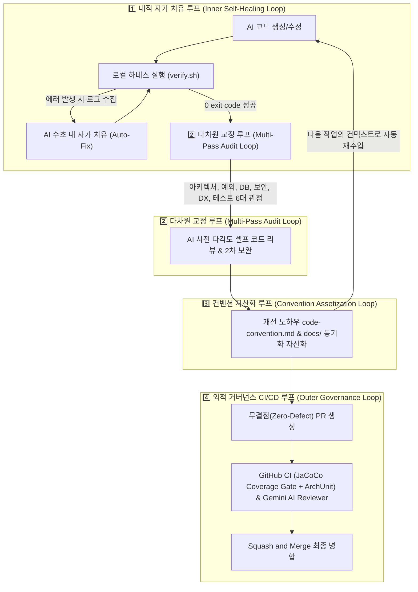

# 🤖 LLM 기반 현대 소프트웨어 엔지니어링 방법론 입문 가이드

이 문서는 **AI(LLM, Large Language Model) 및 AI 에이전트 도구를 활용해 소프트웨어를 개발할 때 필요한 현대적 개발 방법론**을 초보자의 눈높이에 맞춰 체계적으로 정리한 가이드북입니다.

---

## 📌 목차
1. [왜 이 기술들을 써야 할까요? (Core WHY)](#1-왜-이-기술들을-써야-할까요-core-why)
2. [AI 시대의 개발 패러다임 변화](#2-ai-시대의-개발-패러다임-변화)
3. [1️⃣ 프롬프트 엔지니어링 (Prompt Engineering)](#3-1️⃣-프롬프트-엔지니어링-prompt-engineering)
4. [2️⃣ 컨텍스트 엔지니어링 (Context Engineering)](#4-2️⃣-컨텍스트-엔지니어링-context-engineering)
5. [3️⃣ 하네스 엔지니어링 (Harness Engineering)](#5-3️⃣-하네스-엔지니어링-harness-engineering)
6. [4️⃣ 피드백 루프 & 자가 치유 (Feedback Loops & Self-Healing)](#6-4️⃣-피드백-루프--자가-치유-feedback-loops--self-healing)
7. [5️⃣ 에이전트 방법론 & 디자인 패턴 (Agentic Workflows & EDD)](#7-5️⃣-에이전트-방법론--디자인-패턴-agentic-workflows--edd)
8. [6️⃣ 보안 및 데이터 프라이버시 (Security & Privacy)](#8-6️⃣-보안-및-데이터-프라이버시-security--privacy)
9. [7️⃣ AI 환각(Hallucination) 대처법 및 클린코드 원칙](#9-7️⃣-ai-환각hallucination-대처법-및-클린코드-원칙)
10. [8️⃣ 초보자를 위한 AI 트러블슈팅 치트시트](#10-8️⃣-초보자를-위한-ai-트러블슈팅-치트시트)

---

## 1. 왜 이 기술들을 써야 할까요? (Core WHY)

소프트웨어 개발에서 가장 중요한 것은 **"왜(WHY) 이 개념을 도입했는가?"**를 아는 것입니다.

```
┌─────────────────────────────────────────────────────────────────────────────┐
│  1. LLM 활용 개발     ──▶ 개발 속도 및 생산성 10배 향상                       │
│  2. 프롬프트 엔지니어링 ──▶ AI에게 "정확한 지시"를 내려 원하는 코드 획득        │
│  3. 컨텍스트 엔지니어링 ──▶ AI에게 "꼭 필요한 프로젝트 맥락"만 스마트하게 주입   │
│  4. 하네스 엔지니어링   ──▶ AI가 만든 코드를 "안전하게 자동 검증"하는 울타리    │
│  5. 루프 엔지니어링    ──▶ AI-하네스-지식자산화 간 "자율 피드백 순환 구조" 설계 │
└─────────────────────────────────────────────────────────────────────────────┘
```

| 개념 | 왜(WHY) 사용하는가? | 미사용 시 발생하는 참사 (Bad Scenario) |
| :--- | :--- | :--- |
| **🤖 LLM 활용 개발** | 단순/반복 코딩은 AI에 맡기고, 사람은 **설계와 로직 검증에 집중**하여 개발 속도를 10배 올리기 위해 | 단순 코드 타이핑에 수일이 걸리고 기술 문서를 찾느라 개발 피로도 극심 |
| **✍️ 프롬프트 엔지니어링** | AI에게 모호하게 시키면 쓸모없는 코드가 나오므로, **내 의도와 원하는 출력에 100% 부합하는 답을 얻기 위해** | AI가 프로젝트 규칙과 안 맞는 코드를 엉뚱하게 짜서 고치느라 시간이 더 걸림 |
| **🧠 컨텍스트 엔지니어링** | AI의 메모리(Context Window)는 한계가 있으므로, **엉뚱한 정보나 낭비 없이 핵심 코드/규칙만 핀포인트로 전달하기 위해** | 프로젝트 전체 코드를 다 집어넣어 AI가 환각에 빠지거나 중요한 지시사항을 무시함 |
| **🏗️ 하네스 엔지니어링** | AI는 자신 있게 틀린 코드(환각)를 짜기도 함. 이를 **자동으로 감지하고 막아주는 안전한 검사 울타리를 구축하기 위해** | AI가 짠 버그 있는 코드가 그대로 배포되어 실제 서비스 장애로 이어짐 |
| **🔄 루프 엔지니어링** | 단발성 검사를 넘어 **[자가치유 ➔ 다차원교정 ➔ 컨벤션자산화] 4대 피드백 순환 고리를 자율 오케스트레이션하기 위해** | AI가 매번 같은 실수를 반복하고 지적받은 내용을 문서나 다음 작업에 이식하지 못함 |

---

## 2. AI 시대의 개발 패러다임 변화

과거에는 개발자가 코드를 **직접 한 땀 한 땀 작성하는 것(Code Writing)**이 핵심 업무였다면, AI 시대에는 **"AI가 고품질 코드를 작성하도록 판을 깔아주고, 검증하고, 디렉팅하는 것(Code Orchestration & Verification)"**으로 개발자의 역할이 변화하고 있습니다.

이 변화를 주도하는 5대 엔진이 바로 **프롬프트 엔지니어링, 컨텍스트 엔지니어링, 하네스 엔지니어링, 피드백 루프, 에이전트 워크플로우**입니다.

---

## 3. 1️⃣ 프롬프트 엔지니어링 (Prompt Engineering)

### 💡 개념
AI(LLM)에게 원하는 정답을 얻어내기 위해 **지시문(Prompt)의 구조, 역할, 생각의 과정을 최적화하는 기술**입니다.

### 🛠️ 4대 핵심 프롬프트 패턴
1. **Persona / Role Pattern (역할 부여):** "너는 10년 차 Senior Java Architect야."
2. **Context Injection (문맥 주입):** "우리 프로젝트는 Controller에서 Repository를 직접 부를 수 없어."
3. **Few-Shot Prompting (입출력 예시 제공):** 1~2개의 바람직한 코드 수정을 예시로 먼저 보여주기.
4. **Chain-of-Thought (CoT, 단계별 사고 유도):** "바로 코드를 짜지 말고 1) 클래스 목록, 2) 데이터 흐름을 먼저 정돈한 뒤 코드를 짜줘."

---

## 4. 2️⃣ 컨텍스트 엔지니어링 (Context Engineering)

### 💡 개념
AI의 작업 기억 공간인 **컨텍스트 윈도우(Context Window)**에 **"어떤 정보를, 어떤 순서로, 얼마나 정제하여 주입할 것인가"를 관리하는 기술**입니다.

> 💡 **비유:** 시험을 보는 학생(AI)에게 두꺼운 백과사전 전체를 던져주는 대신, **시험 문제와 직결된 1장짜리 족보 요약본(Context)**만 요약 정리해서 집어주는 과정입니다.

### 🧱 컨텍스트 엔지니어링의 4대 핵심 기법
1. **Context Selection & Filtering:** 수정 대상 파일과 직접 관련된 클래스/인터페이스 시그니처만 추출 주입 (RAG/AST 기반)
2. **Context Compression:** 몇 천 줄 코드를 보이지 않고 핵심 인터페이스 규격만 요약 주입
3. **Context File Conventions:** `CLAUDE.md`, `code-convention.md` 등의 인프라 룰북 배치
4. **Context Pruning:** 대화가 길어질 때 토큰 윈도우를 정리하고 핵심 기억만 유지

---

## 5. 3️⃣ 하네스 엔지니어링 (Harness Engineering)

### 💡 개념
**하네스(Harness)**는 AI가 자유롭게 코드를 짜더라도 **"절대로 프로젝트를 망가뜨리지 못하게 막아주고, 작성된 코드가 정답인지 안전하게 테스트해 주는 인프라/환경"**을 설계하는 엔지니어링입니다.

### 🧱 하네스의 3가지 구성 요소
1. **Context Harness (문맥 하네스):** AI 행동 지침 파일 (`CLAUDE.md`, `code-convention.md`).
2. **Execution & Test Harness (실행/테스트 하네스):** 코드 포맷터(Spotless), ArchUnit 아키텍처 검사기, 통합 스크립트 (`./scripts/verify.sh`).
3. **Eval Harness (평가 하네스):** AI 코드가 정확도/성능/보안 기준을 충족하는지 자동 평가하는 체계.

---

## 6. 4️⃣ 루프 엔지니어링 & 피드백 순환 구조 (Loop Engineering & Feedback Loops)

### 💡 개념: 루프 엔지니어링(Loop Engineering)이란?
단발성 프롬프트 작성(Prompt)이나 개별 검사 도구(Harness) 구축을 넘어, **[AI 자가 코드 생성 $\rightarrow$ 하네스 자동 검증 $\rightarrow$ 자가 치유(Self-Healing) $\rightarrow$ 다차원 교정(Multi-Pass Audit) $\rightarrow$ 컨벤션 지식 자산화]로 이어지는 4대 자율 순환 루프(Loop)를 종합 설계하고 제어하는 최상위 AI 시스템 아키텍처 방법론**입니다.



### 🔄 루프 엔지니어링의 4대 핵심 순환 루프 (The 4 Pillars of Loop Engineering)

1. **🔄 1️⃣ 내적 자가 치유 루프 (Inner Self-Healing Loop):**
   * **원리:** `AI 코드 생성` $\rightarrow$ `로컬 하네스(verify.sh) 실행` $\rightarrow$ `에러 로그 분석` $\rightarrow$ `AI 자가 수정(Auto-Fix)` $\rightarrow$ `0 exit code 달성 시까지 자율 반복`
   * **목적:** 사람의 정답 확인 없이 로컬에서 컴파일 및 테스트 100% 그린 상태를 자동 도출.

2. **🔍 2️⃣ 다차원 교정 다중 루프 (Multi-Pass Audit Loop):**
   * **원리:** 1차 그린 빌드 달성 후 멈추지 않고, **6대 프로젝트 관점(아키텍처 순수성, 비즈니스 예외 안전성, DB 마이그레이션, 보안, 개발자 경험, 테스트 유의미성)**에서 AI가 스스로 다각도 교정을 2차, 3차 탐색.
   * **목적:** 눈에 보이지 않는 오버 엔지니어링이나 숨은 부작용(Side-effect)을 사전에 스스로 발굴하여 제거.

3. **📚 3️⃣ 컨벤션 자산화 선순환 루프 (Convention Assetization Loop):**
   * **원리:** 코드 수정 및 AI 리뷰 과정에서 얻은 새로운 해결책과 패턴 노하우를 단회성 작업으로 끝내지 않고 **`code-convention.md` 및 `docs/` 가이드 문서에 즉시 동기화 ➔ 다음 대화의 컨텍스트(Context)로 자동 재주입**
   * **목적:** AI가 동일한 실수를 반복하거나 지적받았던 내용을 잊어버리는 현상을 근본적으로 차단.

4. **🛡️ 4️⃣ 외적 거버넌스 CI/CD 루프 (Outer Governance Loop):**
   * **원리:** `로컬 무결점 PR` $\rightarrow$ `GitHub Actions CI (JaCoCo Coverage Gate + ArchUnit)` $\rightarrow$ `Gemini AI Reviewer` $\rightarrow$ `Squash and Merge`로 연결되는 안전망 연동.
   * **목적:** 메인 브랜치에 단 1개의 결함도 유입되지 않도록 원격 3중 안전 장치 보장.

---

## 7. 5️⃣ 에이전트 방법론 & 디자인 패턴 (Agentic Workflows & EDD)

### 🤖 1) 에이전틱 디자인 패턴 (Agentic Patterns)
* **Planning (작업 분할):** 한 번에 구현하지 않고 [설계 $\rightarrow$ 코드 $\rightarrow$ 검증] 단계를 나눔.
* **Reflection (반성 및 자가 검토):** 자신이 만든 코드를 제출하기 전에 오류가 없는지 다시 검토.
* **Tool Use (도구 활용):** 터미널 명령어, 커널, 린터, 브라우저 등의 외부 도구를 자유자재로 실행.
* **Multi-Agent Collaboration (다중 에이전트 협업):** 기획 에이전트, 코더 에이전트, 리뷰어 에이전트가 역할을 나누어 소통.

### 🧪 2) 평가 기반 개발 (Eval-Driven Development, EDD)
* 개발자가 먼저 **검증 테스트 케이스(Eval/Test Harness)를 작성**해 둔 뒤, AI에게 **"이 검증을 통과하는 코드를 작성하라"**고 지시하여 정답율을 100%로 끌어올리는 기법.

---

## 8. 6️⃣ 보안 및 데이터 프라이버시 (Security & Privacy)

AI 도구를 사용할 때 가장 조심해야 할 2가지 보안 수칙입니다.

1. **API Key & 비밀번호 절대 주입 금지:** 
   - DB 비밀번호, API 토큰 등은 절대 AI 대화창이나 파일에 하드코딩하지 말고 `.env` 파일로 관리해야 합니다.
2. **기업 기밀 & 개인정보(PII) 보호:**
   - 회사의 기밀 코드나 실제 고객 개인정보가 외부 AI 모델의 학습 데이터로 유출되지 않도록 **Zero Data Retention(데이터 미저장) 옵션**이 적용된 에이전트/API를 사용합니다.

---

## 9. 7️⃣ AI 환각(Hallucination) 대처법 및 클린코드 원칙

### 👻 AI 환각(Hallucination)이란?
AI가 존재하지 않는 가짜 라이브러리 패키지를 추천하거나, 오래전에 없어진 폐기된(Deprecated) 메서드를 진짜인 것처럼 우기며 코드를 작성하는 현상입니다.

### 🛡️ 대처법
* **하네스 검증:** AI가 준 코드를 무작정 믿지 말고 항상 `./scripts/verify.sh`로 컴파일 및 테스트를 돌립니다.
* **클린코드(SOLID) 지침 주입:** AI에게 *"단일 책임 원칙(SRP)을 지키고, 20줄 이하의 작은 메서드로 쪼개서 작성해 줘"* 라고 구체적으로 요구하면 품질이 극상승합니다.

---

## 10. 8️⃣ 초보자를 위한 AI 트러블슈팅 치트시트

AI와 대화하다가 이상해졌을 때 대처하는 4가지 꿀팁입니다.

| 현상 | 원인 | 해결책 |
| :--- | :--- | :--- |
| **AI가 말을 안 듣고 엉뚱한 코드를 반복해요** | 대화가 너무 길어져 컨텍스트 오염 발생 | 대화 세션을 초기화(Reset)하고 새로 시작하세요. |
| **AI가 계속 똑같은 에러를 수정 못해요** | 에러 로그 원인이 불충분함 | `./gradlew test --stacktrace` 전체 로그를 AI에게 보여주세요. |
| **AI가 프로젝트 규칙을 자꾸 잊어버려요** | 룰북 위치 인식 못함 | `"CLAUDE.md 및 code-convention.md 규칙을 재확인하고 고쳐줘"` 라고 지시하세요. |
| **모든 검증을 마치고 마무리를 하고 싶어요** | - | 터미널에 **`./pr`** 단 한 줄만 입력하면 커밋부터 PR까지 자동 완료됩니다! |

---

## 11. 🔰 9️⃣ 처음 LLM으로 개발하는 초보자를 위한 10분 실전 입문 가이드라인

AI(LLM) 도구를 처음 접하는 신입 개발자나 입문자가 **가장 자주 범하는 3대 실수와 백전백승 실전 지침**입니다.

### 💡 1. 초보 개발자 3대 실수 & Before / After 지침

#### ❌ 실수 1: 한 번에 거대한 기능 전체를 다 짜달라고 요구하기
- **Bad (Before):** *"스프링 부트로 회원가입이랑 로그인, 포인트 결제 기능까지 전부 다 짜줘."*
- **Good (After - 단계별 분할):** *"먼저 `Member` 엔티티와 DTO 규격만 정돈해줘. 컴파일 확인 후 서비스 계층 구현으로 넘어가자."*
- **👉 이유:** AI는 한 번에 너무 많은 코드를 짜면 중반부 이후 집중력이 떨어져 메서드를 생략하거나 오타를 냅니다.

#### ❌ 실수 2: AI가 준 코드를 무작정 복사-붙여넣기
- **Bad (Before):** 빌드 에러가 나는데도 AI가 답변한 코드를 그대로 복사해서 계속 덮어씌움.
- **Good (After - 하네스 자가치유):** 터미널에 `./scripts/verify.sh`를 구동하고, 에러 스택트레이스를 AI에게 보여주어 자가 치유(Auto-Fix)를 유도함.
- **👉 이유:** 사람이 에러를 직접 고치려고 헤매는 것보다, 에러 로그를 AI에게 다시 보여주는 피드백 루프가 10배 빠릅니다.

#### ❌ 실수 3: 대화창 하나에서 3시간 동안 끊임없이 대화하기
- **Bad (Before):** 대화 내용이 수십 페이지 쌓여 AI가 프로젝트 컨벤션을 잊어버리고 엉뚱한 코드를 짜기 시작함.
- **Good (After - 컨텍스트 리셋):** 기능 1개가 완료되어 `./scripts/verify.sh`가 통과되면 대화 세션을 리셋(New Chat)하고 새로 시작함.

---

### 📖 2. 초보자를 위한 1초 용어 번역기 (쉬운 용어 해설)

| 전문 용어 | 쉽게 말하자면? | 이 프로젝트에서의 의미 |
| :--- | :--- | :--- |
| **프롬프트 (Prompt)** | AI에게 내리는 **"작업 지시서"** | `"MemberService 단위 테스트 작성해 줘"`와 같은 지시문 |
| **컨텍스트 (Context)** | AI가 지금 기억하고 있는 **"작업 메모리"** | AI 대화창에 들어있는 `code-convention.md`와 소스 파일 |
| **하네스 (Harness)** | AI 코드가 안전한지 검사하는 **"자동 안전 울타리"** | `./scripts/verify.sh` (Spotless, ArchUnit, JaCoCo, 테스트) |
| **자가 치유 (Self-Healing)** | 검사 오류를 AI가 수초 만에 **스스로 고치는 과정** | 테스트 실패 로그를 AI가 읽고 코드를 자동 보정하는 동작 |
| **루프 (Loop)** | 작업이 톱니바퀴처럼 **스스로 순환 돌아가는 구조** | [코드작성 ➔ 검사 ➔ 자가치유 ➔ 자산화] 자율 반복 |

---

### 📋 3. 초보자가 복사해서 바로 쓰는 실전 프롬프트 템플릿 3종

#### 템플릿 A: 신규 기능 개발 요청 시
> "너는 최고 수준의 Java/Spring Boot 개발자야.  
> `Member` 도메인에 이메일 중복 검사 기능을 추가하고 싶어.  
> 1) `code-convention.md` 규칙을 준수하고  
> 2) `Controller`에서 `Repository`를 직접 부르지 말고  
> 3) 서비스 계층 예외는 `BusinessException(ErrorCode.DUPLICATE_EMAIL)`을 던지도록 코드를 작성해 줘."

#### 템플릿 B: 에러 발생 시 자가 치유 요청 시
> "방금 `./scripts/verify.sh`를 실행했는데 아래 에러가 발생했어.  
> 추측으로 고치지 말고, 아래 스택트레이스의 정확한 원인을 진단한 뒤 최소한의 정교한 수정 코드를 제공해 줘:  
> [에러 스택트레이스 복사/붙여넣기]"

#### 템플릿 C: 코드 수정을 마친 뒤 자산화 요청 시
> "방금 반영한 예외 처리 구조나 아키텍처 패턴 중 팀원들이 알아야 할 내용이 있다면,  
> 초급 개발자의 눈높이에 맞추어 `code-convention.md` 및 `docs/` 가이드 문서에 동기화할 마크다운 텍스트를 정리해 줘."
