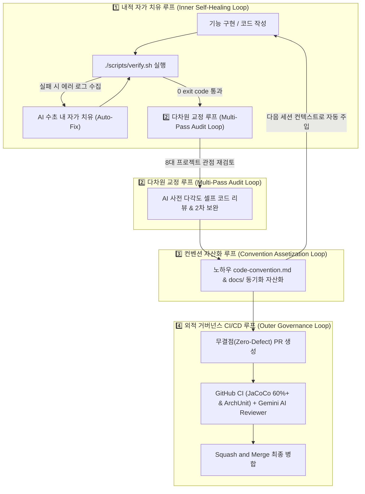

# 🔄 프로젝트 루프 엔지니어링(Loop Engineering) 실전 플레이북

이 문서는 **shinhan-gaecheokja** 프로젝트에서 인간 개발자와 AI 에이전트(Antigravity, Cursor, Claude, Copilot 등)가 협업할 때 사수해야 하는 **루프 엔지니어링 기반 실전 운영 절차(Playbook)**입니다.

---

## 📌 목차
1. [루프 엔지니어링 핵심 개요](#1-루프-엔지니어링-핵심-개요)
2. [1️⃣ 내적 자가 치유 루프 (Inner Self-Healing Loop)](#2-1️⃣-내적-자가-치유-루프-inner-self-healing-loop)
3. [2️⃣ 다차원 교정 다중 루프 (Multi-Pass Audit Loop)](#3-2️⃣-다차원-교정-다중-루프-multi-pass-audit-loop)
4. [3️⃣ 컨벤션 지식 자산화 루프 (Convention Assetization Loop)](#4-3️⃣-컨벤션-지식-자산화-루프-convention-assetization-loop)
5. [4️⃣ 외적 거버넌스 CI/CD 루프 (Outer Governance Loop)](#5-4️⃣-외적-거버넌스-cicd-루프-outer-governance-loop)
6. [💡 AI 에이전트 전용 행동 체크리스트](#6-💡-ai-에이전트-전용-행동-체크리스트)

---

## 1. 루프 엔지니어링 핵심 개요

우리 프로젝트의 모든 개발 및 리팩토링은 **4대 자율 순환 루프(Loop)**를 거쳐 100% 그린 빌드가 입증된 무결점(Zero-Defect) 상태로만 병합됩니다.

---

## 2. 1️⃣ 내적 자가 치유 루프 (Inner Self-Healing Loop)

* **목표:** 개발자가 정답 여부를 판단하지 않아도, 로컬 하네스가 컴파일 및 테스트 100% 성공을 자동 도출합니다.
* **실행 명령어:** `./scripts/verify.sh` (또는 터미널 `./pr`)
* **자가 치유 5단계 동작:**
  1. **Flyway 마이그레이션 린트:** 파일명 오타 및 DDL 락 구문 검사
  2. **Spotless 포맷팅:** Google Java Style 자동 교정 (`./gradlew spotlessApply`)
  3. **ArchUnit 검증:** 계층 의존성 위반 (`Controller` ➔ `Repository` 직접 참조 등) 차단
  4. **JaCoCo Quality Gate:** 서비스 계층 테스트 커버리지 60% 이상 준수 검증
  5. **46개전체 테스트 전수 검증:** JUnit5 / Mockito 단위 및 통합 테스트 성공 확인

---

## 3. 2️⃣ 다차원 교정 다중 루프 (Multi-Pass Audit Loop)

1차 로컬 하네스를 통과했더라도 멈추지 않고 아래 **세계 최고 IT 전문가 수준 8대 관점**에서 스스로 다각도 교정을 수행합니다:

1. **아키텍처 순수성:** Controller가 DTO만 다루며 Entity를 외부 노출하지 않는가?
2. **비즈니스 예외 안전성:** 공통 `EntityNotFoundException` + `ErrorCode` Enum 매핑이 올바른가?
3. **DB & Flyway 무중단 수칙:** Online DDL 옵션(`INPLACE`, `LOCK=NONE`)을 준수했는가?
4. **다층 방어 보안:** 비밀번호/Secret 노출 차단, BCrypt 및 XSS/SQL Injection 방어가 적용되었는가?
5. **개발자 경험(DX):** Mac/Windows 하네스 실행 및 초급자 설명 문서가 구비되었는가?
6. **테스트 유의미성:** 단순히 개수만 채우는 테스트가 아닌, 회귀 버그를 방지하는 실질적 테스트인가?
7. **무상태성 및 멱등성:** 공유 인스턴스 필드가 없으며, 동시성 환경에서도 멱등성이 보장되는가?
8. **하위 호환성:** 기존 응답 DTO 규격 및 API 계약을 파괴하지 않는가?

---

## 4. 3️⃣ 컨벤션 지식 자산화 루프 (Convention Assetization Loop)

코드 수정 및 리뷰에서 얻은 기술 노하우를 일회성 커밋으로 끝내지 않고 저장소에 **영구 적재**하는 선순환 구조입니다.

* **동기화 1:** 프로젝트 작성 규격 갱신 ➔ [code-convention.md](file:///Users/sungminjo/workspace/shinhan/shinhan-gaecheokja/code-convention.md)
* **동기화 2:** 초급자 튜터링 가이드 작성 ➔ [docs/](file:///Users/sungminjo/workspace/shinhan/shinhan-gaecheokja/docs/)
* **동기화 3:** AI 에이전트 수칙 반영 ➔ [AGENTS.md](file:///Users/sungminjo/workspace/shinhan/shinhan-gaecheokja/AGENTS.md)

---

## 5. 4️⃣ 외적 거버넌스 CI/CD 루프 (Outer Governance Loop)

원격 저장소 PR 생성 시 **3중 안전망**이 작동합니다:
1. **GitHub Actions CI:** JaCoCo Coverage Gate (60%+) 및 ArchUnit 자동 빌드 검증
2. **Gemini AI Reviewer:** 원격 PR 1차 리뷰 코멘트 자동 작성 (재요청 시 `/review` 댓글 전송)
3. **Squash and Merge:** 깨끗한 메인 히스토리 유지를 위한 압축 병합

---

## 6. 💡 AI 에이전트 전용 행동 체크리스트

모든 AI 에이전트는 본 프로젝트 작업 시 아래 수칙을 반드시 이행해야 합니다:

- [ ] 작업 완료 전 반드시 `./scripts/verify.sh`를 실행하여 0 exit code를 확인했는가?
- [ ] 신규 기능/패턴 변경 시 `code-convention.md`와 `docs/` 문서를 동기화했는가?
- [ ] PR 생성 시 `.github/pull_request_template.md` 마크다운 서식을 그대로 파싱하여 작성했는가?
