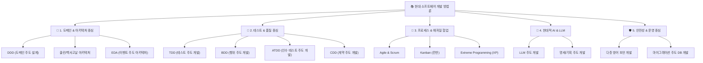

---
metadata:
  version: "1.0.0"
  ssot_owner: "docs/methodologies/README.md"
  last_updated: "2026-07-31"
  status: "APPROVED (SSOT Primary)"
---

# 📚 현대 소프트웨어 개발 방법론 & 설계·테스트 기법 종합 학습 가이드북

이 가이드북은 `shinhan-gaecheokja` 프로젝트 팀원 및 입문자가 **도메인 설계, 테스트 기법, 애자일 협업, AI 활용 개발 및 보안 방어 수칙**을 체계적으로 익히고 실무에 즉시 적용할 수 있도록 정리된 **14대 현대 소프트웨어 개발 방법론 총서**입니다.

---

## 🗺️ 14대 개발 방법론 전체 내비게이션 맵 (Methodology Index)

---

## 📖 주제별 상세 학습 문서 목록 (Detailed Learning Index)

### 🎯 1. 도메인 & 아키텍처 중심 개발 방법론 (Domain & Architecture-Driven)
* 📘 [**DDD (Domain-Driven Design, 도메인 주도 설계) 가이드**](./ddd.md)
  - 유비쿼터스 언어, Bounded Context, Aggregate, Entity vs VO 설계 및 도메인 격리 수칙.
* 📘 [**Clean & Hexagonal Architecture (클린/헥사고날 아키텍처) 가이드**](./clean-architecture.md)
  - 포트와 어댑터(Port & Adapter) 패턴, 의존성 역전 원칙(DIP) 및 비즈니스 로직 순수성 보장.
* 📘 [**EDA (Event-Driven Architecture, 이벤트 주도 아키텍처) 가이드**](./event-driven.md)
  - 이벤트를 통한 서비스 디커플링, 최종 일관성(Eventual Consistency) 및 Pub/Sub 메시징 패턴.

### 🧪 2. 테스트 & 품질 중심 개발 방법론 (Test & Quality-Driven)
* 📘 [**TDD (Test-Driven Development, 테스트 주도 개발) 가이드**](./tdd.md)
  - Red ➔ Green ➔ Refactor 사이클, 방어적 코드 작성 및 결함 0개 사수 실천법.
* 📘 [**BDD (Behavior-Driven Design, 행위 주도 개발) 가이드**](./bdd.md)
  - Given - When - Then 시나리오 작성법, 비즈니스 요구사항과 검증 테스트의 일치화.
* 📘 [**ATDD (Acceptance Test-Driven Development, 인수 테스트 주도 개발) 가이드**](./atdd.md)
  - 사용자 인수 조건(Acceptance Criteria) 정의 및 MockMvc/RestAssured 자동화 인수 테스트.
* 📘 [**Contract-Driven Development (계약 주도 개발) 가이드**](./cdd.md)
  - OpenAPI/Swagger 및 Consumer-Driven Contract 기반 프론트엔드/백엔드 병렬 협업.

### 🔄 3. 프로세스 & 애자일 협업 (Agile & Team Process)
* 📘 [**Agile & Scrum (애자일 & 스크럼) 프레임워크 가이드**](./agile-scrum.md)
  - 2주 스프린트, 데일리 스크럼, 스프린트 리뷰 및 회고(Retrospective) 운용 기법.
* 📘 [**Kanban (칸반) 파이프라인 가이드**](./kanban.md)
  - WIP(Work In Progress) 제한, 개발 병목 시각화 및 리드타임 최적화.
* 📘 [**Extreme Programming (XP, 익스트림 프로그래밍) 실천 가이드**](./xp.md)
  - 페어 프로그래밍, 지속적 통합(CI), 잦은 릴리스 및 코드 소유권 공유.

### 🤖 4. 현대적 AI & LLM 개발 방법론 (AI-Augmented & Modern Engineering)
* 📘 [**LLM-Driven Development (LLM 주도 개발) 가이드**](./llm-driven-development.md)
  - AI 에이전트와 페어 프로그래밍, 프롬프트 주입 및 테스트 하네스 자가 치유 피드백 루프.
* 📘 [**Spec / Plan-Driven Development (명세/기획 주도 개발) 가이드**](./spec-driven-development.md)
  - 코드 작성 전 4대 설계 산출물 작성, LangGraph `/plan` 워크플로우를 통한 무결점 설계.

### 🛡️ 5. 안전성 & 운영 중심 (DevOps & Security)
* 📘 [**Defense-in-Depth / Security-First Development (다층 방어 보안 개발) 가이드**](./defense-in-depth.md)
  - 입력값 Validation, OWASP Top 10 방어, Secret/개인정보 유출 방지 샌드박싱.
* 📘 [**Migration-Driven Development (마이그레이션 주도 DB 개발) 가이드**](./migration-driven-development.md)
  - Flyway 버전 관리, 무중단 Online DDL 마이그레이션 및 데이터 무결성 보수 수칙.
