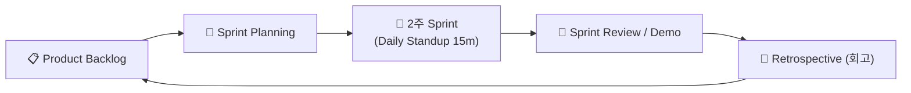

---
metadata:
  version: "1.0.0"
  ssot_owner: "docs/methodologies/agile-scrum.md"
  last_updated: "2026-07-31"
  status: "APPROVED"
---

# 🔄 Agile & Scrum (애자일 & 스크럼) 학습 가이드

이 문서는 `shinhan-gaecheokja` 프로젝트에서 **짧은 개발 주기(Sprint)를 통해 변경에 유연하게 대응하고 지속적인 피드백과 동반 성장을 이끄는 애자일 & 스크럼** 방법론의 가이드북입니다.

---

## 📌 1. 애자일 & 스크럼이란 무엇인가? (WHY)

거대한 방포식 폭포수(Waterfall) 모델은 수개월 후 결과물이 나와 시장 요구와 어긋나거나 위험이 뒤늦게 터지는 단점이 있습니다.

스크럼은 **2주 단위의 반복 주기(Sprint) 동안 계획 ➔ 개발 ➔ 리뷰 ➔ 회고를 수행**하여 가장 가치 있는 기능을 신속하게 검증하고 제공하는 프레임워크입니다.

---

## 📐 2. 스크럼 4대 핵심 미팅 & 운용 지침

### ① 🎯 Sprint Planning (스프린트 계획)
- 2주 동안 팀이 달성할 목표(Sprint Goal)를 수립하고 백로그 항목을 선택합니다.

### ② ☕ Daily Scrum / Standup (데일리 스크럼)
- 매일 아침 15분 동안 서서 진행: "어제 한 일", "오늘 할 일", "진행 중 장애 요소(Blocker)" 공유.

### ③ 🎉 Sprint Review (스프린트 리뷰)
- 완성된 신규 기능 소프트웨어를 팀원 및 이해관계자에게 데모하고 피드백 수용.

### ④ 🌱 Retrospective (회고 - KPT/5 Whys)
- **Keep(잘해서 유지할 점), Problem(개선할 점), Try(다음 스프린트에 시도할 점)** 도출.

---

## 💻 3. 우리 프로젝트 실천 수칙

우리 프로젝트의 팀 문화 및 회고 규칙은 [docs/engineering-culture-and-working-style.md](../engineering-culture-and-working-style.md)와 [docs/team-operating-model-guide.md](../team-operating-model-guide.md)에 상세히 표준화되어 있습니다.

- **비난 없는 심리적 안전지대사수:** 실패나 버그 발생 시 인물이 아닌 시스템 프로세스를 개선합니다.
- **15분 질문 룰:** 혼자 막혀서 15분 이상 해결되지 않으면 지체 없이 팀원에게 공유합니다.
