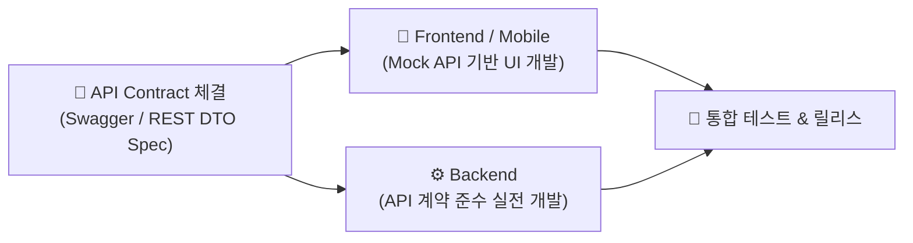

---
metadata:
  version: "1.0.0"
  ssot_owner: "docs/methodologies/cdd.md"
  last_updated: "2026-07-31"
  status: "APPROVED"
---

# 📜 Contract-Driven Development (계약 주도 개발) 학습 가이드

이 문서는 `shinhan-delivery` 프로젝트에서 **프론트엔드와 백엔드 간, 혹은 마이크로서비스 간 REST API 명세 계약(Contract)을 미리 체결하고 독립적으로 병렬 개발하는 계약 주도 개발** 방법론의 가이드북입니다.

---

## 📌 1. 계약 주도 개발이란 무엇인가? (WHY)

백엔드 개발이 끝날 때까지 프론트엔드가 기다리거나, 개발 도중 API 응답 필드명이 변경되어 UI가 연쇄적으로 깨지는 현상을 차단하기 위해 **API 계약(OpenAPI / Swagger Spec / DTO 규격)을 사전에 정의하고 공유**한 뒤 개발을 집행하는 방식입니다.



---

## 📐 2. 계약 사전 4대 정의 요소 (Core Contract Elements)

1. **Endpoint & HTTP Method:** URL 경로 및 자원 조작 행위 (`GET /api/categories`, `POST /api/deliveries`).
2. **Request / Response DTO Schema:** 필드명, 데이터 타입, 필수(Required) 여부.
3. **HTTP Status Code:** 성공(200, 201), 예외(400, 401, 403, 404, 409).
4. **Error Response Schema:** 전역 예외 처리 규격 DTO (`ErrorCode`, `message`, `timestamp`).

---

## 💻 3. 우리 프로젝트 사전 API 명세 계약 예시

[docs/REST-API-설계-규격-가이드.md](../REST-API-설계-규격-가이드.md) 및 Swagger 아노테이션으로 계약을 명시합니다.

```java
// DTO 계약 명세
public record DeliveryRequest(
    @NotBlank(message = "우편번호는 필수입니다")
    String zipcode,
    @NotBlank(message = "기본주소는 필수입니다")
    String baseAddress,
    String detailAddress,
    @Positive(message = "무게는 0보다 커야 합니다")
    Double weightKg
) {}

// Controller API 계약 명세
@Operation(summary = "신규 배송 신청 API", description = "화물 주소 및 무게 정보를 받아 매칭 대기 건을 생성합니다.")
@ApiResponse(responseCode = "200", description = "배송 신청 성공")
@ApiResponse(responseCode = "400", description = "필수 입력값 누락 유효성 에러")
```

---

## 🧪 4. 검증 명령어 (Verification)

Swagger UI 및 REST API 규격 린팅을 실행합니다:

```bash
./gradlew test --tests "com.example.shinhandelivery.architecture.RestApiConventionTest"
```
