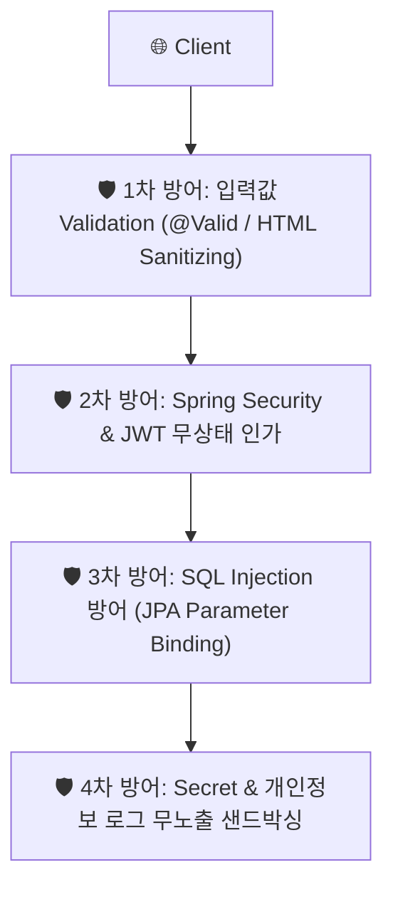

---
metadata:
  version: "1.0.0"
  ssot_owner: "docs/methodologies/defense-in-depth.md"
  last_updated: "2026-07-31"
  status: "APPROVED"
---

# 🛡️ Defense-in-Depth / Security-First (다층 방어 보안 개발) 학습 가이드

이 문서는 `shinhan-gaecheokja` 프로젝트에서 **개인정보 유출, OWASP Top 10 보안 취약점 및 Secret 유출을 레이어별 다층 방어막으로 원천 차단하는 다층 방어 보안 개발** 방법론의 가이드북입니다.

---

## 📌 1. 다층 방어 보안 개발이란 무엇인가? (WHY)

단일 방어선(예: 프론트엔드 검증만 존재)에 의존하는 보안은 취약점이 뚫렸을 때 전체 시스템이 마비되거나 개인정보가 노출될 위험이 큽니다.

다층 방어 보안(Defense-in-Depth)은 **입력값 검증, JWT 무상태 인증/인가, SQL Injection/XSS 방어, Secret/개인정보 로그 무노출 샌드박싱 등 여러 겹의 방어선을 겹겹이 배치하는 개발론**입니다.

---

## 📐 2. 4대 핵심 보안 방어 수칙 (Core Rules)

### ① 🚫 Secret / 개인정보 절대 무노출
- 비밀번호, Secret Key, 개인정보(전화번호, 주소)는 `log.info`, 예외 메시지, JSON DTO에 노출을 절대 금지합니다.

### ② 🧹 입력값 검증 & XSS / SQL Injection 방어
- `@Valid` 및 `@NotBlank`, `@Size` 아노테이션으로 샌드박싱 검증.
- JPA Named Parameter Binding을 사용하여 SQL Injection 파괴.

### ③ 🔐 JWT 무상태 인증 & 역할별 인가 (RBAC)
- `CUSTOMER`, `COURIER`, `ADMIN` 역할(Role)에 따른 권한을 API 레벨에서 엄격히 분기.

---

## 💻 3. 우리 프로젝트 실천 가이드

- [보안 & JWT 인증 가이드 (docs/security-jwt-guide.md)](../security-jwt-guide.md)
- [ADR-0001: JWT 기반 무상태 인증 체계 채택 (docs/adr/0001-stateless-jwt-authentication.md)](../adr/0001-stateless-jwt-authentication.md)
