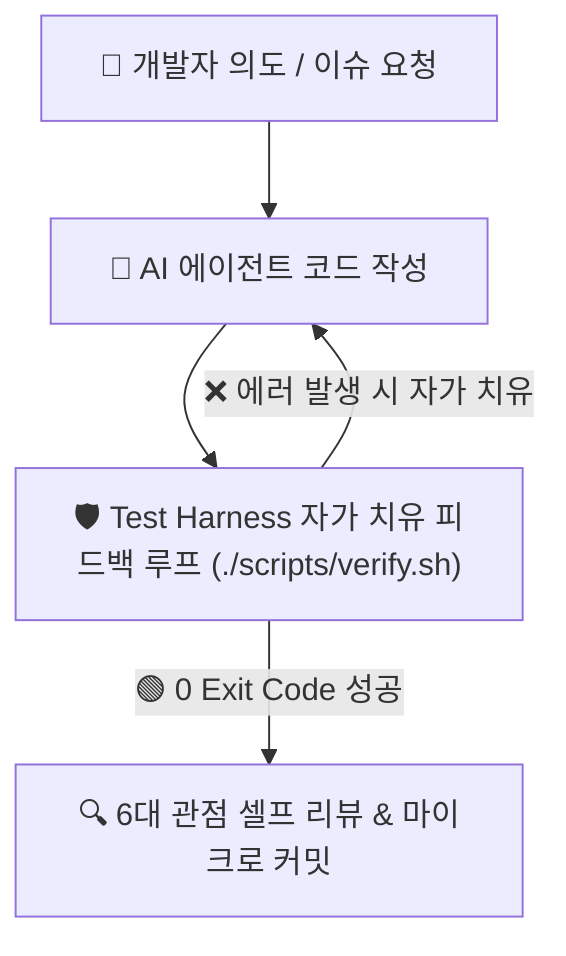

---
metadata:
  version: "1.0.0"
  ssot_owner: "docs/methodologies/llm-driven-development.md"
  last_updated: "2026-07-31"
  status: "APPROVED"
---

# 🤖 LLM-Driven Development (LLM 주도 개발) 학습 가이드

이 문서는 `shinhan-delivery` 프로젝트에서 **AI 에이전트(Claude Code, Antigravity, Copilot 등)와 페어 프로그래밍하며 생산성과 품질을 동시에 극대화하는 LLM 주도 개발** 방법론의 가이드북입니다.

---

## 📌 1. LLM 주도 개발이란 무엇인가? (WHY)

단순한 단순 코드 자동완성을 넘어, **AI 에이전트에게 프롬프트 엔지니어링, 컨텍스트 엔지니어링, 아키텍처 규칙 및 테스트 하네스(Test Harness)를 결합하여 피드백 루프로 코드를 완성**해 나가는 현대 SW 엔지니어링 기법입니다.

---

## 📐 2. LLM 개발 4대 엔지니어링 기둥 (Core Pillars)

### ① 📋 Prompt & Context Engineering (프롬프트/컨텍스트 엔지니어링)
- `AGENTS.md`, `code-convention.md`, `.gitmessage` 등 단일 원본(SSOT) 규칙을 AI 컨텍스트에 100% 동기화.

### ② 🛡️ Harness Engineering (하네스 엔지니어링)
- AI가 생성한 코드가 정적 분석(Spotless), 아키텍처 검증(ArchUnit), 단위 테스트를 통과해야만 제출 허용.

### ③ 🔄 Self-Healing Loop (자가 치유 피드백 루프)
- 테스트 실패 시 사람의 개입 없이 스택트레이스를 분석하고 AI 스스로 소스코드를 1초 내 보정.

### ④ 🔍 Multi-Pass Project Audit (6대 다각도 사전 검토)
- 1차 통과 후에도 (1) 아키텍처 순수성 (2) 예외 처리 (3) DB 무중단 DDL (4) 보안 (5) DX (6) 테스트 유의미성 6대 관점에서 재검토.

---

## 💻 3. 우리 프로젝트 실천 가이드

- [LLM 기반 현대 SW 엔지니어링 입문서 (docs/LLM-소프트웨어-엔지니어링-가이드.md)](../LLM-소프트웨어-엔지니어링-가이드.md)
- [AI 에이전트 행동 지침 및 8대 수칙 (AGENTS.md)](../../AGENTS.md)
