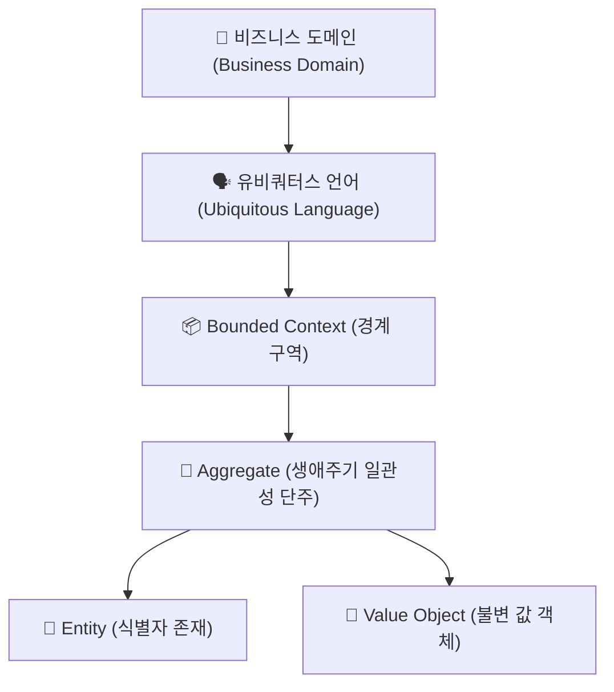

---
metadata:
  version: "1.0.0"
  ssot_owner: "docs/methodologies/도메인-주도-설계.md"
  last_updated: "2026-07-31"
  status: "APPROVED"
---

# 🎯 DDD (Domain-Driven Design, 도메인 주도 설계) 학습 가이드

이 문서는 `shinhan-delivery` 프로젝트에서 **비즈니스 도메인의 복잡성을 극복하고 코드가 비즈니스 요구사항을 명확히 반영하도록 돕는 도메인 주도 설계(DDD) 방법론**의 가이드북입니다.

---

## 📌 1. DDD 핵심 개념 및 왜 도입해야 하는가? (WHY)

전통적인 데이터베이스 중심 개발(DB-Centric) 방식은 **데이터베이스 테이블 구조에 코드가 종속**되어 비즈니스 로직이 Service 레이어에 파편화되거나, 객체가 단순 데이터 껍데기(Anemic Domain Model)로 전락하는 문제를 유발합니다.

DDD는 **기술적 구현보다 비즈니스 도메인 모델에 집중**하며, 도메인 전문가와 개발자가 동일한 언어로 소통하여 아키텍처를 유연하게 유지하는 설계 방법론입니다.



---

## 📐 2. DDD 핵심 5대 구성 요소 (Core Elements)

### ① 🗣️ 유비쿼터스 언어 (Ubiquitous Language)
- 개발자와 기획자/비즈니스 팀이 대화할 때 사용하는 **공통의 명확한 용어집**.
- 코드의 클래스명, 메소드명, Variable에도 이 용어를 100% 반영합니다. (예: `Delivery`, `Courier`, `PointWallet`)

### ② 📦 Bounded Context (경계 구역)
- 특정 도메인 모델이 의미를 가지는 명확한 경계.
- 예를 들어 동일한 '사용자'라도 **회원 도메인**에서는 `Member`, **배송 도메인**에서는 `Customer` 또는 `Courier`로 해석됩니다.

### ③ 🧩 Aggregate (어그리게잇)
- 데이터 변경의 단위로 묶이는 **연관 객체들의 집합**.
- 각 Aggregate는 하나의 **Aggregate Root(예: `Delivery`)**를 가지며, 외부에서는 반드시 Aggregate Root를 통해서만 내부 상태를 변경합니다.

### ④ 👤 Entity vs 💎 Value Object (VO)
- **Entity:** 고유한 식별자(ID)를 가지며 생애주기 동안 상태가 변하는 객체 (`MemberId`, `DeliveryId`).
- **Value Object (VO):** 식별자 없이 동등성(Equals/HashCode)으로만 식별되며 **불변(Immutable)** 객체 (`Address`, `Money`, `Weight`).

---

## 💻 3. 우리 프로젝트 실전 적용 코드 예시

```java
// 💎 Value Object 예시: Address (불변 객체)
@Embeddable
@Getter
@NoArgsConstructor(access = AccessLevel.PROTECTED)
@AllArgsConstructor
@EqualsAndHashCode
public class Address {
    private String zipcode;
    private String baseAddress;
    private String detailAddress;
}

// 🧩 Aggregate Root 예시: Delivery (비즈니스 로직을 스스로 수행)
@Entity
@Getter
@NoArgsConstructor(access = AccessLevel.PROTECTED)
public class Delivery {

    @Id @GeneratedValue(strategy = GenerationType.IDENTITY)
    private Long id;

    @Embedded
    private Address pickupAddress;

    @Enumerated(EnumType.STRING)
    private DeliveryStatus status;

    // 도메인 비즈니스 로직 메서드: 객체 스스로 상태 변경 검증
    public void assignCourier(Long courierId) {
        if (this.status != DeliveryStatus.MATCHING_PENDING) {
            throw new IllegalStateException("매칭 대기 상태의 배송만 기사를 할당할 수 있습니다.");
        }
        this.status = DeliveryStatus.MATCHED;
    }
}
```

---

## 🧪 4. 검증 명령어 (Verification)

도메인 모델의 순수성과 단방향 의존성을 검증하기 위해 로컬 아키텍처 테스트를 수행합니다:

```bash
./gradlew test --tests "com.example.shinhandelivery.architecture.ArchitectureTest"
```
