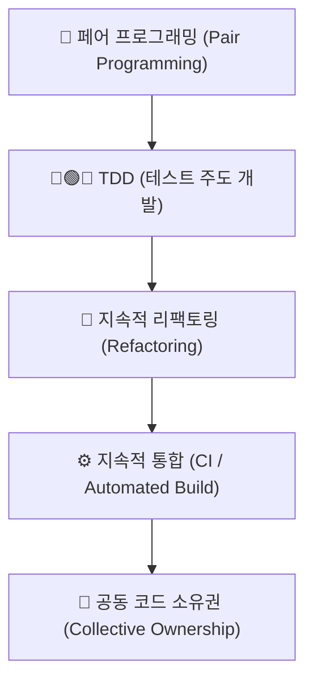

---
metadata:
  version: "1.0.0"
  ssot_owner: "docs/methodologies/익스트림-프로그래밍.md"
  last_updated: "2026-07-31"
  status: "APPROVED"
---

# 🛠️ Extreme Programming (XP, 익스트림 프로그래밍) 학습 가이드

이 문서는 `shinhan-delivery` 프로젝트에서 **코드 품질과 엔지니어링 실천법(Engineering Practices)을 극대화하여 기술적 부채를 차단하는 XP(익스트림 프로그래밍)** 방법론의 가이드북입니다.

---

## 📌 1. XP(익스트림 프로그래밍)란 무엇인가? (WHY)

스크럼이 프로젝트 관리 및 미팅 프레임워크 중심이라면, XP는 **실제 코드 작성 및 기술적 엔지니어링 실천법에 집중**하는 개발론입니다.

"좋은 실천법이라면 극단적(Extreme)으로 매일 실천한다"는 원칙하에 페어 프로그래밍, TDD, 지속적 통합(CI), 잦은 리팩토링을 강조합니다.

---

## 📐 2. XP 5대 핵심 기술 실천법 (Core Practices)

### ① 👥 Pair Programming (페어 프로그래밍)
- 2명의 개발자가 하나의 화면을 보며 내비게이터(설계/검토)와 드라이버(코드 작성) 역할을 번갈아 수행하며 결함을 즉시 교정.

### ② 🔵 Continuous Refactoring (지속적 리팩토링)
- 기능 추가 후 가독성이 떨어지거나 중복된 코드가 보이면 즉시 코드 스타일과 구조를 다듬음.

### ③ ⚙️ Continuous Integration (지속적 통합)
- 하루에도 여러 번 작업 결과를 메인 브랜치에 통합하고 자동화된 빌드/테스트 게이트를 통과시킴.

### ④ 🤝 Collective Code Ownership (공동 코드 소유권)
- 특정 개인만 특정 코드를 수정할 수 있는 독점을 배제하고, 팀원 누구나 모든 소스코드를 개선할 수 있는 권한과 책임 보유.

---

## 💻 3. 우리 프로젝트 실천 도구 연동

- **AI 페어 프로그래밍 지원:** [docs/AI-기반-페어-프로그래밍-가이드.md](../AI-기반-페어-프로그래밍-가이드.md)
- **로컬 자동화 통합 빌드 하네스:** `./scripts/verify.sh` 및 `./pr` 커맨드로 통합 자동화 사수.
