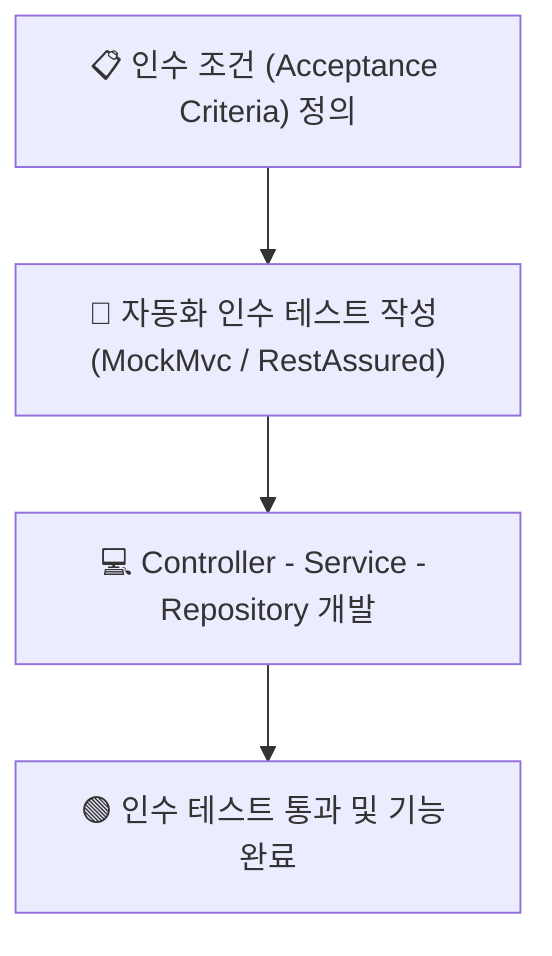

---
metadata:
  version: "1.0.0"
  ssot_owner: "docs/methodologies/인수-테스트-주도-개발.md"
  last_updated: "2026-07-31"
  status: "APPROVED"
---

# 🤝 ATDD (Acceptance Test-Driven Development, 인수 테스트 주도 개발) 학습 가이드

이 문서는 `shinhan-delivery` 프로젝트에서 **사용자 인수 조건(Acceptance Criteria)을 엔드투엔드(E2E) 자동화 인수 테스트로 작성하여 개발을 인도하는 ATDD** 방법론의 가이드북입니다.

---

## 📌 1. ATDD란 무엇인가? (WHY)

단위 테스트(Unit Test)만으로는 실제 Web HTTP 요청, Spring Security 필터 처리, JSON 직렬화/역직렬화 과정에서 발생하는 결함을 완벽히 사수할 수 없습니다.

ATDD는 **사용자 관점에서의 블랙박스 인수 조건(Acceptance Criteria)을 먼저 정의하고, HTTP 요청 레벨의 자동화 테스트(MockMvc / RestAssured)를 작성 후 개발에 들어가는 기법**입니다.



---

## 📐 2. 인수 조건(AC) 정의 및 테스트 구조

### 📋 예시: 배송 신청 인수 조건 (Acceptance Criteria)
- **AC 1:** 인증된 고객은 출도착지 주소 및 무게를 입력하여 배송을 신청할 수 있다. (HTTP 200 OK)
- **AC 2:** 필수 주소값이 누락되면 400 Bad Request 에러와 함께 메시지가 반환된다.
- **AC 3:** 미인증 사용자가 요청하면 401 Unauthorized 에러가 반환된다.

---

## 💻 3. 우리 프로젝트 인수 테스트 실전 코드 예시

```java
@SpringBootTest
@AutoConfigureMockMvc
class DeliveryAcceptanceTest {

    @Autowired
    private MockMvc mockMvc;

    @Autowired
    private ObjectMapper objectMapper;

    @Test
    @DisplayName("[인수 테스트] 정상적인 배송 신청 요청 시 200 OK 및 생성 데이터가 반환된다")
    void createDelivery_acceptanceTest() throws Exception {
        // given
        DeliveryRequest request = new DeliveryRequest("13529", "서울시 강남구", "101호", 5.5);

        // when & then
        mockMvc.perform(post("/api/deliveries")
                .contentType(MediaType.APPLICATION_JSON)
                .content(objectMapper.writeValueAsString(request)))
            .andExpect(status().isOk())
            .andExpect(jsonPath("$.id").exists())
            .andExpect(jsonPath("$.status").value("MATCHING_PENDING"));
    }
}
```

---

## 🧪 4. 검증 명령어 (Verification)

전체 인수 테스트 및 통합 테스트 모음을 실행합니다:

```bash
./gradlew test --tests "*AcceptanceTest"
```
