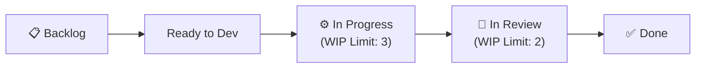

---
metadata:
  version: "1.0.0"
  ssot_owner: "docs/methodologies/칸반.md"
  last_updated: "2026-07-31"
  status: "APPROVED"
---

# 📊 Kanban (칸반) 학습 가이드

이 문서는 `shinhan-delivery` 프로젝트에서 **작업 현황을 시각화하고 진행 중인 작업(WIP)을 제한하여 리드타임을 최적화하는 칸반** 방법론의 가이드북입니다.

---

## 📌 1. 칸반이란 무엇이며 왜 필요한가? (WHY)

한꺼번에 너무 많은 작업(Task)이 진행되면 멀티태스킹 컨텍스트 스위칭 비용이 증가하고 병목(Bottleneck) 현상이 지연됩니다.

칸반은 **작업 흐름을 시각적 보드(Board)로 관리하고, 동시에 진행할 수 있는 작업의 수(WIP Limit)를 제한**하여 끝내는 속도(Velocity)를 높이는 유량 제어 시스템입니다.

---

## 📐 2. 칸반 3대 핵심 원칙 (Core Rules)

### ① 👁️ Visualized Workflow (흐름의 시각화)
- 백로그부터 완료까지 모든 이슈 카드가 보드상에서 어느 단계에 정체되어 있는지 한눈에 파악.

### ② ⛔ WIP Limit (진행 중 작업 제한)
- 개발자 1인당 동시에 진행 가능한 In Progress 작업 개수를 1~2개로 제한하여 병목 예방.

### ③ 🚀 Flow Management (흐름 관리 & 병목 제거)
- 카드가 `In Review` 단계에 오래 머물러 있으면 팀 전체가 리뷰를 도와 병목을 먼저 해소.

---

## 💻 3. 우리 프로젝트 GitHub Project 보드 연동 수칙

- [GitHub Issues & PR 수칙](../git-flow-guide.md)에 따라 이슈 생성 시 칸반 컬럼이 자동 할당됩니다.
- 이슈 완료 시 `Closes #이슈번호` 마크다운 키워드로 `Done` 컬럼으로 자동 이동시킵니다.
