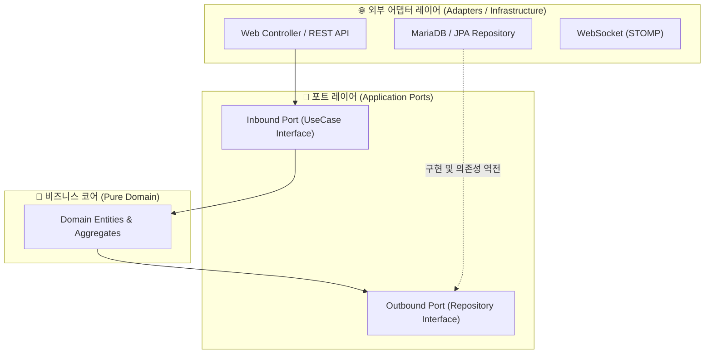

---
metadata:
  version: "1.0.0"
  ssot_owner: "docs/methodologies/클린-아키텍처.md"
  last_updated: "2026-07-31"
  status: "APPROVED"
---

# 🏛️ Clean & Hexagonal Architecture 학습 가이드

이 문서는 `shinhan-delivery` 프로젝트의 **핵심 비즈니스 로직이 외부 기술(DB, 프레임워크, Web UI)에 오염되지 않고 순수함을 유지하도록 돕는 클린/헥사고날 아키텍처** 방법론의 가이드북입니다.

---

## 📌 1. 클린 & 헥사고날 아키텍처란 무엇인가? (WHY)

기술 프레임워크나 DB는 프로젝트 시간이 지남에 따라 교체되거나 변경될 수 있습니다.  
클린 아키텍처(Hexagonal Architecture / Port & Adapter)는 **비즈니스 코어(Domain)를 가장 중심에 두고, 프레임워크나 외부 세부기술은 어댑터(Adapter) 형태로 바깥쪽에 배치**하는 의존성 역전 구조입니다.



---

## 📐 2. 핵심 3대 계층과 포트/어댑터 (Core Layers)

### ① 💎 Pure Domain Layer (비즈니스 코어)
- 외부 라이브러리나 Spring, JPA 등의 아노테이션에 의존하지 않는 순수한 자바 객체 및 비즈니스 규약.

### ② 🔌 Port Layer (포트 인터페이스)
- **Inbound Port (입력 포트):** 외부(Controller)에서 비즈니스 로직을 호출할 때 사용할 유스케이스 인터페이스 (`DeliveryUseCase`).
- **Outbound Port (출력 포트):** 비즈니스 코어가 외부(DB, 외부 API)를 호출할 때 사용할 영속성 인터페이스 (`DeliveryRepositoryPort`).

### ③ 🌐 Adapter Layer (어댑터 구현체)
- **Inbound Adapter:** REST Controller, Web UI, 메시지 큐 수신기.
- **Outbound Adapter:** Spring Data JPA Repository, RestTemplate / WebClient 어댑터.

---

## 💻 3. 우리 프로젝트 단방향 의존성 규칙

우리 프로젝트에서는 `Controller -> Service -> Repository` 단방향 의존성을 엄격히 유지합니다.

```java
// 1. Controller (Inbound Adapter) -> Service (UseCase) 호출
@RestController
@RequiredArgsConstructor
public class DeliveryController {
    private final DeliveryService deliveryService; // Inbound Port

    @PostMapping("/api/deliveries")
    public ResponseEntity<DeliveryResponse> create(@RequestBody DeliveryRequest request) {
        return ResponseEntity.ok(deliveryService.createDelivery(request));
    }
}

// 2. Service (Core Logic) -> Entity & Repository Port 사용
@Service
@RequiredArgsConstructor
public class DeliveryService {
    private final DeliveryRepository deliveryRepository; // Outbound Port

    @Transactional
    public DeliveryResponse createDelivery(DeliveryRequest request) {
        Delivery delivery = request.toEntity();
        Delivery saved = deliveryRepository.save(delivery);
        return DeliveryResponse.from(saved);
    }
}
```

---

## 🧪 4. 검증 명령어 (Verification)

ArchUnit을 활용해 아키텍처 레이어 순수성 및 단방향 의존성 위반 여부를 로컬에서 검증합니다:

```bash
./gradlew test --tests "com.example.shinhandelivery.architecture.ArchUnitTest"
```
