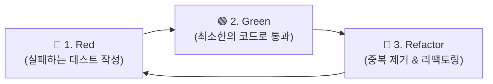

---
metadata:
  version: "1.0.0"
  ssot_owner: "docs/methodologies/테스트-주도-개발.md"
  last_updated: "2026-07-31"
  status: "APPROVED"
---

# 🔴🟢🔵 TDD (Test-Driven Development, 테스트 주도 개발) 학습 가이드

이 문서는 `shinhan-delivery` 프로젝트에서 **결함 0개(Zero-Defect)를 사수하고 회귀 버그 발생 위험을 원천 차단하기 위한 테스트 주도 개발(TDD)** 방법론의 가이드북입니다.

---

## 📌 1. TDD란 무엇이며 왜 필요한가? (WHY)

전통적인 시나리오에서는 코드를 모두 작성한 후 테스트를 붙이거나 생략하여 **미지의 예외 상황이나 회귀 버그(Regression Bug)**를 뒤늦게 발견하곤 합니다.

TDD는 **구현 코드를 작성하기 전에 실패하는 테스트를 먼저 작성**함으로써 명확한 요구사항과 인터페이스를 설계하고, 안전하게 리팩토링할 수 있는 안전망을 확보하는 기법입니다.



---

## 📐 2. TDD 3단계 피드백 루프 (Red - Green - Refactor)

### ① 🔴 Red (실패하는 테스트)
- 실제 구현할 클래스/메소드가 존재하지 않거나 컴파일 실패하는 테스트 코드를 먼저 작성합니다.
- 예외 상황(Null, 음수 입력, 권한 부족)에 대한 실패 조건을 명확히 기재합니다.

### ② 🟢 Green (테스트 통과)
- 하드코딩이나 임시 로직이라도 상관없이 **테스트를 가능한 한 가장 빠르게 통과(Green)**시키는 최소한의 구현 코드를 작성합니다.

### ③ 🔵 Refactor (리팩토링)
- 테스트가 그린(Pass) 상태임을 확인한 후, 중복 코드를 제거하고 디자인 패턴을 적용하여 **코딩 컨벤션 및 8대 수칙에 맞게 개선**합니다.

---

## 💻 3. 우리 프로젝트 실전 TDD 적용 예시

```java
// Step 1: 🔴 Red - 실패하는 테스트 먼저 작성
@Test
@DisplayName("포인트 충전 시 음수 금액이 입력되면 IllegalArgumentException 예외가 발생한다")
void chargePoint_negativeAmount_throwsException() {
    // given
    PointWallet wallet = new PointWallet(1L, 1000L);
    
    // when & then
    assertThatThrownBy(() -> wallet.charge(-500L))
        .isInstanceOf(IllegalArgumentException.class)
        .hasMessage("충전 금액은 0보다 커야 합니다.");
}

// Step 2 & 3: 🟢 Green & 🔵 Refactor - 도메인 내부 구현
public class PointWallet {
    private Long balance;

    public void charge(Long amount) {
        if (amount == null || amount <= 0) {
            throw new IllegalArgumentException("충전 금액은 0보다 커야 합니다.");
        }
        this.balance += amount;
    }
}
```

---

## 🧪 4. 검증 및 자가 치유 명령어 (Verification)

터미널에서 테스트 하네스 검증을 구동하여 100% 그린 빌드(0 Exit Code)를 사수합니다:

```bash
./scripts/verify.sh
```
