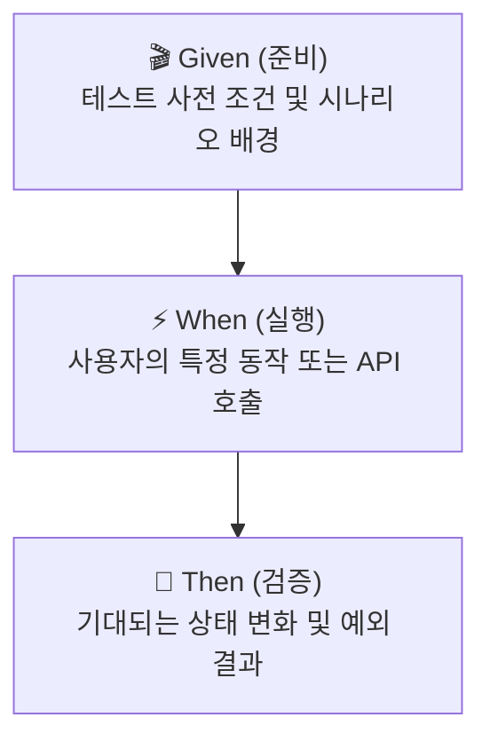

---
metadata:
  version: "1.0.0"
  ssot_owner: "docs/methodologies/행위-주도-개발.md"
  last_updated: "2026-07-31"
  status: "APPROVED"
---

# 🎭 BDD (Behavior-Driven Design, 행위 주도 개발) 학습 가이드

이 문서는 `shinhan-delivery` 프로젝트에서 **비즈니스 요구사항과 검증 테스트를 사용자 행위(Behavior) 중심으로 일치시키는 행위 주도 개발(BDD)** 방법론의 가이드북입니다.

---

## 📌 1. BDD란 무엇인가? (WHY)

TDD가 기술적인 메서드 중심의 테스트라면, BDD는 **"시나리오 기반으로 기획자, 개발자, QA가 이해할 수 있는 비즈니스 사용자 행위"**를 테스트 케이스로 승화하는 기법입니다.

BDD는 **Given - When - Then** 3단계 문맥 구성을 도입하여 명세서(Specification)와 테스트 코드 간의 갭을 완벽하게 메워줍니다.



---

## 📐 2. BDD Given - When - Then 작성 표준

### ① 🎬 Given (사전 상태 준비)
- 테스트 대상이 동작하기 위해 필요한 기본 환경, 데이터 엔티티, 더미 셋업을 구성합니다.

### ② ⚡ When (사용자 행위 실행)
- 비즈니스 유스케이스 메서드 호출, HTTP REST API 요청 등 **실제 실행 파트**를 명시합니다.

### ③ 🎯 Then (결과 및 검증)
- 리턴값, 예외 메시지, DB 상태 변경, 외부 이벤트 발생 여부를 검증합니다.

---

## 💻 3. 우리 프로젝트 BDD 실전 코드 예시

```java
@Test
@DisplayName("사용자가 가용한 라이더에게 배송을 매칭 요청하면 상태가 MATCHED로 변경된다")
void matchDelivery_validCourier_success() {
    // 🎬 Given: 배송 대기 건과 기사 프로필이 존재할 때
    Long deliveryId = 100L;
    Long courierId = 50L;
    Delivery pendingDelivery = createDelivery(deliveryId, DeliveryStatus.MATCHING_PENDING);
    given(deliveryRepository.findById(deliveryId)).willReturn(Optional.of(pendingDelivery));

    // ⚡ When: 매칭 로직을 실행하면
    DeliveryResponse response = deliveryService.matchCourier(deliveryId, courierId);

    // 🎯 Then: 배송 상태가 MATCHED로 변경되고 응답값이 정상 반환된다
    assertThat(response.getStatus()).isEqualTo(DeliveryStatus.MATCHED);
    assertThat(pendingDelivery.getCourierId()).isEqualTo(courierId);
    then(eventPublisher).should(times(1)).publishEvent(any(DeliveryMatchedEvent.class));
}
```

---

## 🧪 4. 검증 명령어 (Verification)

BDD 스타일 단위 테스트 및 검증 리포트를 실행합니다:

```bash
./gradlew test --tests "*ServiceTest"
```
