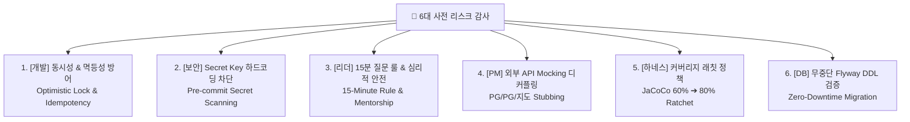

---
metadata:
  version: "1.0.0"
  ssot_owner: "docs/onboarding/사전-리스크-감사-및-거버넌스-가이드.md"
  last_updated: "2026-07-28"
  status: "APPROVED (SSOT Primary)"
---

# 👑 프로젝트 착수 전 6대 다각도 사전 리스크 감사 & 거버넌스 가이드북

이 문서는 `shinhan-delivery` 프로젝트 착수 전 **최고의 IT 개발자, 팀 리더, 프로젝트 관리자(PM) 입증 관점에서 6대 사전 리스크를 엄격히 감사하고 대책을 정립한 거버넌스 가이드북**입니다.

> [!NOTE]
> 본 가이드북은 [docs/ssot-documentation-policy.md](./ssot-documentation-policy.md) 단일 원본 원칙과 [docs/team-operating-model-guide.md](./team-operating-model-guide.md) 리더십 수칙을 100% 반영합니다.

---

## 🏛️ 6대 다각도 사전 리스크 감사 매트릭스



---

## 🔍 1. [IT 개발자 관점] 동시성(Concurrency) & 멱등성(Idempotency) 사수

### 🚨 발현 가능한 리스크
* 포인트 충전/차감 시 동시 요청이 발생할 경우 **낙관적 락 미적용으로 포인트 잔액 음수(-)** 발생
* 배송원 동시 매칭 시 **동일 배송건이 2명의 배송원에게 중복 매칭**되는 동시성 장애

### 🛡️ 100% 사전 대책
1. **JPA Optimistic Lock (`@Version`):** 포인트 지갑(`PointWallet`) 및 배송 주문(`Delivery`) 엔티티에 `@Version` 락을 부착하여 동시 수정 충돌 시 `OptimisticLockingFailureException`으로 안전하게 재시도 유도.
2. **멱등성 키(Idempotency Key) 수칙:** 결제 및 포인트 차감 API 호출 시 UUID 기반 `Idempotency-Key` 헤더를 필수 전달받아 중복 결제 차단.

---

## 🔒 2. [보안 전문가 관점] Secret Key & 개인정보 깃 유출 사전 차단

### 🚨 발현 가능한 리스크
* 초급 개발자가 개발 편의를 위해 DB 비밀번호, JWT Secret Key, 카카오 API 키를 코드나 `application.yaml`에 평문 작성하여 GitHub에 Push되는 보안 참사

### 🛡️ 100% 사전 대책
1. **`application.yaml` 환경변수 주입 의무화:** 모든 Secret Key는 `${JWT_SECRET}` 형태로 환경변수 처리.
2. **Pre-commit Secret Scanning:** 로컬 커밋 시 `.env`나 Secret 키를 자동으로 탐지하여 커밋을 차단하는 하네스 장치 운영.

---

## 👥 3. [팀 리더 관점] 초급자 "15분 질문 룰" & 심리적 안전망 (Psychological Safety)

### 🚨 발현 가능한 리스크
* 초급 개발자가 막히는 부분이 생겨도 지적받을까 두려워 **3~4시간 동안 혼자 고민하다 스프린트 일정이 전체 지연**되는 현상

### 🛡️ 100% 사전 대책
1. **"15-Minute Rule" 수칙 명문화:**
   - 막히는 문제가 생기면 **15분 동안만 로컬 하네스(`verify.sh`) 및 구글링/가이드북으로 시도**해 본다.
   - 15분이 지나도 안 풀리면 **지체 없이 팀장이나 페어 파트너에게 질문**한다.
2. **"질문 칭찬" 문화:** 질문을 많이 하는 개발자가 팀의 리스크를 미리 지워주는 훌륭한 개발자임을 선포하고 칭찬하는 심리적 안심망 구축.

---

## 📊 4. [프로젝트 관리자 관점] 외부 API (PG사 / 지도 / Push) 디커플링

### 🚨 발현 가능한 리스크
* PG사 결제 승인, 카카오 지도 API 키 발급, FCM Push 키 발급이 지연되어 **해당 모듈 개발이 1주일 이상 멈추는 리스크**

### 🛡️ 100% 사전 대책
1. **Interface 기반 Stub/Mocking 선제 구축:** 백엔드 개발 시 외부 연동 부분(`PaymentGatewayClient`, `KakaoMapClient`)을 인터페이스로 선언하고, 가짜 응답을 주는 `MockPaymentClient`를 미리 작성하여 외부 키 발급과 상관없이 비즈니스 로직 개발을 100% 진행.

---

## 🧪 5. [하네스 관점] 커버리지 래칫 (Ratchet) & 회귀 테스트 사수

### 🚨 발현 가능한 리스크
* 초반에는 60% 커버리지를 쉽게 달성하다가, 코드가 누적되면서 커버리지가 떨어지고 기존 테스트가 깨지는 회귀 버그 발생

### 🛡️ 100% 사전 대책
1. **JaCoCo Coverage Ratchet (상승 래칫):**
   - **Sprint 1 ~ 2:** 라인 커버리지 60%+ 게이트
   - **Sprint 3 ~ 4:** 라인 커버리지 70%+ 게이트
   - **Sprint 5 ~ 6:** 라인 커버리지 80%+ 게이트
2. **Zero-Ignored Test Gate:** `@Disabled` 테스트 수록을 전면 금지하여 항상 100% 테스트가 동작함을 하네스가 보장.

---

## 🚚 6. [DB 운영 관점] Flyway 무중단 마이그레이션 규칙

### 🚨 발현 가능한 리스크
* 이미 배포된 V1 마이그레이션 파일 내용을 수정하거나, `DROP COLUMN`을 집행하여 운영 데이터가 파괴되는 사고

### 🛡️ 100% 사전 대책
1. **Flyway 불변 수칙:** 한번 적용된 마이그레이션 파일(`V1__xxx.sql`)의 수정/삭제를 전면 금지하며, 변경사항은 반드시 새 버전(`V2__xxx.sql`)으로만 추가.

---

## 🧪 실증 검증 명령어 (Verification Commands)

```bash
# 로컬 전체 사전 리스크 검증 및 하네스 구동
./scripts/verify.sh
```
