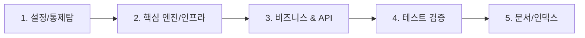

# 🗺️ PR 리뷰어 3분 족보 가이드 작성 규격 (PR Reviewer Walkthrough Guide)

이 문서는 `shinhan-gaecheokja` 프로젝트에서 **PR(Pull Request)을 작성할 때 리뷰어(관리자 및 동료 개발자)가 3분 만에 핵심 변경사항과 아키텍처를 파악할 수 있도록 돕는 PR 가이드 작성 규격 및 표준 가이드북**입니다.

---

## 📌 1. 왜 이 작성 규격이 필요한가요? (Core WHY)

프로젝트 규모가 커지고 PR의 코드 양이 증가함에 따라, 리뷰어가 10개 이상의 파일 변경사항(diff)을 순서 없이 읽을 경우 다음과 같은 부작용이 발생합니다:
- ❌ **아키텍처 인지 장애:** 전체 흐름(Controller ➔ Service ➔ Repository)이 잡히지 않아 코드 리뷰 피로도 상승
- ❌ **검토 소요 시간 증가:** 600줄 이상의 코드를 읽는 데 30분 이상 소요
- ❌ **결함 놓침 현상:** 핵심 비즈니스 로직이나 예외 처리를 놓치고 가벼운 오타만 검토하는 현상 발생

💡 **해결책:** 모든 PR에는 리뷰어가 **"어떤 파일부터 읽어야 하는지" (추천 읽기 순서)**와 **"파일별 핵심 포인트 및 체크리스트"**를 담은 **[리뷰어 3분 족보 가이드]**를 100% 필수 작성합니다.

---

## 📐 2. 리뷰어 3분 족보 가이드 5대 표준 구성 요소

PR 제출 시 PR 본문이나 첫 번째 댓글에 아래 **5대 마크다운 표준 서식**을 준수하여 작성합니다.

### ① ⏱️ 1분 퀵 서머리 (Executive Summary)
- PR의 도입 배경과 해결하려는 비즈니스/기술 문제 1~2줄 요약
- 로컬 하네스 검증 결과 (테스트 개수, JaCoCo 커버리지, ArchUnit 검증 통과 증거)

### ② 🗺️ 추천 파일 읽기 순서 (Recommended Reading Order)
- 리뷰어가 코드를 읽는 권장 순서를 **Mermaid 흐름도**와 함께 단계별 명시
- **표준 권장 순서:**
  1. `1단계 (설정/통제탑)`: Config, YML, Security 설정
  2. `2단계 (핵심 엔진/인프라)`: 공통 필터, 프로바이더, 유틸리티
  3. `3단계 (비즈니스 & API)`: Service, Controller, DTO
  4. `4단계 (동작 증명 테스트)`: 단위/통합 테스트
  5. `5단계 (지식 자산화)`: `docs/` 가이드 문서 및 `README.md`

### ③ 🎯 파일별 1줄 핵심 체크포인트 (Key Highlights)
- 단계별 주요 파일마다 리뷰어가 집중해서 봐야 할 **1줄 핵심 검토 포인트** 명시

### ④ 🛡️ 리뷰어 전용 1초 체크리스트 (Reviewer Verification Checklist)
- 리뷰어가 체크박스([ ])로 클릭해 검증할 수 있는 핵심 무결점 항목 수록

### ⑤ 📊 시각화 흐름도 (Sequence / Architecture Diagram)
- 데이터 흐름이나 시퀀스를 시각적으로 표현하여 1초 만에 전체 맥락 파악 지원

---

## 📋 3. 표준 마크다운 작성 템플릿 (Copy & Paste)

PR 작성 시 아래 템플릿을 복사하여 작성합니다:

```markdown
# 🗺️ [Reviewer 3-Minute Walkthrough] PR #XX 리뷰어 3분 족보 가이드

## 1. ⏱️ 1분 퀵 서머리 (Executive Summary)
* **이 PR이 해결하는 문제 (WHY):** [도입 배경 및 개요 1~2줄]
* **변경 영향 범위 (Impact Scope):** [영향을 받는 도메인 및 부작용 유무]
* **하네스 검증 상태:** 🟢 `./scripts/verify.sh` 전수 패스 (XX/XX PASS, 커버리지 60%+)

---

## 2. 🗺️ 추천 파일 읽기 순서 (Recommended Reading Order)



---

## 3. 🎯 파일별 1줄 핵심 체크포인트 (Key Highlights)

### 📌 1단계: 설정 & 통제탑 (Config)
* `XxxConfig.java`: [설정 핵심 요약]

### 📌 2단계: 핵심 엔진/인프라 (Core)
* `XxxProvider.java`: [인프라 모듈 핵심 요약]

### 📌 3단계: 비즈니스 연동 & DTO (Service & Controller)
* `XxxService.java`: [비즈니스 로직 핵심 요약]
* `XxxController.java`: [API 엔드포인트 핵심 요약]

### 📌 4단계: 동작 증명 테스트 (Tests)
* `XxxTest.java`: [단위/통합 테스트 검증 내용]

### 📌 5단계: 지식 자산화 (Docs)
* `docs/xxx-guide.md`: [가이드북 신설 내역]

---

## 4. 🛡️ 리뷰어 전용 1초 체크리스트 (Reviewer Verification Checklist)
- [ ] 비즈니스 예외가 `GlobalExceptionHandler`에 매핑되어 처리되는가?
- [ ] Controller에서 Entity를 직접 반환하지 않고 DTO로 변환하는가?
- [ ] 새로 추가된 모든 클래스에 Lombok `@Getter`/`@Setter`가 100% 적용되었는가?
- [ ] 기존 API 하위 호환성 및 기존 테스트가 깨지지 않고 유지되는가?
```

---

## 🛠️ 4. 가이드라인 준수 및 검증 방식

- **개발자/AI 필수 수칙:** 본 가이드라인은 `AGENTS.md` 및 `code-convention.md`에 명문화되어 관리됩니다.
- **PR 오픈 시:** `./pr` 구동 또는 PR 오픈 직후 본 족보 가이드를 PR 본문이나 첫 댓글로 즉시 수록하여 리뷰를 요청합니다.

---

## 🎯 5. Files changed 탭 핀포인트 인라인 댓글 (Inline Comment) 작성 수칙

대형 PR 검토 시 리뷰어의 시선 이동(Context Switching)을 최소화하기 위해, **주요 핵심 코드 라인(Line)에 핀포인트 인라인 리뷰 댓글(Inline Review Comment)**을 동시 부착합니다.

### 📌 인라인 댓글 부착 대상 기준 (Target Lines):
1. **보안/암호화 집행 구문:** BCrypt 암호화, JWT 서명/파싱, 권한 체크 구문
2. **트랜잭션/동시성 제어 구문:** JPA Lock, `@Transactional(readOnly = true)`, 비관적 락 설정 구문
3. **아키텍처/예외 전환 구문:** `BusinessException` / `EntityNotFoundException` 예외 던짐 라인
4. **리뷰어가 질문할 법한 비즈니스 정책 구문:** 허용 URI (`permitAll()`), 잔액 계산 로직

### 💡 인라인 댓글 작성 서식 예시:
> **💡 [리뷰어 핀포인트 안내]**  
> **역할:** 이 구문은 평문 비밀번호를 **BCrypt 10라운드 단방향 해시 알고리즘**으로 암호화하여 DB에 안전하게 저장하는 핵심 보안 라인입니다.  
> **체크 포인트:** 평문 유출 위험이 없으며 `MemberSecurityTest`에서 100% 검증되었습니다.
