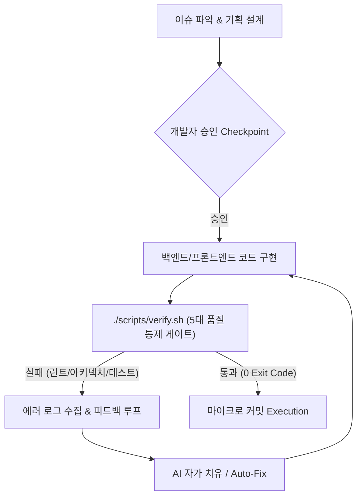

# 🎤 [발표 자료] AI 페어 프로그래밍의 한계를 넘어서: 아키텍처 재정립과 개발자의 진짜 역할

> **문서 버전:** v6.0 (HTML/CSS/JS Separation & Rendering Insight Deck)  
> **최종 수정일:** 2026-08-21  
> **대상:** 신한 딜리버리(shinhan-delivery) 프로젝트 발표자 및 팀원 전체  
> **목적:** 설계부터 구현까지 단일 파이프라인으로 연결되는 엔드투엔드 개발 플로우, Thymeleaf SSR vs CSR AJAX 렌더링 오용 극복, HTML/CSS/JS 파일 분리 모듈화, 자가 치유 피드백 루프 구축 경험을 담은 발표 시나리오 슬라이드 덱입니다.

---

## 📌 발표 서사 구조 (Narrative Arc)

```
[Slide 1] 📌 Intro: 설계부터 구현까지 단일 파이프라인 통합 개발 플로우 도입 & 극적인 기대효과
   ↓ "이슈 분석부터 기획·구현까지 하나의 연결된 개발 플로우로 생산성이 5배 폭발했습니다."
[Slide 2] 🔍 Phase 1: 화려한 성공 뒤의 5대 현실 문제점 (HTML/CSS/JS 파일 비분리 & SSR 외면 CSR AJAX 남용)
   ↓ "하지만 HTML/CSS/JS 인라인 오염과 FOUC 0.5초 현상이 발생하는 치명적 반전이 찾아왔습니다."
[Slide 3] 🛠️ Phase 2: 아키텍처 재정립 & 코드 작성 후 '자가 치유 피드백 루프' 구축
   ↓ "HTML/CSS/JS 3-Tier 완전 분리와 테스트 하네스 자가 치유 피드백 루프로 결함 0개를 사수했습니다."
[Slide 4] 🎯 Phase 3: AI와 협업할 때 개발자가 반드시 사수해야 할 4대 핵심 수칙
   ↓ "AI는 구현(How)의 부사수일 뿐, 파일 분리와 아키텍처 설계(What)는 개발자의 주도권입니다."
[Slide 5] 🚀 Outro: 회고 (Keep / Problem / Try) & "AI 시대 개발자의 진짜 역할"
```

---

## 📑 슬라이드별 상세 콘텐츠 & 발표 멘트 (Slide-by-Slide Details)

### 📌 [Slide 1] Intro: 설계부터 구현까지 단일 파이프라인 통합 개발 플로우 도입

* **슬라이드 제목:** AI 시대의 개발 혁신: 설계부터 구현까지 연결된 엔드투엔드 개발 플로우
* **발표자:** [발표자 이름] / 프로젝트 테크 리드 & 아키텍처 담당
* **발표 서사 한 줄 요약:**  
  `"이슈 분석과 기획부터 코드 구현, 자가 치유 피드백 루프까지 단일 연결 흐름으로 수행되는 개발 플로우를 설계하여 개발 속도를 5배 향상시켰습니다."`
* **주요 발표 내용:**
  1. **단일 파이프라인 통합 개발 플로우 (End-to-End Dev Flow)**:
     - **[1단계: 기획/설계]** 이슈 파악 ➔ 기술 영향도 분석 ➔ 설계 작성 ➔ 개발자 승인 Checkpoint
     - **[2단계: 코드 구현]** 백엔드 핵심 비즈니스 로직 및 프론트엔드 화면 연동 코드 연속 구현
     - **[3단계: 자가 치유 피드백]** 코드 작성 완료 시 테스트 하네스 자동 구동 ➔ 실패 시 에러 로그 수집 후 자가 치유(Auto-Fix)
     - **[4단계: 마이크로 커밋]** 100% 그린 빌드 확인 후 마이크로 커밋(`commit`) 자동 집행
  2. **기대효과 & 생산성 향상 성과**:
     - 설계-구현 간 문맥 단절 방지 및 반복 상투적 코드(Boilerplate) 작성 시간 **90% 단축**
     - 전체 신규 비즈니스 기능 개발 속도 **5배 향상**

---

### 🔍 [Slide 2] Phase 1: 화려한 성공 뒤의 5대 현실 문제점 — "속도는 빠른데 설계와 파일 분리가 비어있다"

* **슬라이드 제목:** 현실의 반전: 신입 개발자의 AI 맹목적 의존과 5대 설계 결함

| 영역 | 발생한 현실 문제점 & 부작용 | 기술적 스펙 타격 및 아키텍처 위험 |
|---|---|---|
| **0. 인적/조직적 관점 (AI 맹목적 의존)** | **개발자의 직접적 의사결정 부재 및 맹목적 채택** | 신입/초급 개발자가 설계·예외·레이어 구조를 직접 고민하거나 검증하지 않고, 발생한 문제점조차 인식하지 못한 채 **AI의 코드 출력 결과에만 맹목적으로 의존**하는 매너리즘 고착 |
| **1. 사용자 경험 (UX) & 렌더링 오용** | **Thymeleaf 템플릿 엔진을 사용함에도 SSR 대신 CSR AJAX 방식 남발** | 프로젝트에 **Thymeleaf가 도입되어 있음에도 AI가 SSR 사전 바인딩 기능을 활용하지 않고**, 빈 HTML 리턴 후 브라우저 비동기 AJAX(`fetch`)로만 동적 조작하는 코드를 대량 작성 ➔ 렌더링 흐름 이해 부족 시 **0.5초간 화면 텅 빔/깜빡이는 FOUC 현상 방치** |
| **2. 프론트엔드 모듈화 (파일 비분리)** | **HTML, CSS, JavaScript 파일이 분리되지 않고 인라인 결합** | AI가 HTML 템플릿 파일 내부에 대용량 `<style>` 및 `<script>` 코드를 분리 없이 인라인으로 몰아 넣음 ➔ **브라우저 캐싱 불가, HTML 가독성 저하, 화면 간 동일 스타일/스크립트 중복 파편화** |
| **3. 백엔드 캡슐화** | 요청 처리 시 매번 동일한 인증 검사 반복 | 공통 인증 로직이 파편화되어 지저분하게 중복 작성됨 |
| **4. 아키텍처 레이어** | 계층을 건너뛰고 내부 데이터 직접 접근 | **표준 아키텍처 단방향 계층 분리 규칙 위반** |

> 🎤 **발표 멘트 포인트:**  
> *"AI는 단일 HTML 파일 안에서 모든 동작을 해결하려는 습성이 있어, HTML, CSS, JavaScript 파일을 독립적으로 분리하지 않고 인라인 코드로 몰아넣었습니다. 이로 인해 브라우저 캐싱 혜택을 전혀 누리지 못하고 코드 파편화가 발생했습니다."*

---

### 🛠️ [Slide 3] Phase 2: 아키텍처 재정립 & 코드 작성 후 '자가 치유 피드백 루프' 구축

* **슬라이드 제목:** 시스템적 해결: HTML/CSS/JS 완전 분리 & 자가 치유 피드백 루프 구축



* **핵심 개선 성과 3가지:**
  1. **Thymeleaf SSR 사전 바인딩 전환 (`th:each`)**: AI의 무분별한 CSR AJAX 패턴을 제거하고 서버 진입 시 데이터 사전 바인딩 ➔ 초기 진입 지연 **`0.5s` → `0ms` (Zero FOUC 100% 달성)**
  2. **HTML/CSS/JS 3-Tier 완전 분리 모듈화**: HTML 내 인라인 코드 오염을 제거하고 독립 static CSS/JS 모듈 파일로 완전 분리 ➔ **중복 코드 332줄 제거 및 브라우저 캐싱 혜택 확보**
  3. **자가 치유 피드백 루프**: `./scripts/verify.sh` 5대 게이트를 통해 AI가 코드를 작성한 후 자동으로 정적분석, 아키텍처, 커버리지를 자가 치유(Auto-Fix)하도록 통제망 구축

---

### 🎯 [Slide 4] Phase 3: AI와 협업할 때 개발자가 반드시 사수해야 할 4대 핵심 수칙

* **슬라이드 제목:** AI 시대, 개발자가 주도권을 쥐어야 할 4대 핵심 수칙

```
┌─────────────────────────────────────────────────────────────────────────┐
│ 💡 AI는 "구현(How)"의 부사수일 뿐, "품질과 방향성(What & Architecture)"은 사람의 몫  │
└─────────────────────────────────────────────────────────────────────────┘
```

1. **[수칙 1] 사람이 직접 아키텍처와 기술적 의사결정 주도 (Human-in-the-Loop Decision)**
   - AI의 추천을 맹목적으로 수용하지 않고, 계층 분리, 무상태성, 실시간 유효성 검사 등 핵심 방향성을 사람이 직접 설계하고 지시할 것.
2. **[수칙 2] 프론트엔드 HTML/CSS/JS 3-Tier 파일 분리 및 모듈화 (Modularization)**
   - AI가 HTML 템플릿 내부에 CSS/JS 코드를 인라인으로 작성하지 못하도록 독립 파일로의 역할 분리를 강제하고 공통 디자인 시스템으로 모듈화할 것.
3. **[수칙 3] Thymeleaf SSR vs CSR AJAX 렌더링 역할 분담 (Zero FOUC)**
   - 초기 DOM은 서버 사전 바인딩(SSR)으로 0ms에 띄우고, 진입 후 비동기 연동만 클라이언트(CSR AJAX)가 맡도록 개발자가 렌더링 흐름을 지시할 것.
4. **[수칙 4] 정적 분석 & 자동화된 하네스 통제망 구축 (Harness First)**
   - AI의 환각과 실수를 눈으로 검수하지 말고, `./scripts/verify.sh` 같은 하네스로 0 Exit Code 피드백 루프를 자동 회전시킬 것.

---

### 🚀 [Slide 5] 회고 & Lessons Learned (Outro)

* **슬라이드 제목:** 결론: AI 시대에 더욱 빛나는 수석 엔지니어의 디테일

* **KPT 회고:**
  * **Keep (잘한 점):** HTML/CSS/JS 완전 분리 + Thymeleaf SSR 사전 바인딩 + 자가 치유 피드백 루프로 0ms 로딩 & 결함 0개 달성
  * **Problem (아쉬운 점):** 초기에 AI가 남용한 인라인 결합 코드와 CSR AJAX 방식을 인지하지 못해 발생했던 시행착오
  * **Try (향후 시도):** 팀 내 Custom Lint & MCP Tool을 더 확충하여 자동 피드백 루프 고도화
* **💡 Final Key Lesson:**  
  `"AI 도구는 개발자를 대체하는 것이 아니라, 프론트엔드 파일 분리와 아키텍처를 고민하고 기술적 의사결정을 내리는 진짜 수석 엔지니어의 가치를 더욱 돋보이게 만든다."`

---

## 🎨 마크다운 변환 및 PPT 생성 팁

* 본 가이드북을 [Marp](https://marp.app/) 또는 [Gamma.app](https://gamma.app/) 등의 도구에 Import하여 시각화된 PPT 발표 자료로 즉시 변환할 수 있습니다.
