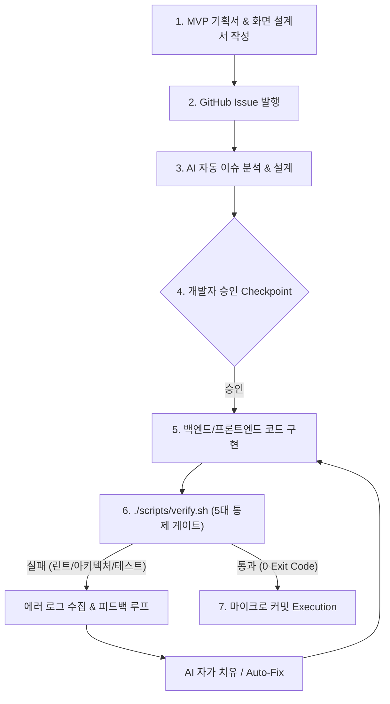

# 🎤 [발표 자료] AI 페어 프로그래밍의 한계를 넘어서: 아키텍처 재정립과 개발자의 진짜 역할

> **문서 버전:** v8.0 (Authentic Team Retrospective & Human-AI Synergy Deck)  
> **최종 수정일:** 2026-08-21  
> **대상:** 신한 딜리버리(shinhan-delivery) 프로젝트 발표자 및 팀원 전체  
> **목적:** 사전 기획(MVP/화면설계) 기반 AI 연동 개발 플로우 도입 성과와 함께, 팀원들이 초기에 겪었던 AI 맹목적 의존 매너리즘(코딩 근육 퇴화, 메타인지 상실), 가이드라인 피로도 등 생생한 인적 고충을 조명하고, 자율 스터디 및 자가 치유 통제망으로 이를 극복한 릴레이션 스토리를 서사형 슬라이드 덱으로 제공합니다.

---

## 📌 발표 서사 구조 (Narrative Arc)

```
[Slide 1] 📌 Intro: 사전 기획(MVP/화면설계) ➔ 이슈 발행 ➔ AI 페어 프로그래밍 통합 개발 플로우
   ↓ "MVP 기획서와 화면 설계서를 먼저 정의하고 이슈를 발행한 뒤 AI와 함께 5배 빠른 개발을 달성했습니다."
[Slide 2] 🔍 Phase 1: 화려한 성공 뒤의 솔직한 팀원 고충 & 5대 현실 결함 (AI 의존성 & 코딩 근육 퇴화)
   ↓ "하지만 AI 맹목적 의존으로 인한 코딩 근육 퇴화, 메타인지 상실, FOUC 0.5초 현상이라는 성장통이 찾아왔습니다."
[Slide 3] 🛠️ Phase 2: 아키텍처 재정립 & 코드 작성 후 '자가 치유 피드백 루프' 구축
   ↓ "HTML/CSS/JS 3-Tier 완전 분리와 테스트 하네스 자가 치유 피드백 루프로 결함 0개를 사수했습니다."
[Slide 4] 🎯 Phase 3: AI와 협업할 때 개발자가 반드시 사수해야 할 4대 핵심 수칙
   ↓ "AI는 구현(How)의 부사수일 뿐, 사전 기획·설계와 아키텍처(What)는 개발자의 주도권입니다."
[Slide 5] 🚀 Outro: 회고 (Keep / Problem / Try) & "AI 시대 개발자의 진짜 역할"
   ↓ "Human-First Thinking과 스터디 정례화로 AI를 주도하는 수석 엔지니어 팀으로 거듭났습니다."
```

---

## 📑 슬라이드별 상세 콘텐츠 & 발표 멘트 (Slide-by-Slide Details)

### 📌 [Slide 1] Intro: 사전 기획(MVP/화면설계) 기반 AI 페어 프로그래밍 개발 플로우

* **슬라이드 제목:** AI 시대의 개발 혁신: 사전 기획 기반 이슈 자동화와 AI 페어 프로그래밍
* **발표자:** [발표자 이름] / 프로젝트 테크 리드 & 아키텍처 담당
* **발표 서사 한 줄 요약:**  
  `"프로젝트 시작 전 MVP 기획서와 화면 설계서를 먼저 선제 정의하고, 이슈 발행부터 AI 페어 프로그래밍 구현, 자가 치유 피드백 루프까지 이어지는 통합 개발 체계를 구축하여 개발 속도를 5배 향상시켰습니다."`
* **주요 발표 내용:**
  1. **사전 기획-이슈 기반 AI 페어 프로그래밍 4단계 체계**:
     - **[1단계: 사전 기획 및 설계]** 개발 시작 전 **MVP 기획서 작성** (요구사항 정의) ➔ **화면 설계서 작성** (UI/UX 및 화면 명세)
     - **[2단계: 이슈 발행 및 기획]** 기획/화면설계서 기반 **GitHub Issue 발행** ➔ `/plan <이슈번호>` 지침 기반 **AI 자동 이슈 분석 및 설계 작성** ➔ **개발자 승인 Checkpoint**
     - **[3단계: AI 페어 프로그래밍 구현]** 백엔드 핵심 비즈니스 로직 및 프론트엔드 화면 연동 코드 AI 연속 구현
     - **[4단계: 자가 치유 피드백 & 커밋]** 테스트 하네스 자동 구동 ➔ 에러 로그 피드백 ➔ AI Auto-Fix ➔ 그린 빌드 확인 후 마이크로 커밋(`commit`)
  2. **기대효과 & 생산성 향상 성과**:
     - 사전 기획과 코드 구현 간 문맥 단절 방지 및 반복 상투적 코드(Boilerplate) 작성 시간 **90% 단축**
     - 전체 신규 비즈니스 기능 개발 속도 **5배 향상**

---

### 🔍 [Slide 2] Phase 1: 화려한 성공 뒤의 솔직한 팀원 고충 & 5대 현실 결함 — "속도는 빠른데 코딩 근육이 퇴화한다?"

* **슬라이드 제목:** 현실의 반전: 팀원들이 겪은 4대 인적 고충과 기술적 설계 결함

| 구분 | 팀원들이 실제로 겪은 인적/기술적 고충 (Real Pain Points) | 실제 부작용 및 스펙 타격 |
|---|---|---|
| **1. 도구/학습 과부하** | **AI 도구 숙련도 부족 & 방대한 컨벤션 문서 피로도** | 초급 개발자 입장에서 개발 생태계와 AI 도구/프롬프팅을 동시 학습하는 정보 과부하 발생, 방대한 MD 가이드라인 속 **'진짜 핵심과 중요도'를 인지하기 벅참** |
| **2. AI 맹목적 의존** | **'뇌의 코딩 근육' 퇴화 & 메타인지(내가 뭘 모르는지) 상실** | AI가 정답 코드를 즉시 출력해주자 스스로 고민하는 습관이 사라지고, AI 없이는 한 줄도 짜기 힘들다는 **무력감 및 사고/창의력 저하 현상 체감** |
| **3. UX / 렌더링 오용** | **Thymeleaf 템플릿 엔진을 사용함에도 SSR 대신 CSR AJAX 방식 남발** | Thymeleaf가 도입되어 있음에도 AI가 SSR 사전 바인딩 기능을 활용하지 않고 빈 HTML 리턴 후 client AJAX 통신만 남발 ➔ **0.5초간 화면 텅 빔/깜빡이는 FOUC 현상 방치** |
| **4. 프론트엔드 파일 비분리** | **HTML, CSS, JavaScript 파일이 분리되지 않고 인라인 결합** | AI가 HTML 템플릿 내부에 대용량 `<style>` 및 `<script>` 코드를 인라인으로 몰아 넣음 ➔ **브라우저 캐싱 불가, HTML 가독성 저하, 중복 스타일 파편화** |
| **5. 아키텍처 계층 위반** | **요청 시 매번 동일한 인증 검사 반복 & 계층 건너뛰기** | 공통 인증 로직 파편화 및 **표준 아키텍처 단방향 계층 분리 규칙 위반** |

> 🎤 **발표 멘트 포인트:**  
> *"개발 속도는 5배 빨라졌지만, 팀 내부에서는 'AI 없이는 코드를 못 짜겠다', '내가 뭘 모르는지도 모르겠다'는 솔직한 고충이 쏟아져 나왔습니다. AI의 편리함 뒤에 숨은 개발자 스스로의 사고 멈춤과 디테일한 설계 부재를 직시해야 했습니다."*

---

### 🛠️ [Slide 3] Phase 2: 아키텍처 재정립 & 코드 작성 후 '자가 치유 피드백 루프' 구축

* **슬라이드 제목:** 시스템적 해결: 사전 설계 준수 & 자가 치유 피드백 루프 구축



* **핵심 개선 성과 3가지:**
  1. **Thymeleaf SSR 사전 바인딩 전환 (`th:each`)**: AI의 무분별한 CSR AJAX 패턴을 제거하고 서버 진입 시 데이터 사전 바인딩 ➔ 초기 진입 지연 **`0.5s` → `0ms` (Zero FOUC 100% 달성)**
  2. **HTML/CSS/JS 3-Tier 완전 분리 모듈화**: HTML 내 인라인 코드 오염을 제거하고 독립 static CSS/JS 모듈 파일로 완전 분리 ➔ **중복 코드 332줄 제거 및 브라우저 캐싱 혜택 확보**
  3. **자가 치유 피드백 루프**: `./scripts/verify.sh` 5대 게이트를 통해 AI가 코드를 작성한 후 자동으로 정적분석, 아키텍처, 커버리지를 자가 치유(Auto-Fix)하도록 통제망 구축

---

### 🎯 [Slide 4] Phase 3: AI와 협업할 때 개발자가 반드시 사수해야 할 4대 핵심 수칙

* **슬라이드 제목:** AI 시대, 개발자가 주도권을 쥐어야 할 4대 핵심 수칙

```
┌─────────────────────────────────────────────────────────────────────────┐
│ 💡 AI는 "구현(How)"의 부사수일 뿐, "품질과 방향성(What & Architecture)"은 사람의 몫  │
└─────────────────────────────────────────────────────────────────────────┘
```

1. **[수칙 1] 선(先) 기획 및 사람이 직접 기술적 의사결정 주도 (Planning-First & Human Decision)**
   - 개발 전 **MVP 기획서와 화면 설계서**를 선제 정의하고, 계층 분리, 무상태성, 유효성 검사 등 핵심 방향성을 사람이 직접 설계하고 지시할 것.
2. **[수칙 2] 프론트엔드 HTML/CSS/JS 3-Tier 파일 분리 및 모듈화 (Modularization)**
   - AI가 HTML 템플릿 내부에 CSS/JS를 인라인으로 섞지 못하도록 독립 파일 역할 분리를 강제하고 공통 디자인 시스템으로 모듈화할 것.
3. **[수칙 3] Thymeleaf SSR vs CSR AJAX 렌더링 역할 분담 (Zero FOUC)**
   - 초기 DOM은 서버 사전 바인딩(SSR)으로 0ms에 띄우고, 진입 후 비동기 연동만 클라이언트(CSR AJAX)가 맡도록 개발자가 렌더링 흐름을 지시할 것.
4. **[수칙 4] 정적 분석 & 자동화된 하네스 통제망 구축 (Harness First)**
   - AI의 환각과 실수를 눈으로 검수하지 말고, `./scripts/verify.sh` 같은 하네스로 0 Exit Code 피드백 루프를 자동 회전시킬 것.

---

### 🚀 [Slide 5] 회고 & Lessons Learned (Outro)

* **슬라이드 제목:** 결론: AI 시대에 더욱 빛나는 수석 엔지니어의 디테일과 팀의 성장

* **KPT 회고 (Keep / Problem / Try):**
  * **Keep (잘한 점):** 사전 기획서/화면설계서 정의 + 자가 치유 피드백 루프로 0ms 로딩 & 결함 0개 달성
  * **Problem (아쉬운 점):** 초기에 AI 코드를 맹목 수용하면서 발생한 '뇌의 코딩 근육 퇴화', 메타인지 상실 및 가이드라인 과부하
  * **Try (향후 극복 대책 3가지):**
    1. **"Human-First Thinking (30분 스스로 고민 타임)"**: AI에게 물어보기 전, 개발자가 직접 30분간 고민하고 설계하는 습관 정립
    2. **"팀 내 기초 CS & 아키텍처 스터디 정례화"**: '내가 뭘 모르는지' 인지하고 AI를 능동적으로 지휘하기 위한 자발적 스터디 병행
    3. **"핵심 수칙 3대 숏컷 도식화"**: 벅찬 md 파일 대신 꼭 챙길 핵심 3대 수칙 위주로 팀 내 가이드 시각화
* **💡 Final Key Lesson:**  
  `"AI 도구는 개발자를 대체하는 것이 아니라, 사전 기획과 아키텍처를 고민하고 스스로 학습하는 개발자의 진짜 가치를 더욱 돋보이게 만든다."`

---

## 🎨 마크다운 변환 및 PPT 생성 팁

* 본 가이드북을 [Marp](https://marp.app/) 또는 [Gamma.app](https://gamma.app/) 등의 도구에 Import하여 시각화된 PPT 발표 자료로 즉시 변환할 수 있습니다.
