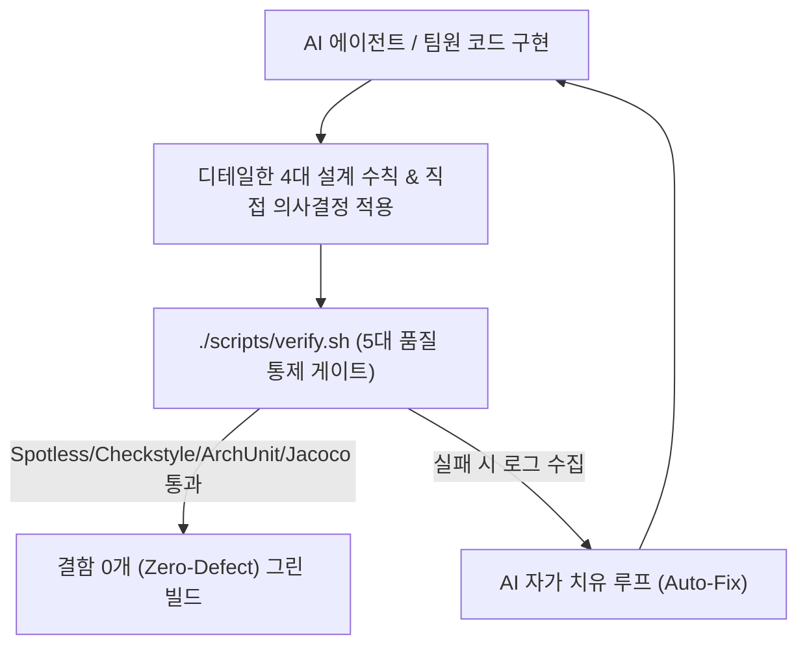

# 🎤 [발표 자료] AI 페어 프로그래밍의 한계를 넘어서: 아키텍처 재정립과 개발자의 진짜 역할

> **문서 버전:** v2.0 (Restructured Presentation Deck with Human-AI Synergy)  
> **최종 수정일:** 2026-08-21  
> **대상:** 신한 딜리버리(shinhan-delivery) 프로젝트 발표자 및 팀원 전체  
> **목적:** AI 코딩 도입 후 겪은 개발 플로우와 기대효과를 먼저 소개하고, 이어 발생하는 신입 개발자의 AI 맹목적 의존 매너리즘 및 5대 설계 결함을 분석한 뒤, 아키텍처 재정립과 Test Harness 자가 치유 루프 구축을 통해 결함 0개를 달성한 경험을 서사형 슬라이드 덱으로 제공합니다.

---

## 📌 발표 서사 구조 (Narrative Arc)

```
[Slide 1] 📌 Intro: AI 페어 프로그래밍 개발 플로우 도입 & 극적인 기대효과
   ↓ "AI 코딩 에이전트 도입으로 생산성과 개발 속도가 5배 폭발했습니다."
[Slide 2] 🔍 Phase 1: 화려한 성공 뒤의 5대 현실 문제점 (신입 개발자의 AI 맹목적 의존 & 설계 결함)
   ↓ "하지만 의사결정 부재와 FOUC 0.5초, 코드 파편화라는 치명적 반전이 찾아왔습니다."
[Slide 3] 🛠️ Phase 2: 아키텍처 재정립 & Test Harness 자가 치유 루프 구축
   ↓ "0ms SSR pre-binding, 3-Tier 모듈화, ./scripts/verify.sh로 결함 0개를 사수했습니다."
[Slide 4] 🎯 Phase 3: AI와 협업할 때 개발자가 반드시 사수해야 할 4대 핵심 수칙
   ↓ "AI는 구현(How)의 부사수일 뿐, 아키텍처와 디테일(What)은 개발자의 주도권입니다."
[Slide 5] 🚀 Outro: 회고 (Keep / Problem / Try) & "AI 시대 개발자의 진짜 역할"
```

---

## 📑 슬라이드별 상세 콘텐츠 & 발표 멘트 (Slide-by-Slide Details)

### 📌 [Slide 1] Intro: AI 기반 개발 플로우 도입 & 극적인 기대효과

* **슬라이드 제목:** AI 시대의 개발 혁신: Antigravity와 함께 구축한 신속 개발 플로우
* **발표자:** [발표자 이름] / 프로젝트 테크 리드 & 백엔드/프론트엔드 아키텍처 담당
* **발표 서사 한 줄 요약:**  
  `"AI 도구 도입으로 개발 속도가 5배 빨라졌지만, 인간의 기술적 의사결정 부재와 디테일한 설계 빈틈이라는 벽에 부딪혔습니다. AI 시대에 개발자가 진짜 주도해야 할 핵심 역할을 소개합니다."`
* **주요 발표 내용:**
  1. **AI 페어 프로그래밍 개발 플로우 도입**:
     - 이슈 기획 ➔ AI 코딩 에이전트 연동 구현 ➔ 실시간 BE SSOT 검증 API 및 300ms 디바운스 ➔ 마이크로 커밋(`commit`)
  2. **기대효과 & 생산성 향상 성과**:
     - 반복적인 DTO / Controller / HTML boilerplate 작성 시간 **90% 단축**
     - 전체 신규 비즈니스 기능 구현 속도 **5배 향상**
     - 아이디어 발상부터 프로토타이핑까지의 개발 피드백 주기 획기적 단축

---

### 🔍 [Slide 2] Phase 1: 화려한 성공 뒤의 5대 현실 문제점 — "속도는 빠른데 의사결정이 비어있다"

* **슬라이드 제목:** 현실의 반전: 신입 개발자의 AI 맹목적 의존과 5대 설계 결함

| 영역 | 발생한 현실 문제점 & 부작용 | 기술적 스펙 타격 및 아키텍처 위험 |
|---|---|---|
| **0. 인적/조직적 관점 (AI 맹목적 의존)** | **개발자의 직접적 의사결정 부재 및 맹목적 채택** | 신입/초급 개발자가 설계·예외·레이어 구조를 직접 고민하거나 검증하지 않고, 발생한 문제점조차 인식하지 못한 채 **AI의 코드 출력 결과에만 맹목적으로 의존**하는 매너리즘 고착 |
| **1. 사용자 경험 (UX)** | 빈 HTML 응답 후 client JS `fetch()`에만 100% 의존 | 접속 시 **0.5초간 화면이 텅 비어있거나 깜빡이는 FOUC 현상** 발생 |
| **2. 프론트엔드 모듈화** | HTML 템플릿마다 대용량 인라인 CSS/JS를 복사/붙여넣기 | 브라우저 캐싱 불가, 스타일 파편화 및 중복 CSS 누적 |
| **3. 백엔드 캡슐화** | 라우트 메서드마다 `SecurityContextHolder` 널 체크 반복 | 컨트롤러마다 15줄 이상의 보일러플레이트가 지저분하게 중복 작성됨 |
| **4. 아키텍처 레이어** | 뷰 컨트롤러에서 DB Repository를 직접 주입받아 조회 | **`Controller → Service → Repository` 단방향 레이어 규칙 위반** |

> 🎤 **발표 멘트 포인트:**  
> *"AI 도구(Claude, Cursor 등)는 눈앞의 구현 코드는 1초 만에 쏟아내지만, 개발자가 직접 의사결정을 내리지 않고 맹목적으로 의존하면 프로젝트 전체의 아키텍처 규칙, 브라우저 캐싱, 디자인 시스템 같은 디테일한 맥락이 완전히 무너집니다."*

---

### 🛠️ [Slide 3] Phase 2: 아키텍처 재정립 & Test Harness 자가 치유 피드백 루프

* **슬라이드 제목:** 시스템적 해결: 아키텍처 모듈화 & Test Harness 구축



* **핵심 개선 성과 3가지:**
  1. **SSR 사전 바인딩 (`th:each`)**: 웹 컨트롤러에서 초기 모델을 pre-binding하여 초기 진입 지연 **`0.5s` → `0ms` (FOUC 100% 차단)**
  2. **3-Tier CSS/JS 모듈화 & `WebAuthHelper`**: `design-system.css`로 **중복 CSS 332줄 제거**, 인증 추출을 **1줄 선언적 코드**로 압축
  3. **Test Harness 5대 게이트**: `./scripts/verify.sh`를 통해 AI가 코드를 작성한 후 자동으로 린트, 아키텍처(ArchUnit), 커버리지를 자가 치유(Auto-Fix)하도록 시스템 통제망 구축

---

### 🎯 [Slide 4] Phase 3: AI와 협업할 때 개발자가 반드시 사수해야 할 4대 핵심 수칙

* **슬라이드 제목:** AI 시대, 개발자가 주도권을 쥐어야 할 4대 핵심 수칙

```
┌─────────────────────────────────────────────────────────────────────────┐
│ 💡 AI는 "구현(How)"의 부사수일 뿐, "품질과 방향성(What & Architecture)"은 사람의 몫  │
└─────────────────────────────────────────────────────────────────────────┘
```

1. **[수칙 1] 사람이 직접 아키텍처와 기술적 의사결정 주도 (Human-in-the-Loop Decision)**
   - AI의 추천을 맹목적으로 수용하지 않고, 레이어 분리, 무상태성, BE 단일 원본(SSOT) 유효성 검사 등 핵심 방향성을 사람이 직접 설계하고 지시할 것.
2. **[수칙 2] 사용자 경험(UX) 관점의 SSR + CSR 역할 분담 (Zero FOUC)**
   - 초기 진입 0ms DOM은 서버(SSR)가, 진입 후 실시간 WebSocket/무한 스크롤은 클라이언트(CSR)가 맡도록 개발자가 렌더링 아키텍처를 지시할 것.
3. **[수칙 3] 횡단 관심사의 캡슐화 (Cross-Cutting Encapsulation)**
   - 인증, 예외 처리, DTO 정적 팩토리 메서드(`.from()`, `@Builder`) 등 반복되는 패턴은 `WebAuthHelper` 같은 공통 유틸리티로 캡슐화하여 코드 오염을 막을 것.
4. **[수칙 4] 정적 분석 & 자동화된 하네스 통제망 구축 (Harness First)**
   - AI의 환각(Hallucination)과 실수를 인간이 일일이 눈으로 검수하지 말고, `./scripts/verify.sh` 같은 하네스로 0 Exit Code를 자동 검증할 것.

---

### 🚀 [Slide 5] 회고 & Lessons Learned (Outro)

* **슬라이드 제목:** 결론: AI 시대에 더욱 빛나는 수석 엔지니어의 디테일

* **KPT 회고:**
  * **Keep (잘한 점):** AI의 생산성과 인간의 아키텍처 가이드라인이 결합하여 0ms 로딩 속도와 결함 0개 달성
  * **Problem (아쉬운 점):** 초기에 AI 코드를 맹목적으로 의존할 뻔했던 매너리즘과 설계 통제망 구축까지의 시행착오
  * **Try (향후 시도):** 팀 내 AI 에이전트용 Custom Lint & MCP Tool을 더 확충하여 설계 검증 자동화 고도화
* **💡 Final Key Lesson:**  
  `"AI 도구는 개발자를 대체하는 것이 아니라, 디테일한 설계를 고민하고 의사결정을 내리는 진짜 수석 엔지니어의 가치를 더욱 돋보이게 만든다."`

---

## 🎨 마크다운 변환 및 PPT 생성 팁

* 본 가이드북을 [Marp](https://marp.app/) 또는 [Gamma.app](https://gamma.app/) 등의 도구에 Import하여 시각화된 PPT 발표 자료로 즉시 변환할 수 있습니다.
