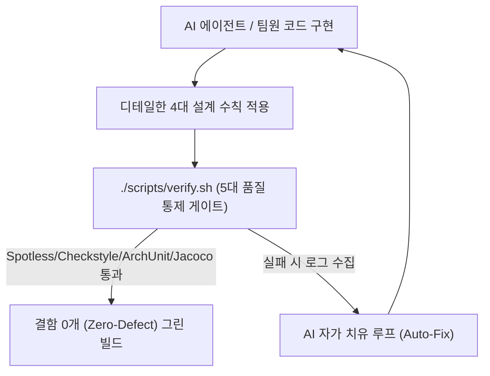

# 🎤 [발표 자료] AI 페어 프로그래밍의 한계를 넘어서: 아키텍처 재정립과 개발자의 진짜 역할

> **문서 버전:** v1.0 (Storytelling Presentation Deck)  
> **최종 수정일:** 2026-08-19  
> **대상:** 신한 딜리버리(shinhan-delivery) 프로젝트 발표자 및 팀원 전체  
> **목적:** AI 도구(Claude Code, Cursor, Antigravity) 도입 후 겪은 초기 한계와 디테일한 설계 부재를 극복하고, 수석 엔지니어로서 아키텍처와 Test Harness를 구축하여 결함 0개를 달성한 릴레이션 스토리를 서사형 슬라이드 덱으로 제공합니다.

---

## 📌 발표 서사 구조 (Narrative Arc)

```
[Slide 1] 📌 표지 & 스토리 개요 (AI 시대의 페어 프로그래밍과 아키텍처의 발견)
   ↓
[Slide 2] 🔍 Phase 1: AI 코딩의 초반 미스 ("기능은 동작하는데 디테일이 생략되었다")
   ↓
[Slide 3] 🛠️ Phase 2: 아키텍처 재정립 & Test Harness 자가 치유 루프 구축
   ↓
[Slide 4] 🎯 Phase 3: AI와 협업할 때 개발자가 반드시 사수해야 할 4대 핵심 수칙
   ↓
[Slide 5] 🚀 Outro: 회고 (Keep / Problem / Try) & "AI 시대 개발자의 진짜 역할"
```

---

## 📑 슬라이드별 상세 콘텐츠 & 발표 멘트 (Slide-by-Slide Details)

### 📌 [Slide 1] 표지 & 스토리 개요 (Introduction)

* **슬라이드 제목:** AI와 함께 달린 프로젝트: 디테일한 설계의 발견과 수석 엔지니어링의 역할
* **발표자:** [발표자 이름] / 프로젝트 테크 리드 & 백엔드/프론트엔드 아키텍처 담당
* **발표 서사 한 줄 요약:**  
  `"AI 도구 도입으로 개발 속도는 5배 빨라졌지만, 화면 깜빡임(FOUC)과 아키텍처 파편화라는 벽에 부딪혔습니다. AI 시대에 개발자가 진짜 챙겨야 할 디테일한 설계 수칙을 소개합니다."`
* **주요 발표 목차:**
  1. **[시작]** AI 도입과 초반의 착시 (속도는 빠른데 디테일이 비어있다?)
  2. **[발견]** 코드 내부에서 발견된 4가지 주요 설계 결함 (FOUC, 중복 CSS/JS, 보일러플레이트, 레이어 위반)
  3. **[개선]** 아키텍처 재정립 & Test Harness 자가 치유 피드백 루프 구축
  4. **[결론]** AI와 협업할 때 개발자가 반드시 챙겨야 할 4대 핵심 수칙

---

### 🔍 [Slide 2] Phase 1: AI 코딩의 초반 미스 — "기능은 동작하는데 디테일이 생략되었다"

* **슬라이드 제목:** AI가 놓치기 쉬운 4가지 디테일한 설계 빈틈

| 영역 | AI가 놓친 디테일한 설계 부재 현상 | 실제 발생한 문제점 & 스펙 타격 |
|---|---|---|
| **1. 사용자 경험 (UX)** | 빈 HTML 응답 후 client JS `fetch()`에만 100% 의존 | 접속 시 **0.5초간 화면이 텅 비어있거나 깜빡이는 FOUC 현상** 발생 |
| **2. 프론트엔드 모듈화** | HTML 템플릿마다 대용량 인라인 CSS/JS를 복사/붙여넣기 | 브라우저 캐싱 불가, 스타일 파편화 및 중복 CSS 누적 |
| **3. 백엔드 캡슐화** | 라우트 메서드마다 `SecurityContextHolder` 널 체크 반복 | 컨트롤러마다 15줄 이상의 보일러플레이트가 지저분하게 중복 작성됨 |
| **4. 아키텍처 레이어** | 뷰 컨트롤러에서 DB Repository를 직접 주입받아 조회 | **`Controller → Service → Repository` 단방향 레이어 규칙 위반** |

> 🎤 **발표 멘트 포인트:**  
> *"AI 도구(Claude, Cursor 등)는 당장 동작하는 눈앞의 기능은 빠르게 만들어 주지만, 프로젝트 전체의 디자인 토큰, 브라우저 캐싱, 무상태 아키텍처 규칙 같은 디테일한 맥락은 쉽게 놓칩니다."*

---

### 🛠️ [Slide 3] Phase 2: 아키텍처 재정립 & Test Harness 자가 치유 피드백 루프

* **슬라이드 제목:** 시스템적 해결: 아키텍처 모듈화 & Test Harness 구축



* **핵심 개선 성과 3가지:**
  1. **SSR 사전 바인딩 (`th:each`)**: 웹 컨트롤러에서 초기 모델을 pre-binding하여 초기 진입 지연 **`0.5s` → `0ms` (FOUC 100% 차단)**
  2. **3-Tier CSS/JS 모듈화 & `WebAuthHelper`**: `design-system.css`로 **중복 CSS 332줄 제거**, 인증 추출을 **1줄 선언적 코드**로 압축
  3. **Test Harness 5대 게이트**: `./scripts/verify.sh`를 통해 AI가 코드를 작성한 후 자동으로 린트, 아키텍처(ArchUnit), 커버리지를 자가 치유(Auto-Fix)하도록 시스템 통제망 구축

---

### 🎯 [Slide 4] Phase 3: AI와 협업할 때 개발자가 반드시 사수해야 할 4대 핵심 수칙

* **슬라이드 제목:** AI 시대, 개발자가 주도권을 쥐어야 할 4대 핵심 수칙

```
┌─────────────────────────────────────────────────────────────────────────┐
│ 💡 AI는 "구현(How)"의 부사수일 뿐, "품질과 방향성(What & Architecture)"은 사람의 몫  │
└─────────────────────────────────────────────────────────────────────────┘
```

1. **[수칙 1] 아키텍처 레이어 순수성 사수 (ArchUnit Enforcement)**
   - AI가 편리함 때문에 `Controller -> Repository` 직접 접근을 시도할 때, 무조건 `Service`를 경유하도록 강제하고 ArchUnit 검증으로 통제할 것.
2. **[수칙 2] 사용자 경험(UX) 관점의 SSR + CSR 역할 분담 (Zero FOUC)**
   - 초기 진입 0ms DOM은 서버(SSR)가, 진입 후 실시간 WebSocket/무한 스크롤은 클라이언트(CSR)가 맡도록 개발자가 렌더링 아키텍처를 지시할 것.
3. **[수칙 3] 횡단 관심사의 캡슐화 (Cross-Cutting Encapsulation)**
   - 인증, 예외 처리, DTO 정적 팩토리 메서드(`.from()`, `@Builder`) 등 반복되는 패턴은 `WebAuthHelper` 같은 공통 유틸리티로 캡슐화하여 코드 오염을 막을 것.
4. **[수칙 4] 정적 분석 & 자동화된 하네스 통제망 구축 (Harness First)**
   - AI의 환각(Hallucination)과 실수를 인간이 일일이 눈으로 검수하지 말고, `./scripts/verify.sh` 같은 하네스로 0 Exit Code를 자동 검증할 것.

---

### 🚀 [Slide 5] 회고 & Lessons Learned (Outro)

* **슬라이드 제목:** 결론: AI 시대에 더욱 빛나는 수석 엔지니어의 디테일

* **KPT 회고:**
  * **Keep (잘한 점):** AI의 생산성과 인간의 아키텍처 가이드라인이 결합하여 0ms 로딩 속도와 결함 0개 달성
  * **Problem (아쉬운 점):** 초기에 AI가 쏟아내는 코드의 디테일한 아키텍처 검증을 시스템화하기까지의 시행착오
  * **Try (향후 시도):** 팀 내 AI 에이전트용 Custom Lint & MCP Tool을 더 확충하여 설계 검증 자동화 고도화
* **💡 Final Key Lesson:**  
  `"AI 도구는 개발자를 대체하는 것이 아니라, 디테일한 설계를 고민하는 진짜 수석 엔지니어의 가치를 더욱 돋보이게 만든다."`

---

## 🎨 마크다운 변환 및 PPT 생성 팁

* 본 가이드북을 [Marp](https://marp.app/) 또는 [Gamma.app](https://gamma.app/) 등의 도구에 Import하여 시각화된 PPT 발표 자료로 즉시 변환할 수 있습니다.
