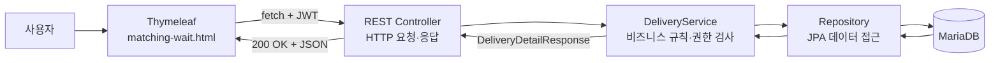

# 신한 딜리버리 REST API 기술 성과 발표

> **문서 버전:** v1.0  
> **최종 수정일:** 2026-08-18  
> **발표자:** 남윤재 / 백엔드 & 신한 Delivery  
> **예상 발표 시간:** 약 10분  
> **발표 주제:** 배송 조회·매칭·취소 흐름을 일관된 HTTP 계약으로 제공하고, 중복·동시 요청에서도 안전한 상태 변경을 보장한 REST API 설계  
> **작성 기준:** [개발자 발표 PPT 표준 템플릿 가이드](./개발자-발표-PPT-표준-템플릿-가이드.md)

---

## Slide 1. REST API 기술 성과 요약

### 배송 상태를 연결하고, 취소 정산을 안전하게 만든 API

신한 딜리버리의 배송 조회·매칭·취소 흐름을 REST API로 제공하고, 화면과 비즈니스 로직 사이에 일관되고 안전한 HTTP 계약을 만들었습니다.

### 3대 핵심 성과

| 구분 | Before | After |
|---|---|---|
| **책임 분리** | 화면 반환과 데이터 처리가 섞일 가능성 | `@Controller`는 HTML, `@RestController`는 JSON을 담당 |
| **상태 자동 반영** | 사용자가 매칭 상태를 확인하기 위해 화면을 다시 요청할 가능성 | `fetch`가 REST API를 5초마다 호출해 상태를 자동 반영 |
| **정산 일관성** | 중복 취소 요청으로 이중 정산이나 부분 반영이 발생할 위험 | 트랜잭션·비관적 락·멱등 처리로 취소 정산 보호 |

> [!IMPORTANT]
> 이 발표의 중심은 REST API입니다. `fetch`는 브라우저의 REST API 호출 수단으로, HATEOAS는 현재 구현이 아닌 향후 확장 선택지로 설명합니다.

### 발표 대본

안녕하세요. 백엔드와 신한 Delivery 프로젝트를 담당한 남윤재입니다. 오늘은 배송 조회, 매칭, 취소 흐름을 중심으로 저희 프로젝트의 REST API를 설명하겠습니다.

핵심 성과는 세 가지입니다. 첫째, HTML 화면과 JSON API의 책임을 분리했습니다. 둘째, 매칭 대기 상태를 `fetch`가 5초마다 조회해 화면에 자동 반영했습니다. 셋째, 취소 API에는 트랜잭션과 DB 락, 멱등 처리를 적용해 중복 요청에서도 정산 일관성을 지켰습니다.

---

## Slide 2. 추진 배경 & 주요 목표

이 프로젝트는 기존 시스템을 REST API로 전환한 사례가 아니라 처음부터 새로 만든 프로젝트입니다. 따라서 Before는 과거의 잘못된 구현이 아니라 **REST API를 적용하지 않았을 때 발생할 수 있었던 설계 과제**를 의미합니다.

| 구분 | 구현 전 설계 과제(Before) | REST API 적용 결과(After) |
|---|---|---|
| **구조·역할** | 화면 반환과 데이터·비즈니스 처리가 한 Controller에 섞일 가능성 | `@Controller`는 HTML, `@RestController`는 JSON을 담당하고 `Controller → Service → Repository`로 책임 분리 |
| **사용자 경험** | 매칭 여부를 확인하기 위해 사용자가 전체 화면을 다시 요청해야 할 가능성 | `fetch`가 GET API를 5초마다 호출하고 `MATCHED` 응답 시 완료 화면으로 자동 이동 |
| **리스크·품질** | Entity 직접 노출과 Controller별 예외 응답 불일치 위험 | 응답 DTO와 `GlobalExceptionHandler`를 적용하고 `401·403·404·409`를 의미에 맞게 반환 |

> **핵심 기대 가치:** 화면 새로고침 없이 최신 상태를 제공하면서 계층별 책임과 API 계약을 명확하게 유지합니다.

### 실제 코드: 화면 Controller와 REST Controller 분리

```java
@Controller
public class DeliveryWebController {

  @GetMapping("/matching-wait")
  public String matchingWait() {
    return "matching-wait";
  }
}
```

```java
@RestController
@RequestMapping("/api/v1/delivery-requests")
public class DeliveryController {

  @GetMapping("/{deliveryRequestId}")
  public ResponseEntity<DeliveryDetailResponse> getDeliveryRequest(...) {
    // JSON 응답
  }
}
```

관련 코드:

- [`DeliveryWebController`](../../src/main/java/com/example/shinhandelivery/delivery/controller/DeliveryWebController.java)
- [`DeliveryController`](../../src/main/java/com/example/shinhandelivery/delivery/controller/DeliveryController.java)

### 발표 대본

이 프로젝트는 기존 시스템을 REST API로 전환한 사례가 아니라 처음부터 새로 만든 프로젝트입니다. 그래서 Before를 과거의 잘못된 구현이라고 표현하지 않고, REST API를 적용하지 않았다면 생길 수 있었던 설계 과제로 정의했습니다.

첫 번째 과제는 화면과 데이터 로직이 한 Controller에 섞이는 것이었습니다. 이를 HTML을 반환하는 Controller와 JSON을 반환하는 REST Controller로 분리했습니다. 두 번째는 매칭 상태 확인을 위한 화면 새로고침 문제였습니다. `fetch`의 5초 GET 폴링으로 해결했습니다. 세 번째는 Entity 노출과 예외 응답 불일치 위험입니다. DTO와 `GlobalExceptionHandler`를 사용해 외부 계약과 상태 코드를 표준화했습니다.

---

## Slide 3. 배송 요청을 자원과 HTTP 메서드로 표현

### REST 자원

```http
/api/v1/delivery-requests/{id}
```

- `/api`: 화면이 아닌 API 요청
- `/v1`: API 버전
- `/delivery-requests`: 복수형 명사로 표현한 배송 요청 자원
- `/{id}`: 특정 배송 요청을 식별하는 Path Variable

### 실제 배송 API

| HTTP 메서드 | API | 프로젝트 동작 | 성공 응답 |
|---|---|---|---|
| `GET` | `/api/v1/delivery-requests/{id}` | 배송 상세 조회 | `200 OK` |
| `POST` | `/api/v1/delivery-requests` | 배송 요청 생성 | `201 Created` |
| `PATCH` | `/api/v1/delivery-requests/{id}/pickup` | 픽업 상태 변경 | `200 OK` |
| `PATCH` | `/api/v1/delivery-requests/{id}/complete` | 배송 완료 처리 | `200 OK` |
| `DELETE` | `/api/v1/delivery-requests/{id}` | 기존 클라이언트 호환 취소 | `204 No Content` |

### 실패도 API 계약이다

| 상태 코드 | 의미 | 프로젝트 사례 |
|---|---|---|
| `401 Unauthorized` | 인증 필요 | 로그인 토큰이 없는 요청 |
| `403 Forbidden` | 접근 권한 없음 | 고객 본인이나 배정 배송원이 아닌 사용자의 상세 조회 |
| `404 Not Found` | 자원 없음 | 존재하지 않는 배송 요청 ID |
| `409 Conflict` | 현재 상태와 요청 충돌 | 허용되지 않는 배송 상태 전이 |

### 발표 대본

REST API 설계의 기본은 URL과 HTTP 메서드의 역할을 나누는 것입니다. 저희 프로젝트는 배송 요청을 `delivery-requests`라는 복수형 명사 자원으로 표현하고, 특정 배송은 Path Variable인 ID로 식별합니다.

GET은 상세 조회, POST는 배송 요청 생성, PATCH는 픽업이나 완료처럼 일부 상태를 변경하는 데 사용했습니다. 기존 클라이언트 호환 취소는 DELETE와 204 응답을 유지합니다. 성공 응답뿐 아니라 실패도 API 계약입니다. URL과 메서드, 상태 코드만 보아도 API의 의도와 결과를 예측할 수 있도록 설계했습니다.

---

## Slide 4. 시스템 구조 & REST API 설계 아키텍처



### 실제 Controller 코드

```java
@GetMapping("/{deliveryRequestId}")
@PreAuthorize("isAuthenticated()")
public ResponseEntity<DeliveryDetailResponse> getDeliveryRequest(
    @AuthenticationPrincipal CustomUserDetails principal,
    @PathVariable Long deliveryRequestId) {
  return ResponseEntity.ok()
      .cacheControl(CacheControl.noStore())
      .body(
          deliveryService.getDeliveryRequestDetail(
              principal.getId(), deliveryRequestId));
}
```

### DTO 응답 예시

```json
{
  "id": 123,
  "status": "MATCHED",
  "feePoint": 5000,
  "courierName": "홍길동",
  "vehicleType": "MOTORCYCLE"
}
```

### Entity 대신 DTO를 반환하는 이유

1. DB 구조와 외부 API 계약을 분리합니다.
2. API에 필요한 필드만 외부에 제공합니다.
3. 내부 필드와 민감 정보의 불필요한 노출을 방지합니다.
4. 배송·매칭·차량에서 가져온 정보를 하나의 응답으로 조합할 수 있습니다.

관련 코드:

- [`DeliveryService#getDeliveryRequestDetail`](../../src/main/java/com/example/shinhandelivery/delivery/service/DeliveryService.java)
- [`DeliveryDetailResponse`](../../src/main/java/com/example/shinhandelivery/delivery/dto/response/DeliveryDetailResponse.java)

### 발표 대본

사용자는 Thymeleaf 화면에서 JWT와 배송 ID를 REST Controller로 보냅니다. Controller는 HTTP 요청과 인증을 담당하고 Service를 호출합니다. Service는 배송, 매칭, 차량을 조회하고 고객 본인이나 배정 배송원인지 확인합니다. Repository는 JPA를 통해 MariaDB에 접근합니다.

의존성은 `Controller → Service → Repository` 방향으로만 흐릅니다. 응답은 `DeliveryRequest` Entity를 직접 반환하지 않고 `DeliveryDetailResponse` DTO로 만듭니다. 이를 통해 DB 구조와 외부 API 계약을 분리하고 필요한 필드만 노출할 수 있습니다.

---

## Slide 5. 매칭 대기 GET API와 fetch

### 실제 fetch 코드

```javascript
const response = await fetch(
    `/api/v1/delivery-requests/${deliveryId}`,
    {
        headers: { Authorization: header },
        cache: 'no-store'
    }
);

const detail = await response.json();
```

### 5초 상태 폴링

```javascript
const POLL_INTERVAL_MS = 5000;

pollStatus();
pollTimer = setInterval(pollStatus, POLL_INTERVAL_MS);
```

### 상태에 따른 화면 처리

```javascript
if (
    detail.status === 'MATCHED' ||
    detail.status === 'PICKED_UP' ||
    detail.status === 'COMPLETED'
) {
    stopPolling();
    location.replace(
        `/matching-complete?id=${encodeURIComponent(deliveryId)}`
    );
}
```

### HTTP 상태 코드 처리

```javascript
if (response.status === 401) {
    location.replace('/login');
}

if (response.status === 403) {
    showStatusMessage('이 배송 요청을 볼 권한이 없어요.');
}

if (response.status === 404) {
    showStatusMessage('배송 요청 정보를 확인할 수 없어요.');
}
```

> [!NOTE]
> `fetch`는 REST가 아니라 브라우저가 REST API를 호출하는 도구입니다. 또한 `fetch`는 HTTP `404`나 `500` 응답을 받더라도 네트워크 통신이 완료되면 자동으로 예외를 발생시키지 않으므로 `response.ok` 또는 `response.status`를 확인해야 합니다.

관련 코드: [`matching-wait.html`](../../src/main/resources/templates/matching-wait.html)

### 발표 대본

매칭 대기 화면은 배송 상세 GET API를 즉시 한 번 호출한 뒤 5초마다 반복합니다. Authorization 헤더에는 JWT를 넣고, 캐시된 과거 상태를 사용하지 않도록 `no-store`를 설정했습니다. 서버 역시 응답에 `Cache-Control: no-store`를 포함합니다.

JSON의 상태가 `REQUESTED`이면 계속 기다리고, `MATCHED`, `PICKED_UP`, `COMPLETED`가 되면 폴링을 중단하고 매칭 완료 화면으로 이동합니다. 오류도 상태 코드별로 처리합니다.

---

## Slide 6. 핵심 기술 구현 — 취소 API의 정산 불일치 방지

### 조회와 명령 분리

```http
GET /api/v1/delivery-requests/{id}/cancellation-preview
```

- 서버 상태를 변경하지 않습니다.
- 현재 상태에 따른 수수료와 예상 환불·배송원 보상액을 반환합니다.

```http
POST /api/v1/delivery-requests/{id}/cancel
```

- 배송 상태를 `CANCELLED`로 변경합니다.
- 고객 환불, 배송원 보상, 매칭 취소, 차량 상태 복구를 처리합니다.
- 실제 정산 결과를 `DeliveryCancellationResponse`로 반환합니다.

### P-R-S-I 기술 분석

| 단계 | 분석 | 상세 내용 |
|---|---|---|
| **Problem** | 문제 상황 | 중복 클릭이나 네트워크 재시도로 동일한 취소 POST 요청이 반복될 수 있음 |
| **Root Cause** | 원인 진단 | 취소가 상태 변경뿐 아니라 환불·보상·매칭 취소·차량 복구를 함께 수행하므로 일부 작업만 반영되면 정산 불일치 발생 |
| **Solution** | 해결 방법 | `@Transactional`, 비관적 락, 취소 완료 시 기존 결과 반환, 배송 ID 기반 정산 멱등성 키 적용 |
| **Impact** | 검증 결과 | 중복 요청의 이중 정산을 방지하고 취소 관련 변경을 하나의 원자적 작업으로 처리 |

### 실제 Service 코드

```java
@Transactional
public DeliveryCancellationResponse cancel(
    Long customerId, Long deliveryRequestId) {
  DeliveryRequest deliveryRequest =
      findDeliveryRequestForUpdateOrThrow(deliveryRequestId);

  if (deliveryRequest.getStatus() == DeliveryStatus.CANCELLED
      && deliveryRequest.getCancellationReason()
          == DeliveryCancellationReason.CUSTOMER_REQUEST) {
    return DeliveryCancellationResponse.from(deliveryRequest);
  }

  // 환불·보상·매칭·차량·배송 상태를 하나의 트랜잭션으로 처리
}
```

### Repository의 비관적 락

```java
@Lock(LockModeType.PESSIMISTIC_WRITE)
@Query("select d from DeliveryRequest d where d.id = :id")
Optional<DeliveryRequest> findByIdForUpdate(@Param("id") Long id);
```

> **Key Point:** 좋은 REST API는 URI와 HTTP 메서드뿐 아니라 중복·동시 요청에서도 동일하고 일관된 비즈니스 결과를 보장해야 합니다.

관련 코드:

- [`DeliveryCancellationService`](../../src/main/java/com/example/shinhandelivery/delivery/service/DeliveryCancellationService.java)
- [`DeliveryRequestRepository`](../../src/main/java/com/example/shinhandelivery/delivery/repository/DeliveryRequestRepository.java)
- [`GlobalExceptionHandler`](../../src/main/java/com/example/shinhandelivery/common/exception/GlobalExceptionHandler.java)

### 발표 대본

먼저 GET `cancellation-preview`는 서버 상태를 바꾸지 않고 예상 수수료와 환불액만 조회합니다. 사용자가 동의하면 POST `cancel`이 실제 취소를 수행합니다.

문제는 버튼 중복 클릭이나 네트워크 재시도로 같은 POST가 반복될 수 있다는 점입니다. 취소는 단순 삭제가 아니라 고객 환불, 배송원 보상, 매칭 취소, 차량 상태 복구를 함께 처리합니다. 일부만 성공하면 정산 불일치가 발생할 수 있습니다.

이를 방지하기 위해 Service 전체를 트랜잭션으로 묶고 Repository에서 비관적 쓰기 락으로 배송 행을 조회합니다. 이미 고객 요청으로 취소된 배송이면 다시 정산하지 않고 기존 결과를 반환합니다. 허용되지 않는 상태 전이는 `409 Conflict`로 변환합니다.

---

## Slide 7. 회고 & 향후 발전 방향

| 구분 | 항목 | 상세 내용 |
|---|---|---|
| **Keep** | 계속 유지할 것 | `Controller → Service → Repository` 책임 분리, DTO와 공통 `ErrorResponse` 계약, 트랜잭션·락·멱등성 기반 안전성 |
| **Problem** | 현재 한계 | 프론트엔드가 API URL을 직접 구성하고, 5초 폴링으로 불필요한 요청이 발생할 수 있으며, 외부 클라이언트 증가 시 결합도가 높아질 수 있음 |
| **Try** | 향후 확장 | HATEOAS로 상태별 행동 링크 제공, WebSocket 이벤트와 GET 상태 조회 병행, 링크 관계와 API 계약 테스트 추가 |

### 현재 응답

```json
{
  "id": 123,
  "status": "REQUESTED"
}
```

현재 프론트엔드는 API URL을 직접 구성합니다.

```javascript
fetch(
    `/api/v1/delivery-requests/${deliveryId}/cancel`,
    { method: 'POST' }
);
```

### HATEOAS 적용 예시

```json
{
  "id": 123,
  "status": "REQUESTED",
  "_links": {
    "self": {
      "href": "/api/v1/delivery-requests/123"
    },
    "cancel": {
      "href": "/api/v1/delivery-requests/123/cancel"
    }
  }
}
```

> [!WARNING]
> 현재 프로젝트에는 Spring HATEOAS 의존성과 `_links` 응답이 구현되어 있지 않습니다. 위 JSON은 다중 클라이언트 확장 시 검토할 수 있는 설계 예시입니다.

### 현재 HATEOAS를 사용하지 않은 이유

1. Thymeleaf 프론트엔드와 Spring Boot API가 같은 저장소에서 관리됩니다.
2. 현재 API 경로가 단순하고 일정하여 URL 구성 비용이 크지 않습니다.
3. HATEOAS 의존성, 링크 조립 계층, 응답·프론트엔드 변경에 비해 현재 얻는 효과가 작습니다.
4. 모바일 앱이나 외부 제휴 클라이언트가 늘어나면 도입 가치가 커질 수 있습니다.

> **Key Lesson:** REST API는 데이터를 반환하는 코드가 아니라 화면과 비즈니스 로직을 연결하는 명확하고 안전한 계약입니다.

### 발표 대본

Keep은 계층별 책임 분리, DTO와 공통 에러 계약, 트랜잭션과 멱등성으로 API 안전성을 확보한 점입니다. Problem은 현재 프론트엔드가 API 경로를 직접 구성하고 매칭 확인을 위해 5초마다 요청한다는 점입니다.

현재처럼 Thymeleaf와 API가 같은 저장소에 있고 경로가 단순한 규모에서는 구현 복잡도를 낮추는 합리적인 선택입니다. 따라서 HATEOAS는 현재 구현이라고 말하면 안 됩니다. 향후 모바일 앱이나 외부 클라이언트가 늘어난다면 Try로 검토할 수 있습니다.

---

## 예상 질문과 답변

### Q1. fetch는 REST API인가요?

아닙니다. REST API는 서버가 제공하는 HTTP 인터페이스이고, `fetch`는 브라우저 JavaScript가 해당 API를 호출하는 수단입니다. Postman이나 모바일 애플리케이션도 같은 REST API를 호출할 수 있습니다.

### Q2. 취소에 `DELETE` 대신 `POST /cancel`을 사용한 이유는 무엇인가요?

배송 취소는 배송 요청을 물리적으로 삭제하는 작업이 아닙니다. 배송 상태 변경, 고객 환불, 배송원 보상, 매칭 취소, 차량 상태 복구를 포함하는 도메인 명령입니다. 실제 정산 결과도 반환해야 하므로 명령형 POST API를 사용했습니다. 기존 클라이언트 호환을 위한 DELETE API도 유지하고 있습니다.

### Q3. HATEOAS를 실제로 사용했나요?

아닙니다. 현재 프로젝트에는 Spring HATEOAS가 구현되어 있지 않습니다. 프론트엔드와 백엔드가 같은 저장소에 있고 API 경로가 단순하기 때문에 현재 규모에서는 구현 복잡도를 낮추는 것을 우선했습니다. 다중 클라이언트 환경으로 확장될 때 검토할 수 있습니다.

### Q4. 폴링 대신 WebSocket을 사용하지 않은 이유는 무엇인가요?

현재 화면의 상태 확인 요구사항에는 5초 GET 폴링이 단순하고 충분한 선택입니다. 프로젝트에는 실시간 통신 구조도 존재하므로 향후에는 WebSocket 이벤트로 변경 사실을 전달하고 GET API로 최종 상태를 확인하는 방식으로 확장할 수 있습니다.

### Q5. `fetch`에서 `response.ok`를 확인해야 하는 이유는 무엇인가요?

`fetch`는 HTTP `404`나 `500`을 받더라도 네트워크 요청 자체가 완료되면 Promise를 자동으로 reject하지 않습니다. 따라서 `response.ok`나 `response.status`를 확인해 성공과 실패를 구분해야 합니다.

---

## 발표 전 검증 체크리스트

- [ ] 발표에서 HATEOAS를 현재 구현이라고 표현하지 않는다.
- [ ] `fetch`와 REST API를 같은 개념이라고 설명하지 않는다.
- [ ] Before를 과거의 잘못된 시스템이 아니라 구현 전 설계 과제로 설명한다.
- [ ] `POST /cancel`은 물리 삭제가 아닌 정산 포함 도메인 명령이라고 설명한다.
- [ ] 전체 발표 시간을 10분 이내로 리허설한다.

### 코드 확인 명령어

```bash
rg -n "@(GetMapping|PostMapping|PatchMapping|DeleteMapping)" \
  src/main/java/com/example/shinhandelivery/delivery/controller/DeliveryController.java

rg -n "fetch\\(|POLL_INTERVAL_MS|cancellation-preview" \
  src/main/resources/templates/matching-wait.html

rg -n "@Transactional|findByIdForUpdate|PESSIMISTIC_WRITE" \
  src/main/java/com/example/shinhandelivery/delivery \
  src/main/java/com/example/shinhandelivery/delivery/repository
```
