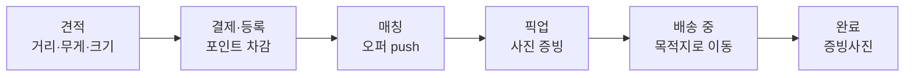
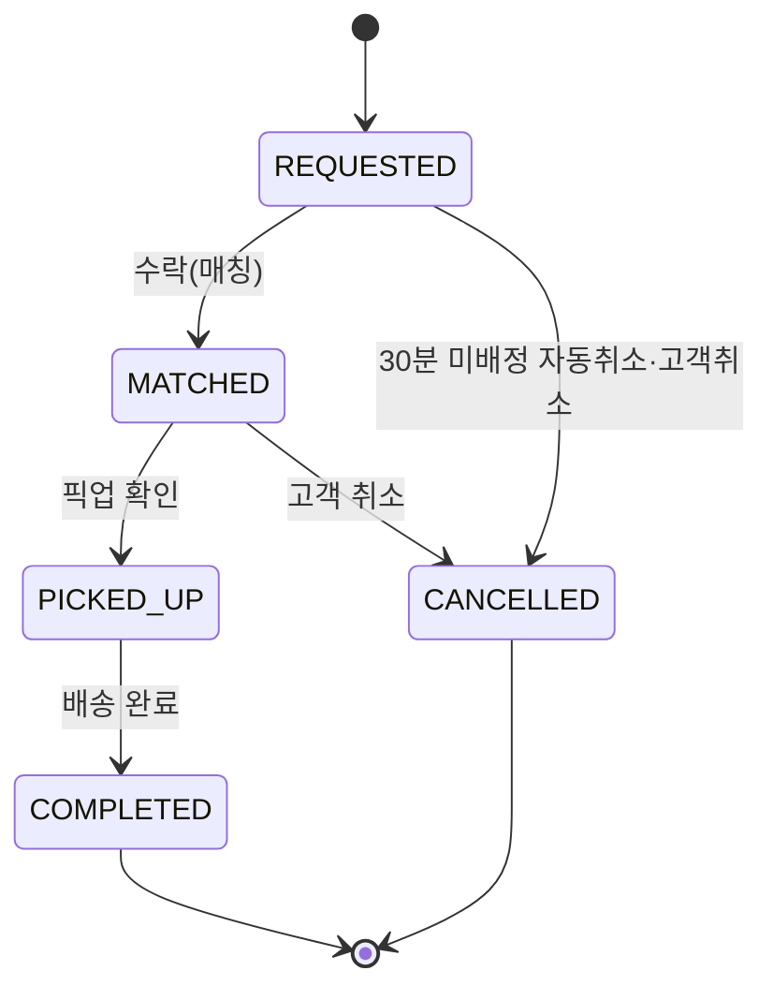
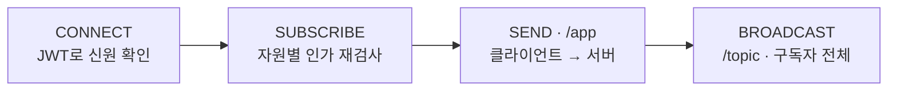
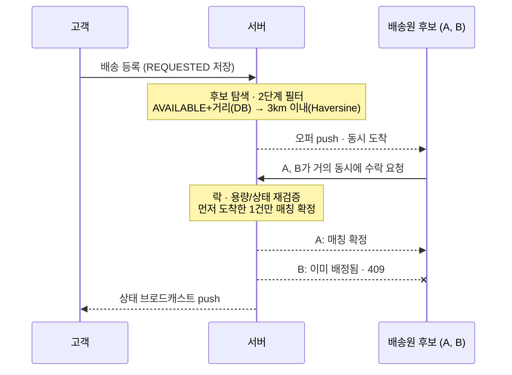
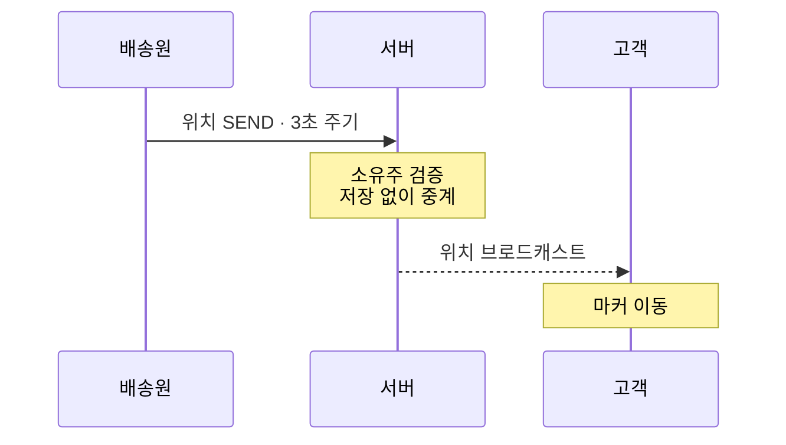

# 실시간 배송 매칭 — WebSocket 아키텍처

> 배송 등록부터 완료까지, 매칭·위치·상태·알림이 WebSocket(STOMP) push로 전달되는 구조를 설명합니다.

---

## 1. 배송 한 건이 지나가는 여섯 단계

견적부터 완료까지, 취소 가능 구간과 위치 push 구간은 서로 다릅니다. 위치 공유는 **매칭되는 즉시** 시작해 완료까지 이어집니다.

- **취소 가능 구간**: 결제·등록 ~ 매칭 (전액~부분 환불)
- **취소 불가 구간**: 픽업 이후
- **위치 push 구간**: 매칭 즉시 시작 ~ 완료까지, 3초 주기 — 픽업 장소로 이동하는 구간과 목적지로 이동하는 구간 모두 push됩니다
- 차량은 `COMPLETED`·`CANCELLED`로 전이될 때 서버가 자동으로 `AVAILABLE`로 되돌립니다

### 상태 전이

배송 요청 상태는 `REQUESTED → MATCHED → PICKED_UP → COMPLETED` 순으로만 전이합니다. `CANCELLED`로는 `REQUESTED`·`MATCHED`에서만 갈 수 있고, 취소 API 자체가 그 외 상태에서는 막혀 있습니다.

- `REQUESTED`에서 취소되면 전액 환불
- `MATCHED`에서 취소되면 최대 1,000P가 차감된 뒤 나머지가 환불되고, 차감액은 배송원 보상으로 지급
- `PICKED_UP`·`COMPLETED`에서는 취소로 전이할 수 없음

---

## 2. WebSocket · STOMP, 그리고 토픽 설계

| | 일반 HTTP라면 | WebSocket이라면 |
|---|---|---|
| | 요청 → 응답이 끝나면 연결이 닫혀서, 서버가 새 소식이 생겨도 클라이언트가 다시 물어보기 전엔 알릴 방법이 없습니다. 오퍼 경쟁·위치·상태처럼 지연이 결과를 바꾸는 곳에서는 폴링 주기만큼 그대로 지연이 체감됩니다. | 연결을 계속 열어둔 채로 양쪽이 아무 때나 메시지를 보낼 수 있어, 서버가 먼저 오퍼·위치·상태 변화를 밀어넣을(push) 수 있습니다. |

이 프로젝트는 WebSocket 위에 발행-구독 규칙을 표준화한 STOMP를 얹어, 토픽을 구독(SUBSCRIBE)하고 발행(SEND)하는 방식으로 씁니다.

CONNECT에서는 인증("이 사람이 누구인가", JWT)만 확인하고, SUBSCRIBE에서 인가("이 사람이 이 자원을 볼 자격이 있는가")를 자원 단위로 검사합니다. 연결(CONNECT)과 구독(SUBSCRIBE)은 세션 시작 시 한 번만 일어나고, SEND·BROADCAST는 메시지가 생길 때마다 반복됩니다.

### 토픽 설계

| 토픽 | 발행 주체 | 용도 |
|---|---|---|
| `/vehicles/{id}/offers` | 서버 (등록 시 자동) | 새 콜 오퍼 알림 |
| `/delivery/{id}/status` | 서버 (상태 변경 시) | 매칭·픽업·완료·취소 |
| `/delivery/{id}/location` | 배송원 (SEND) | 실시간 위치 중계 |
| `/members/{id}/notifications` | 서버 (상태 변경 시) | 개인 알림 |

4개 토픽 모두 자원(차량·배송·회원) ID 단위로 쪼개, 구독 시점마다 자원별 인가를 검사합니다.

---

## 3. 오퍼는 동시에 도착한다, 매칭은 한 번만 확정된다

서버는 조건에 맞는 배송원 후보 전원에게 오퍼를 동시에 push합니다. 여러 명이 거의 동시에 수락해도, 락을 먼저 잡은 단 하나의 요청만 매칭으로 확정됩니다.

---

## 4. 한 콜에 두 번 배정되지 않도록 — 2중 방어

**1차 · 비관적 락**
배송 요청 행과 차량 행에 락을 걸어, 같은 콜·같은 차량을 노리는 트랜잭션을 줄 세웁니다. 락을 먼저 잡은 요청만 용량·`AVAILABLE` 상태를 재검증하고 매칭을 확정합니다. 차량 엔티티는 ID로만 먼저 조회하고, 락을 잡는 시점에 실제 엔티티를 로드합니다.

**2차 · DB 유니크 제약**
락을 거치지 않는 경로가 있더라도 배송 요청 ID에 걸린 DB 유니크 제약이 중복 저장 자체를 거부하는 최후 방어선입니다.

---

## 5. 위치는 저장하지 않고, 중계만 합니다

위치는 배송원 브라우저의 위치 API가 기기 GPS로 계속 추적합니다. "정확도 우선" 모드로 요청해 Wi-Fi·기지국으로 대충 추정하지 않고, 느리더라도 GPS로 정확한 좌표를 받습니다. 브라우저가 좌표를 바꿀 때마다 바로 알려주지만, 그걸 다 보내지 않고 3초에 한 번 그 시점의 최신 좌표만 골라 서버로 발행합니다.

위치 SEND가 올 때마다 경로·본문의 배송 ID가 일치하는지, 보낸 사람이 그 배송에 매칭된 차량의 소유주인지 재검증한 뒤 중계합니다. DB를 거치지 않는 순수 중계라 지연이 거의 없고, 새 좌표를 받는 즉시 지도 마커 위치를 갱신합니다.
