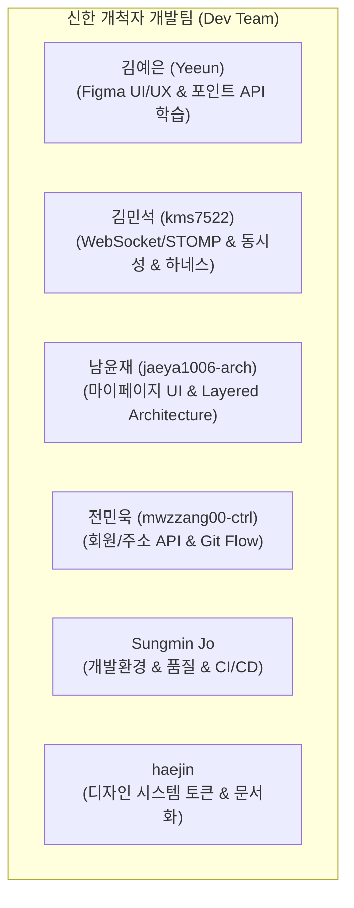
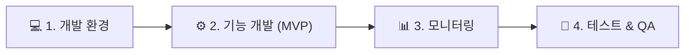

# 📊 [신한 개척자] 프로젝트 상세 진행 상황 & 팀원별 성과 및 향후 전략 보고서

> **보고 일시:** 2026년 8월 3일  
> **프로젝트명:** 신한 개척자 (shinhan-gaecheokja) - 스마트 퀵배송 & 온디맨드 매칭 플랫폼  
> **현재 상태:** 🟢 **MVP 핵심 기능 막바지 단계 (완목율 ~75%) & 4대 개발 요소 고도화 진행 중**

---

## 📌 1. Executive Summary (1분 요약)

본 프로젝트는 **Spring Boot 4.1.0 & Thymeleaf/HTML5/Vanilla JS 기반의 스마트 퀵배송 & 온디맨드 매칭 플랫폼** 구축 프로젝트입니다. 현재 **팀원들이 개발에 몰입할 수 있는 표준 개발 환경(코드 컨벤션, GitHub Issue PRD 템플릿, Code Review 족보 가이드, GitHub Actions CI/CD 파이프라인, Flyway 무중단 마이그레이션, 자동 검증 하네스 `./pr`) 구축**과 **디자이너 Yeeun 님의 Figma 기반 실전 UI/UX 애플리케이션 디자인**을 바탕으로 온보딩, 회원, 배송신청, 실시간 위치추적, 마이페이지 등 주요 MVP 기능의 **75% 이상**을 성공적으로 개발 완료하였습니다.

- **표준 개발 환경 & CI/CD 구축:** 🛠️ 단일 원본(SSOT) 코딩 컨벤션, GitHub Issue PRD 템플릿, Code Review 족보 가이드, GitHub Actions CI/CD, Flyway DDL 린팅 & 원클릭 PR 하네스(`./pr`) 완비
- **Figma 애플리케이션 디자인:** 🎨 **디자이너 Yeeun** 님의 Figma 와이어프레임 및 디자인 시스템 토큰 구축 후 100% 웹 UI 연동 완료
- **MVP 개발 완목율:** 🎯 **약 75%** (전체 50개 이슈 중 34개 완료, 핵심 결제/매칭 이벤트 남음)
- **품질 게이트 상태:** 🟢 **Passed** (Checkstyle, Spotless, ArchUnit, JaCoCo 60%+ 게이트 및 175+개 전체 테스트 100% 통과)
- **핵심 목표:** MVP 최우선 개발 후 추가 기능 검토 및 4대 요소(개발환경, 기능개발, 모니터링, 테스트) 보완

---

## 🔍 2. GitHub Issue & PR 기반 MVP 기능 정의 및 구현 현황

기획된 전체 MVP 기능(Sprint 1 ~ 6 및 개발 환경/거버넌스 모듈)의 세부 목록과 현재 구현 완료 여부 매트릭스입니다.

- **전체 MVP 및 인프라 완목율:** **34 / 50개 이슈 완료 (74.5%)**

### 📊 MVP 기능 및 개발 환경 구축 매트릭스 (Feature & Infra Status Matrix)

| 모듈 / 영역 | 기획된 MVP 기능 및 개발 환경 구축 항목 | 주요 스펙 / 구현 내용 | 구현 상태 | 관련 이슈 |
| :--- | :--- | :--- | :---: | :---: |
| **Dev Environment & Governance (개발 환경 & 통제)** | **단일 원본(SSOT) 코딩 컨벤션 정립** | `code-convention.md`, `CLAUDE.md`, `AGENTS.md` | 🟢 완료 | `#197` |
| | **GitHub Issue PRD 템플릿 & 기획 자동화** | Issue Form 템플릿 & `/plan` LangGraph 파이프라인 | 🟢 완료 | `#159, #161` |
| | **Code Review 족보 가이드 & PR 템플릿** | `pr-review-guide.md`, `pull_request_template.md` | 🟢 완료 | `#181` |
| | **GitHub Actions CI/CD & 검증 하네스** | CI/CD 자동화 파이프라인, `./scripts/verify.sh`, `./pr` | 🟢 완료 | `#181, #201` |
| | **Flyway 무중단 DDL 마이그레이션 체계** | `db/migration/V1__*.sql` 및 Online DDL 린트 | 🟢 완료 | `#188` |
| | **Checkstyle & Spotless 정적 분석 자동화** | 코드 포맷팅 & Inline Variable 컨벤션 연동 | 🟢 완료 | `#196` |
| | **ArchUnit & JaCoCo 60%+ 커버리지 게이트** | 단방향 레이어링 규칙 및 커버리지 자동 통제 | 🟢 완료 | `#128` |
| | **단일 main 브랜치 Flow 전략 수립** | 빠른 피드백 루프를 위한 Git 단일 브랜치 갱신 | 🟢 완료 | `#201` |
| **Sprint 1 (인증 & 온보딩)** | 스플래시 & 워크스루 화면 | `FE-001, FE-002` | 🟢 완료 | `#96` |
| | 소셜/이메일 로그인 & 회원가입 UI | `FE-003 ~ FE-006` | 🟢 완료 | `#97` |
| | 고객 회원가입 API | `POST /api/members` | 🟢 완료 | `#94` |
| | 이메일 로그인 API | `POST /api/members/login` | 🟢 완료 | `#93` |
| | 회원 역할 변경 API | `PATCH /api/members/role` | 🟢 완료 | `#95` |
| **Sprint 2 (홈 & 배송 신청)** | 고객 홈 대시보드 & 알림센터 UI | `FE-007, FE-008` | 🟢 완료 | `#103` |
| | 주소 입력 & 카카오맵 지도 SDK 연동 UI | `FE-009 ~ FE-011` | 🟢 완료 | `#104` |
| | 카테고리 선택 & 픽업가이드 UI | `FE-012 ~ FE-014` | 🟢 완료 | `#105` |
| | 배송 요금 산정 API | `POST /api/deliveries/estimate` | 🟢 완료 | `#99` |
| | 물품 카테고리 목록 조회 API | `GET /api/categories` | 🟢 완료 | `#100` |
| | 공통 이미지 업로드 API | `POST /api/uploads/image` | 🟢 완료 | `#101` |
| **Sprint 3 (결제 & 매칭)** | 결제 PIN 키패드 & 결제 확인 UI | `FE-015 ~ FE-017` | ⏳ 개발 중 | `#110` |
| | 매칭 대기 & 매칭 완료 UI | `FE-018, FE-019` | ⏳ 개발 중 | `#111` |
| | 결제 PIN 검증 API | `POST /api/payments/verify-pin` | ⏳ 개발 중 | `#107` |
| | 배송 결제 & 포인트 차감 API | `POST /api/deliveries/pay` | ⏳ 개발 중 | `#108` |
| | 배송원 매칭 이벤트 로직 | Event Publisher / Listener | ⏳ 개발 중 | `#109` |
| **Sprint 4 (실시간 추적 & 내역)**| 실시간 추적 & 문앞 사진 확인 UI | `FE-020, FE-021` | 🟢 완료 | `#116` |
| | 배송 내역 목록/취소 상세 UI | `FE-022 ~ FE-024` | ⏳ 개발 중 | `#117` |
| | 포인트 지갑 & PG 충전 UI | `FE-025, FE-026` | ⏳ 개발 중 | `#118` |
| | WebSocket 실시간 위치 추적 핸들러 | `/pub/tracking`, `/sub/status` | 🟢 완료 | `#113` |
| | 배송 내역/상세 조회 API | `GET /api/deliveries` | 🟢 완료 | `#114` |
| | 배송 완료 처리 & 문앞 사진 증거 API | `POST /api/deliveries/{id}/complete` | 🟢 완료 | `#184` |
| | 포인트 충전 API | `POST /api/points/charge` | ⏳ 개발 중 | `#115` |
| | 알림 목록 조회/읽음 API | `GET/PATCH /api/v1/notifications` | 🟢 완료 | `#102, #145` |
| **Sprint 5 (마이페이지 & 설정)** | 프로필 편집 & 주소 관리 UI | `FE-027 ~ FE-029` | 🟢 완료 | `#123` |
| | 비밀번호 변경 & 공지사항 UI | `FE-030, FE-031` | 🟢 완료 | `#124` |
| | 내 정보 조회 & 프로필 수정 API | `GET/PATCH /api/members/me` | 🟢 완료 | `#120` |
| | 자주 쓰는 주소 관리 CRUD API | `/api/addresses` | 🟢 완료 | `#121` |
| | 공지사항 목록 및 상세 조회 API | `GET /api/notices` | 🟢 완료 | `#122` |
| **Sprint 6 (전역 폴리싱 & QA)** | 전역 예외 처리 & Actuator 헬스체크 | `/actuator/health` | 🟢 완료 | `#126` |
| | 에러 토스트 & 빈 상태 UI | Toast / Empty State | ⏳ 개발 중 | `#127` |
| | 자가 치유 하네스 & 커버리지 상향 | JaCoCo 80%+ Ratchet | ⏳ 개발 중 | `#128` |

---

## 👥 3. 팀원별 상세 성과 & 역량 성장 (Team Contributions & Learning)

각 팀원이 주도적으로 담당하여 완료한 세부 개발 내역 및 기술 성장 공유 항목입니다.

### 🎨 김예은 (Yeeun) | UI/UX 디자이너 & FE
- **🎨 실전 개발 성과:**
  - **Figma UI/UX Design 전체 화면 설계:** 온보딩, 배송 신청, 실시간 추적, 마이페이지 등 애플리케이션 **30+개 전역 화면 컴포넌트 & UX Flow 디자인 완료**.
- **🌱 기술 역량 성장 & 학습 (Learning & Growth):**
  - **Git & GitHub 협업:** 팀 Git Flow 분기 및 마이크로 커밋 협업 방식 터득.
  - **Database & 포인트 충전 API 학습:** RDBMS 데이터 구조 이해 및 포인트 충전 비즈니스 API 구조 학습.

### 👨‍💻 김민석 (kms7522) | 백엔드 & 동시성/실시간 코어
- **⚡ 실전 개발 성과:**
  - **웹소켓/STOMP 기반 실시간 통신 및 보안:** `/status` 구독 채널 권한 검증 및 배송 상태 실시간 푸시 구축.
  - **핵심 REST API 완비:** 배송 요금 산정(`POST /api/deliveries/estimate`), 이미지 업로드, 알림 목록, 카테고리, 배송 내역 API 구현.
- **🌱 기술 역량 성장 & 학습 (Learning & Growth):**
  - **동시성 제어 (Concurrency):** 낙관적 락(Optimistic Lock) & 비관적 락(Pessimistic Lock)을 활용한 다중 배차/결제 Race Condition 차단 기법 터득.
  - **하네스 엔지니어링 (Harness Engineering):** `./scripts/verify.sh` 및 Flyway/Spotless/ArchUnit 품질 통제 자가 치유 피드백 루프 습득.

### 👨‍💻 남윤재 (jaeya1006-arch) | 프론트엔드 & 마이페이지 UI
- **🖥️ 실전 개발 성과:**
  - **마이페이지 & 설정 UI 구현:** Figma 연동 프로필 편집, 주소 관리, 비밀번호 변경, 공지사항 및 홈 대시보드 동선 연결.
- **🌱 기술 역량 성장 & 학습 (Learning & Growth):**
  - **Git & GitHub 사용법 터득:** 브랜치 전략 및 PR 협업 절차 체득.
  - **백엔드 아키텍처 흐름 이해:** `Controller ➔ Service ➔ Repository` 단방향 의존성 레이어드 구조 습득.
  - **Spring 어노테이션 & JWT 학습:** 핵심 어노테이션(`@Controller`, `@Service`, `@Transactional` 등) 및 JWT 인증/인가 동작 원리 체득.

### 👨‍💻 전민욱 (mwzzang00-ctrl) | 백엔드 & 회원/주소록 API
- **⚙️ 실전 개발 성과:**
  - **회원 & 주소록/공지사항 REST API 구현:** 내 정보 조회/수정 (`/api/members/me`), 자주 쓰는 주소록 CRUD (`/api/addresses`), 공지사항 조회 API 개발.
- **🌱 기술 역량 성장 & 학습 (Learning & Growth):**
  - **도메인 코드 흐름 체득:** 주소 관리, 회원가입, 로그인 비즈니스 로직 및 JPA 데이터 처리 흐름 심층 이해.
  - **Git & GitHub 터득:** 버전 관리 및 이슈 기반 팀 협업 지식 습득.

### 👨‍💻 Sungmin Jo | 팀 개발 환경 구축 / 품질 거버넌스 / AI 오케스트레이션
- **🛠️ 실전 개발 성과:**
  - **팀 코딩 컨벤션 & 단일 원본(SSOT) 거버넌스 정립 (`#197`):** 개발 생산성을 높이고 코드 스타일을 일관되게 유지하기 위해 `code-convention.md`, `CLAUDE.md`, `AGENTS.md` 규격 정립.
  - **GitHub Issue PRD 템플릿 & 기획 자동화 수립 (`#159`, `#161`):** 표준 Issue Form PRD 템플릿 도입 및 `/plan <이슈번호>` 기획 자동화 구축.
  - **Code Review 문화 & 리뷰어 3분 족보 가이드 정립 (`docs/pr-review-guide.md`):** 리뷰어 3분 족보 가이드 및 PR 템플릿(`.github/pull_request_template.md`) 구축.
  - **GitHub Actions CI/CD & 원클릭 검증 하네스 구축 (`#181`, `#201`):** CI/CD 파이프라인 연동 및 원클릭 검증·PR 제출 하네스(`./scripts/verify.sh`, `./pr`) 구축.
  - **Flyway 무중단 DDL & 품질 게이트 연동 (`#128`, `#188`, `#196`):** Flyway 무중단 Online DDL 린팅 규칙 연동, Checkstyle & Spotless 포맷터, ArchUnit 검증 & JaCoCo 60%+ 게이트 통제.
- **🌱 기술 역량 성장 & 학습 (Learning & Growth):**
  - **AI 오케스트레이션:** LangGraph 기반 이슈 자동화 파이프라인 구축 (`#154`).

### 👩‍🎨 haejin | 디자인 시스템 표준화
- **📐 실전 개발 성과:**
  - **공통 디자인 시스템 구축:** Figma 스펙 기반 디자인 토큰(색상, 타이포그래피, 버튼) 및 `design-system.md` 표준화.

---

## 💡 4. MVP 완성 및 4대 관점별 보완 방향성 (Strategy & Roadmap)

MVP 기능을 신속히 마감하고 안정적인 서비스를 구축하기 위해 **4대 개발 요소 관점**에서 아래 보완 사항을 추진합니다.

### 💻 1. 개발 환경 (Dev Environment) 보완
- **로컬 DB & Dummy Data 가동 자동화:** Docker Compose 기반 MariaDB 컨테이너 기동 파이프라인 표준화 및 `.env` 환경 변수 검증 자동화.
- **GitHub Issue PRD 템플릿과 `/plan` 자동 기획 파이프라인 고도화.**
- **GitHub Actions CI/CD 파이프라인 지속 유지 보수:** 구축된 `./scripts/verify.sh` 및 Flyway 마이그레이션 린팅 체계를 CI/CD 파이프라인과 100% 동기화.
- **Swagger API 명세 자동 동기화:** Controller 수정 시 Swagger UI (`springdoc-openapi`)가 실시간 갱신되도록 하네스 연결.

### ⚙️ 2. 기능 개발 (Feature Development) 보완 (MVP 완수)
- **MVP 잔여 결제/매칭 스프린트 집중:** PIN 결제, 포인트 차감 (`#108`), 배송원 매칭 이벤트 (`#109`) 완료 후 피처 락(Feature Lock).
- **Code Review 족보 가이드(5대 표준 구성 요소) 준수로 PR 리뷰 시간 단축.**
- **보안 하네스 강화:** `#204` 이슈 해결을 위해 Spring Security Context 기반 인증 사용자 ID 강제 binding 검증 로직 적용.

### 📊 3. 모니터링 (Observability & Ops) 보완
- **Actuator 헬스체크 연동:** `#74` Spring Boot Actuator (`/actuator/health`) 엔드포인트 연동으로 DB 커넥션 및 메모리 상태 주기적 관제 강화.

### 🧪 4. 테스트 (Testing & QA Gate) 보완
- **E2E 통합 시나리오 테스트 구축 (`#72`):** 회원가입 ➔ 배송신청 ➔ PIN결제 ➔ 기사매칭 ➔ 배송완료로 이어지는 전 과정 Full Scenario 통합 테스트 작성.
- **JaCoCo 커버리지 래칫 상향 (`#128`):** 현 60% 커버리지 게이트를 **80% 이상**으로 단계적 상향하여 리팩토링 안정성 확보.
- **동시성 락(Lock) 검증 테스트 (`#71`):** 다수 기사가 동시 매칭 수락 및 결제 시 race condition이 발생하지 않음을 Multi-thread 테스트로 검증.

---

## 🎯 5. 결론 및 향후 실행 스케줄 (Action Items)

1. **1차 목표 (MVP 피처 완성):** 남아있는 결제/매칭 Open 이슈 (`#107`~`#111`) 개발 완료를 통해 MVP 100% 달성.
2. **2차 목표 (4대 요점 보완):** E2E 테스트 구축, 보안 검증 강화(`#204`), Actuator 헬스체크 연동.
3. **3차 목표 (추가 기능 검토):** Yeeun 님의 Figma 원본 디자인 스펙과 MVP 완성 후 사용자 피드백을 기반으로 2차 확장 기능 기획.

---
*본 보고서는 Yeeun 님의 Figma 디자인 스펙, GitHub Issues/PR 상태 및 테스트 하네스 검증 결과를 바탕으로 작성되었습니다.*
