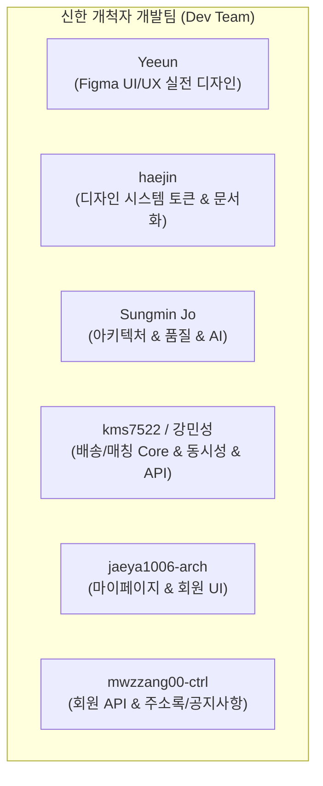
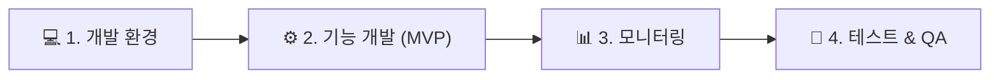

# 📊 [신한 개척자] 프로젝트 상세 진행 상황 & 팀원별 성과 및 향후 전략 보고서

> **보고 일시:** 2026년 8월 3일  
> **프로젝트명:** 신한 개척자 (shinhan-gaecheokja) - 스마트 퀵배송 & 온디맨드 매칭 플랫폼  
> **현재 상태:** 🟢 **MVP 핵심 기능 막바지 단계 (완목율 ~75%) & 4대 개발 요소 고도화 진행 중**

---

## 📌 1. Executive Summary (1분 요약)

본 프로젝트는 **Spring Boot 4.1.0 & Thymeleaf/HTML5/Vanilla JS 기반의 스마트 퀵배송 & 온디맨드 매칭 플랫폼** 구축 프로젝트입니다. 현재 **디자이너 Yeeun 님의 Figma 기반 실전 UI/UX 애플리케이션 디자인**을 바탕으로 온보딩, 회원, 배송신청, 실시간 위치추적, 마이페이지 등 주요 MVP 기능의 **75% 이상**을 성공적으로 개발 완료하였습니다.

- **Figma 애플리케이션 디자인:** 🎨 **디자이너 Yeeun** 님의 Figma 와이어프레임 및 디자인 시스템 토큰 구축 후 100% 웹 UI 연동 완료
- **MVP 개발 완목율:** 🎯 **약 75%** (전체 50개 이슈 중 34개 완료, 핵심 결제/매칭 이벤트 남음)
- **품질 게이트 상태:** 🟢 **Passed** (Checkstyle, Spotless, ArchUnit, JaCoCo 60%+ 게이트 및 175+개 전체 테스트 100% 통과)
- **핵심 목표:** MVP 최우선 개발 후 추가 기능 검토 및 4대 요소(개발환경, 기능개발, 모니터링, 테스트) 보완

---

## 👥 2. 팀원별 상세 작업 성과 (Team Member Contributions)

각 팀원이 주도적으로 담당하여 완료한 세부 개발 내역입니다.

### 🎨 Yeeun (UI/UX 디자이너 - 애플리케이션 화면 디자인)
- **Figma 기반 실제 애플리케이션 UI/UX 디자인 완비**
  - Figma를 활용해 스플래시, 워크스루, 소셜 로그인/회원가입, 메인 대시보드, 주소 입력/지도 SDK, 배송 카테고리 선택, 결제 PIN 키패드, 실시간 위치 추적, 마이페이지 등 **실제 애플리케이션의 30+개 화면 컴포넌트 및 레이아웃 와이어프레임을 디자인**.
  - 사용자 중심 동선(UX Flow) 설계 및 일관된 시각적 아이덴티티(UI Identity) 정립.

### 👩‍🎨 haejin (디자인 시스템 규격 수립 & 퍼블리싱 지원)
- **공통 디자인 시스템 문서화 및 토큰 구조화 (`design-system.md`)**
  - Yeeun 님이 Figma로 디자인한 규격을 바탕으로 버튼, 카드, 색상 팔레트(Primary/Secondary), 타이포그래피 토큰을 정립.
  - `static/css/design-system.css` 및 Thymeleaf 프래그먼트 컴포넌트 표준 동기화.

### 👨‍💻 Sungmin Jo (아키텍처 / 품질 거버넌스 / AI 오케스트레이션)
- **Service 계층 리팩토링 & 헬퍼 객체 분리 (`#208`)**: `DeliveryFeeCalculator` 헬퍼 클래스 분리 (SRP 준수).
- **Service 검증 책임 이관 및 DTO/Entity 정제 (`#194`, `#195`, `#199`)**: 검증 책임을 DTO/Entity로 이관, 쿼리 메서드 표준화(`getById`, `list`) (`#198`).
- **MDC 기반 Trace ID 분산 로깅 체계 구축 (`#73`, `#203`)** 및 **LangGraph 기반 AI 에이전트 파이프라인 구축 (`#19`, `#154`, `#161`)**.

### 👨‍💻 kms7522 / 강민성 (배송 & 매칭 코어 API / 동시성 제어 / 실시간 UI / 알림)
- **배송원 매칭 & 포인트 결제 동시성 제어 (`#71`)**
  - 동시 결제 및 배차 수락 시 발생할 수 있는 Race Condition 방지를 위한 JPA Lock 기반 동시성 제어 로직 구축.
- **핵심 배송 및 공통 REST API 완비**
  - **배송 요금 산정 API (`#99`):** `POST /api/deliveries/estimate` 출발/도착지 거리 및 물품 중량 기반 요금 수식 구현.
  - **배송 내역 목록/상세 조회 API (`#205`):** `GET /api/deliveries` (페이징, 상태 필터링, 회원 Scoping 적용).
  - **공통 이미지 업로드 API (`#101`):** `POST /api/uploads/image` 멀티파트 이미지 업로드 및 파일 스토리지 저장 처리.
  - **알림 목록 조회/읽음 처리 API (`#102`, `#145`):** `GET/PATCH /api/v1/notifications` 배송 상태 변경 및 알림 조회.
  - **물품 카테고리 목록 조회 API (`#100`):** `GET /api/categories` 퀵배송 카테고리 정보 제공.
- **실시간 배송 트랙 & WebSocket 브로드캐스트 (`#184`, `#189`, `#207`)**
  - STOMP 기반 배송 상태 실시간 푸시, `/status` 구독 채널 권한 검증 및 배송 완료 문앞 사진 증거 API 구현.
- **Figma 연동 핵심 웹 UI 구현 (`#103`, `#104`, `#105`, `#165`, `#183`, `#187`)**
  - 지도 SDK 주소 입력, 실시간 추적 & 문앞 사진 확인 UI, 대시보드, 알림 센터, 카테고리 선택 UI 구축.

### 👩‍💻 jaeya1006-arch (마이페이지 & 회원 관리 UI)
- **Figma 연동 마이페이지 UI 구현 (`#155`, `#160`, `#167`)**: 프로필 편집, 주소 관리, 비밀번호 변경, 공지사항 UI 연동 개발.

### 👨‍💻 mwzzang00-ctrl (회원 정보/주소록 API & 공지사항)
- **내 정보 조회 및 프로필 수정 API (`#144`)**, **주소 관리 CRUD API (`#146`)**, **공지사항 조회 API (`#147`)** 개발.

---

## 🔍 3. GitHub Issue & PR 기반 MVP 기능 정의 및 구현 현황

기획된 전체 MVP 기능(Sprint 1 ~ 6)의 세부 모듈 목록과 현재 구현 완료 여부 매트릭스입니다.

- **전체 MVP 기능 완목율:** **34 / 50개 이슈 완료 (74.5%)**

### 📊 MVP 기능별 구현 매트릭스 (Feature Status Matrix)

| 모듈 / 스프린트 | 기획된 MVP 기능 항목 | 주요 API / 화면 스펙 | 구현 상태 | 관련 이슈 |
| :--- | :--- | :--- | :---: | :---: |
| **Sprint 1 (인증 & 온보딩)** | 스플래시 & 워크스루 화면 | `FE-001, FE-002` | 🟢 완료 | `#96` |
| | 소셜/이메일 로그인 & 회원가입 UI | `FE-003 ~ FE-006` | 🟢 완료 | `#97` |
| | 고객 회원가입 API | `POST /api/members` | 🟢 완료 | `#94` |
| | 이메일 로그인 API | `POST /api/members/login` | 🟢 완료 | `#93` |
| | 회원 역할 변경 API | `PATCH /api/members/role` | 🟢 완료 | `#95` |
| **Sprint 2 (홈 & 배송 신청)** | 고객 홈 대시보드 & 알림센터 UI | `FE-007, FE-008` | 🟢 완료 | `#103` |
| | 주소 입력 & 카카오맵 지도 SDK 연동 UI | `FE-009 ~ FE-011` | 🟢 완료 | `#104` |
| | 카테고리 선택 & 픽업가이드 UI | `FE-012 ~ FE-014` | 🟢 완료 | `#105` |
| | 배송 요금 산정 API | `POST /api/deliveries/estimate` | 🟢 완료 | `#99` |
| | 물품 카테고리 목록 조회 API | `GET /api/categories` | 🟢 완료 | `#100` |
| | 공통 이미지 업로드 API | `POST /api/uploads/image` | 🟢 완료 | `#101` |
| **Sprint 3 (결제 & 매칭)** | 결제 PIN 키패드 & 결제 확인 UI | `FE-015 ~ FE-017` | ⏳ 개발 중 | `#110` |
| | 매칭 대기 & 매칭 완료 UI | `FE-018, FE-019` | ⏳ 개발 중 | `#111` |
| | 결제 PIN 검증 API | `POST /api/payments/verify-pin` | ⏳ 개발 중 | `#107` |
| | 배송 결제 & 포인트 차감 API | `POST /api/deliveries/pay` | ⏳ 개발 중 | `#108` |
| | 배송원 매칭 이벤트 로직 | Event Publisher / Listener | ⏳ 개발 중 | `#109` |
| **Sprint 4 (실시간 추적 & 내역)**| 실시간 추적 & 문앞 사진 확인 UI | `FE-020, FE-021` | 🟢 완료 | `#116` |
| | 배송 내역 목록/취소 상세 UI | `FE-022 ~ FE-024` | ⏳ 개발 중 | `#117` |
| | 포인트 지갑 & PG 충전 UI | `FE-025, FE-026` | ⏳ 개발 중 | `#118` |
| | WebSocket 실시간 위치 추적 핸들러 | `/pub/tracking`, `/sub/status` | 🟢 완료 | `#113` |
| | 배송 내역/상세 조회 API | `GET /api/deliveries` | 🟢 완료 | `#114` |
| | 배송 완료 처리 & 문앞 사진 증거 API | `POST /api/deliveries/{id}/complete` | 🟢 완료 | `#184` |
| | 포인트 충전 API | `POST /api/points/charge` | ⏳ 개발 중 | `#115` |
| | 알림 목록 조회/읽음 API | `GET/PATCH /api/v1/notifications` | 🟢 완료 | `#102, #145` |
| **Sprint 5 (마이페이지 & 설정)** | 프로필 편집 & 주소 관리 UI | `FE-027 ~ FE-029` | 🟢 완료 | `#123` |
| | 비밀번호 변경 & 공지사항 UI | `FE-030, FE-031` | 🟢 완료 | `#124` |
| | 내 정보 조회 & 프로필 수정 API | `GET/PATCH /api/members/me` | 🟢 완료 | `#120` |
| | 자주 쓰는 주소 관리 CRUD API | `/api/addresses` | 🟢 완료 | `#121` |
| | 공지사항 목록 및 상세 조회 API | `GET /api/notices` | 🟢 완료 | `#122` |
| **Sprint 6 (전역 폴리싱 & QA)** | 전역 예외 처리 & Actuator 헬스체크 | `/actuator/health` | 🟢 완료 | `#126` |
| | 에러 토스트 & 빈 상태 UI | Toast / Empty State | ⏳ 개발 중 | `#127` |
| | 자가 치유 하네스 & 커버리지 상향 | JaCoCo 80%+ Ratchet | ⏳ 개발 중 | `#128` |

---

## 💡 4. MVP 완성 및 4대 관점별 보완 방향성 (Strategy & Roadmap)

MVP 기능을 신속히 마감하고 안정적인 서비스를 구축하기 위해 **4대 개발 요소 관점**에서 아래 보완 사항을 추진합니다.

### 💻 1. 개발 환경 (Dev Environment) 보완
- **로컬 DB & Dummy Data 가동 자동화:** Docker Compose 기반 MariaDB 컨테이너 기동 파이프라인 표준화 및 `.env` 환경 변수 검증 자동화.
- **Swagger API 명세 자동 동기화:** Controller 수정 시 Swagger UI (`springdoc-openapi`)가 실시간 갱신되도록 하네스 연결.

### ⚙️ 2. 기능 개발 (Feature Development) 보완 (MVP 완수)
- **MVP 잔여 결제/매칭 스프린트 집중:** PIN 결제, 포인트 차감 (`#108`), 배송원 매칭 이벤트 (`#109`) 완료 후 피처 락(Feature Lock).
- **보안 하네스 강화:** `#204` 이슈 해결을 위해 Spring Security Context 기반 인증 사용자 ID 강제 binding 검증 로직 적용.

### 📊 3. 모니터링 (Observability & Ops) 보완
- **MDC Trace ID 로그 시각화:** 구축된 MDC Trace ID를 Logback 파일 롤링 및 APM/Prometheus와 연동하여 에러 발생 시 1초 내 역추적 체계 완성.
- **Actuator 헬스체크 연동:** `#74` Spring Boot Actuator (`/actuator/health`) 엔드포인트 연동으로 DB 커넥션 및 메모리 상태 주기적 관제.

### 🧪 4. 테스트 (Testing & Quality Gate) 보완
- **E2E 통합 시나리오 테스트 구축 (`#72`):** 회원가입 ➔ 배송신청 ➔ PIN결제 ➔ 기사매칭 ➔ 배송완료로 이어지는 전 과정 Full Scenario 통합 테스트 작성.
- **JaCoCo 커버리지 래칫 상향 (`#128`):** 현 60% 커버리지 게이트를 **80% 이상**으로 단계적 상향하여 리팩토링 안정성 확보.
- **동시성 락(Lock) 검증 테스트 (`#71`):** 다수 기사가 동시 매칭 수락 및 결제 시 race condition이 발생하지 않음을 Multi-thread 테스트로 검증.

---

## 🎯 5. 결론 및 향후 실행 스케줄 (Action Items)

1. **1차 목표 (MVP 피처 완성):** 남아있는 결제/매칭 Open 이슈 (`#107`~`#111`) 개발 완료를 통해 MVP 100% 달성.
2. **2차 목표 (4대 요점 보완):** E2E 테스트 구축, 보안 검증 강화(`#204`), MDC 모니터링 연동.
3. **3차 목표 (추가 기능 검토):** Yeeun 님의 Figma 원본 디자인 스펙과 MVP 완성 후 사용자 피드백을 기반으로 2차 확장 기능 기획.

---
*본 보고서는 Yeeun 님의 Figma 디자인 스펙, GitHub Issues/PR 상태 및 테스트 하네스 검증 결과를 바탕으로 작성되었습니다.*
