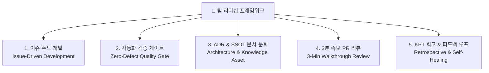

---
metadata:
  version: "1.0.0"
  ssot_owner: "docs/team-operating-model-guide.md"
  last_updated: "2026-07-28"
  status: "APPROVED (SSOT Primary)"
---

# 👑 modern SW 엔지니어링 팀 리더십 & 프로젝트 운용 프레임워크

이 문서는 `shinhan-gaecheokja` 프로젝트의 **팀 리더(Team Leader)가 팀원들과 협업하여 무결점 프로젝트를 완수하기 위한 5대 팀 운용 체계 및 개발 문화 프레임워크** 가이드북입니다.

> [!NOTE]
> 본 가이드북은 [docs/ssot-documentation-policy.md](./ssot-documentation-policy.md)의 **전문 기술 문서화 표준 작성 규격**을 준수합니다.

---

## 🏛️ 1. 팀 리더십 5대 운용 기둥 (5 Pillars of Team Leadership)



---

## 🎯 Pillar 1: 이슈 주도 개발 (Issue-Driven Development)

### 룰 1: 1 Issue = 1 Branch = 1 PR
- 모든 작업은 반드시 **GitHub Issue 생성(#이슈번호)**으로 시작합니다.
- 브랜치명은 `feat/#이슈번호-기능명` (예: `feat/#70-jwt-auth`) 규격을 준수합니다.

### 룰 2: Small, Frequent PRs (작고 빈번한 PR)
- 1,000줄 이상의 대형 PR은 리뷰어의 검토 피로도를 극대화하고 버그를 유발합니다.
- **PR 변경 범위는 300줄 이하로 작게 분할**하여 자주 머지(Continuous Integration)합니다.

---

## 🛡️ Pillar 2: 자동화 검증 게이트 (Zero-Defect Quality Gate)

### 룰 1: 리더가 포맷팅/스타일을 잔소리하지 않는 문화
- 코드 스타일(Google Java Format), 미사용 import, 수동 Getter 금지 등은 **리더가 검사하지 않고 로컬 하네스(`./scripts/verify.sh`)와 GitHub Actions CI가 100% 자동 차단**합니다.
- 리더는 오직 **비즈니스 요구사항(WHY/WHAT)과 아키텍처 방향성**에만 집중합니다.

---

## 📜 Pillar 3: ADR & SSOT 문서 문화 (Knowledge Assetization)

### 룰 1: 말이나 카톡으로 기술 의사결정을 내리지 않는다
- 새로운 라이브러리 도입, DB 스키마 변경, 아키텍처 변경 시 **[docs/adr/](./adr/README.md)에 ADR 1페이지를 먼저 작성** 후 PR을 오픈합니다.
- 신입 팀원이 와도 문서만 보고 시스템 전반을 이해할 수 있는 단일 원본(SSOT)을 유지합니다.

---

## 🤝 Pillar 4: 3분 족보 PR 리뷰 (3-Minute Walkthrough Review)

### 룰 1: 리뷰어의 시간을 아끼는 PR 본문 부착
- PR 오픈자는 반드시 **1분 퀵 서머리 + 추천 읽기 순서(Mermaid) + 체크리스트**를 작성합니다.

### 룰 2: 핀포인트 인라인 댓글 연동
- 리뷰어(리더)는 `Files changed` 탭에서 핵심 라인에 **핀포인트 인라인 댓글**을 달아 3분 내 리뷰를 마감합니다.

---

## 🚀 Pillar 5: 데일리 10분 스탠드업 & KPT 회고

### 룰 1: Daily 10-Min Stand-up (매일 아침 10분)
매일 아침 다음 3가지만 빠르게 공유합니다:
1. **어제 완료한 작업**
2. **오늘 진행할 작업**
3. **블로커 (Blocker):** 기술적 장애나 막히는 부분 (리더가 즉시 해소 조치)

### 룰 2: Sprint KPT Retrospective (스프린트 마감 회고)
스프린트 종료 시 30분간 KPT 회고를 집행합니다:
- **Keep:** 잘해서 계속 유지할 점
- **Problem:** 아쉬웠거나 발생했던 문제점
- **Try:** 다음 스프린트에 시도해볼 개선 조치

---

## 🧪 실증 검증 명령어 (Verification Commands)

팀 운용 상태와 하네스 무결성을 점검하기 위해 다음 명령어를 구동합니다:

```bash
# 로컬 전체 검증 하네스 구동
./scripts/verify.sh
```
