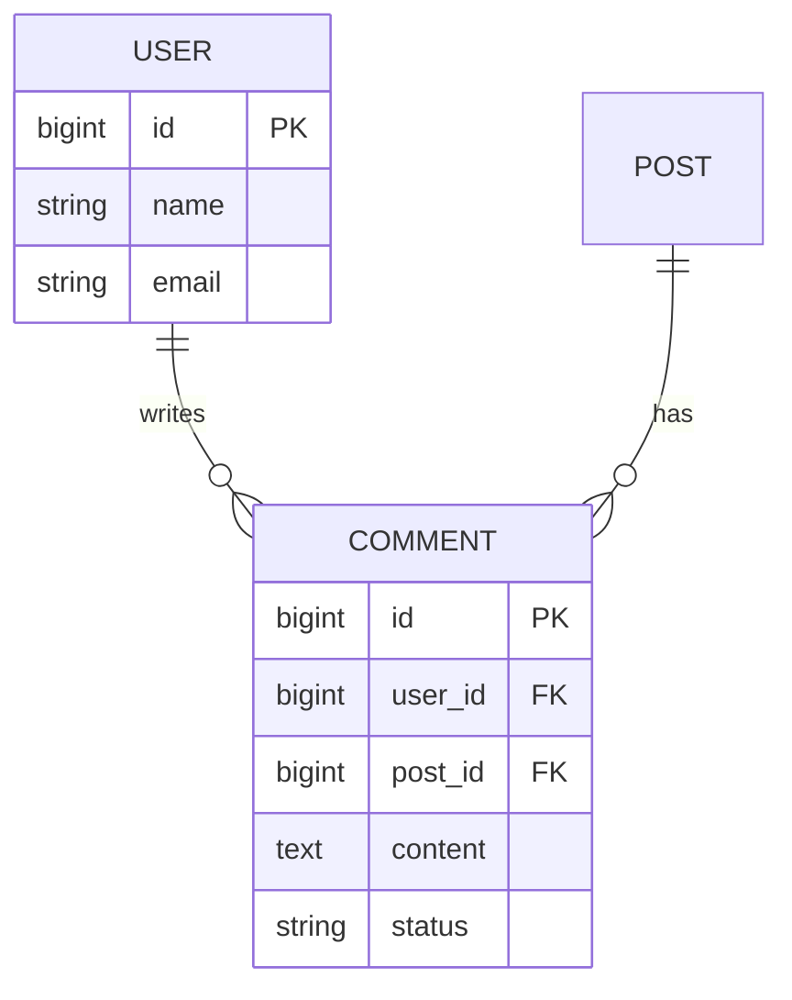

# ERD (Entity Relationship Diagram) 템플릿

## 문서 정보
| 항목 | 내용 |
|---|---|
| 기능/도메인명 | |
| 작성자 | |
| 작성일 | |
| 상태 | 초안 / 검토중 / 확정 |
| 관련 PRD 링크 | |

---

## 1. 개요 (Overview)
- 이 데이터 모델이 다루는 범위/도메인 설명
- 기존 테이블과의 관계 (신규 생성인지, 기존 테이블 수정인지)

## 2. 엔티티 목록 (Entities)
| 엔티티명 | 설명 | 신규/기존 |
|---|---|---|
| User | 사용자 | 기존 |
| Comment | 댓글 | 신규 |

## 3. 엔티티별 속성 정의 (Attributes)

### 3.1 `Comment`
| 컬럼명 | 타입 | PK/FK | Null 허용 | 기본값 | 설명 |
|---|---|---|---|---|---|
| id | BIGINT | PK | N | auto_increment | 댓글 고유 ID |
| user_id | BIGINT | FK → User.id | N | | 작성자 |
| post_id | BIGINT | FK → Post.id | N | | 대상 게시물 |
| content | TEXT | | N | | 댓글 내용 |
| status | VARCHAR(20) | | N | 'active' | active / deleted / reported |
| created_at | DATETIME | | N | now() | 생성일시 |
| updated_at | DATETIME | | Y | | 수정일시 |

> 엔티티가 여러 개면 이 표를 엔티티별로 반복

## 4. 관계 정의 (Relationships)
| 엔티티 A | 관계 | 엔티티 B | 설명 |
|---|---|---|---|
| User | 1 : N | Comment | 한 유저는 여러 댓글 작성 가능 |
| Post | 1 : N | Comment | 한 게시물에 여러 댓글 |

- 관계 유형 표기: `1:1`, `1:N`, `N:M`
- N:M 관계는 중간 테이블(조인 테이블) 필요 여부 명시

## 5. ERD 다이어그램
- Mermaid, dbdiagram.io, draw.io 등으로 작성한 다이어그램 링크 또는 이미지 삽입

## 6. 인덱스 (Indexes)
| 테이블 | 인덱스명 | 컬럼 | 유형 | 목적 |
|---|---|---|---|---|
| Comment | idx_post_id | post_id | INDEX | 게시물별 댓글 조회 최적화 |

## 7. 제약조건 (Constraints)
- Unique 제약: 
- 삭제 정책 (Cascade / Restrict / Soft delete 등):
- 기타 비즈니스 규칙 (예: 댓글은 물리 삭제 대신 status='deleted' 처리)

## 8. 오픈 이슈 (Open Questions)
- [ ] 
- [ ] 
