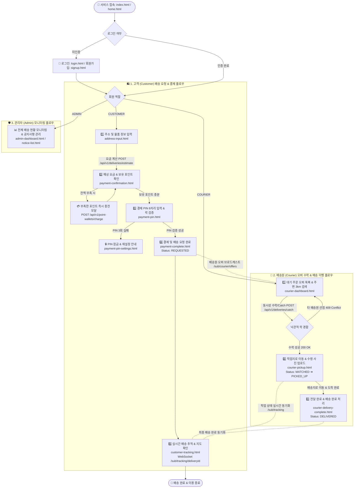
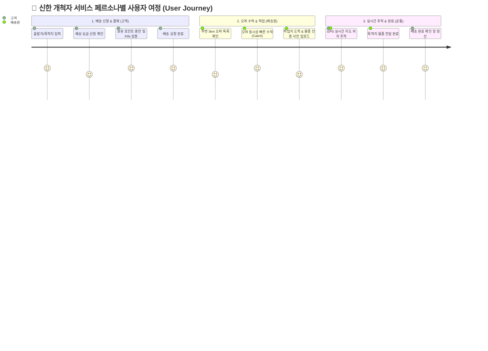
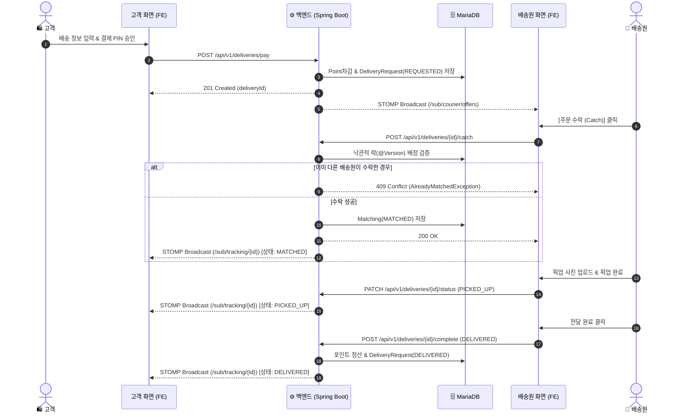

# 🗺️ 신한 개척자 전체 E2E 유저 플로우 가이드 (End-to-End User Flow Standard)

> [!NOTE]
> 본 문서는 **신한 개척자(Shinhan Delivery)** 배송 플랫폼의 전체 유저 플로우(End-to-End User Flow), 화면(`*.html`) 간 이동 구조, REST/WebSocket API 매핑 및 예외/이탈 방지 처리 로직을 일원화하여 정의하는 **단일 원본(SSOT) 지식 자산 문서**입니다.

---

## 📌 1. 개요 및 목적 (Executive Summary)

신한 개척자 배송 플랫폼은 **고객(Customer)**의 배송 요청부터 **배송원(Courier)**의 실시간 콜 수락 및 이행, **관리자(Admin)**의 전체 현황 관제까지 3대 역할이 유기적으로 연동되는 멀티 페르소나 시스템입니다.

### 🎯 핵심 설계 목표
1. **단절 없는 배송 요청 & 결제 UX:** 포인트 잔액 계산 ➔ 부족 시 즉시 충전 ➔ 결제 PIN 입력 ➔ 자동 결제 및 배송 요청 등록.
2. **동시성 보장 오퍼 수락(Catch):** 주변 3km 이내 배송원 대상 비관적/낙관적 락 기반 단 1명 배정 보장.
3. **실시간 트래킹 & 양방향 동기화:** WebSocket(STOMP)을 통한 GPS 위치 및 배송 상태(`REQUESTED` ➔ `MATCHED` ➔ `PICKED_UP` ➔ `DELIVERED`) 실시간 브로드캐스트.

---

## 🗺️ 2. E2E 전체 유저 플로우 다이어그램 (End-to-End Flowchart)



---

## 👤 3. 페르소나별 상세 유저 플로우 & 화면-API 매핑

### 3.1 🛍️ 고객 (Customer) 화면 이동 & API 매핑

| 단계 | 화면 파일명 | 비즈니스 목적 | 호출 API / 이벤트 |
| :--- | :--- | :--- | :--- |
| **1단계** | `address-input.html` | 출발지/목적지 주소 검색, 무게/크기 정보 입력 | `POST /api/v1/deliveries/estimate` |
| **2단계** | `payment-confirmation.html` | 예상 결제 금액 확인 및 보유 포인트 비교 | `GET /api/v1/point-wallets/{walletId}` |
| **2.1단계**| (모달 팝업) | 포인트 부족 시 필요한 금액 즉시 충전 | `POST /api/v1/point-wallets/{walletId}/charge` |
| **3단계** | `payment-pin.html` | 결제 PIN 6자리 입력 및 오류 횟수(최대 3회) 검증 | `POST /api/v1/members/{memberId}/payment-pin/verify` |
| **3.1단계**| `payment-pin-settings.html` | 3회 이상 오입력 시 잠금 및 PIN 재설정 | `POST /api/v1/members/{memberId}/payment-pin/reset` |
| **4단계** | `payment-complete.html` | 결제 승인 완료 및 배송 요청(`REQUESTED`) 생성 | `POST /api/v1/deliveries/pay` |
| **5단계** | `customer-tracking.html` | 배송원 GPS 위치 및 배송 상태 실시간지도 추적 | `WS /sub/tracking/{deliveryId}` |

---

### 3.2 🚴 배송원 (Courier) 화면 이동 & API 매핑

| 단계 | 화면 파일명 | 비즈니스 목적 | 호출 API / 이벤트 |
| :--- | :--- | :--- | :--- |
| **1단계** | `courier-dashboard.html` | 주변 3km 대기 주문(REQUESTED) 오퍼 수락 | `GET /api/v1/deliveries/available`<br/>`POST /api/v1/deliveries/{id}/catch` |
| **2단계** | `courier-pickup.html` | 픽업지 이동 완료 및 수령 인증 사진 업로드 | `POST /api/v1/deliveries/{id}/proof-photo`<br/>`PATCH /api/v1/deliveries/{id}/status` |
| **3단계** | `courier-delivery-complete.html` | 고객 전달 완료 및 최종 정산 처리 | `POST /api/v1/deliveries/{id}/complete` |

---

## 🎨 4. 사용자 여정 다이어그램 (User Journey)



---

## 🔄 5. 실시간 메시징 & 배송 상태 전이 시퀀스 (Sequence Diagram)



---

## 🛡️ 6. 예외 및 이탈 방지 처리 가이드 (Safety & Edge-Case Rules)

> [!IMPORTANT]
> **시스템 이탈 방지를 위한 3대 다층 방어 안전장치:**
> 1. **결제 전 포인트 부족 방어:** `payment-confirmation.html`에서 포인트 잔액이 부족하면 결제 버튼을 막지 않고 즉시 부족한 금액을 충전할 수 있는 모달을 띄워 결제 흐름을 유지합니다. (#247)
> 2. **결제 PIN 보안 락:** `payment-pin.html`에서 비밀번호 3회 오입력 시 계정을 즉시 잠그고 `payment-pin-settings.html`로 자동 이동시켜 보안 사고를 예방합니다.
> 3. **오퍼 수락 동시성 락:** 동일 오퍼에 대해 여러 배송원이 동시에 수락을 누를 경우, JPA `@Version` 낙관적 락을 통해 단 1명만 수락되고 나머지는 `409 Conflict`로 재검색되도록 안전하게 직렬화합니다.

---

## 🧪 7. 실증 하네스 검증 방법 (Verification)

본 전체 유저 플로우 관련 백엔드 API, 보안 락, 동시성 락 및 UI 컴포넌트는 아래 통합 하네스 명령어를 통해 100% 그린 패스로 검증됩니다:

```bash
# 로컬 CI 통합 하네스 전체 검증 (Flyway + Spotless + ArchUnit + JaCoCo 60%+ & 전체 252개 테스트)
./scripts/verify.sh
```
