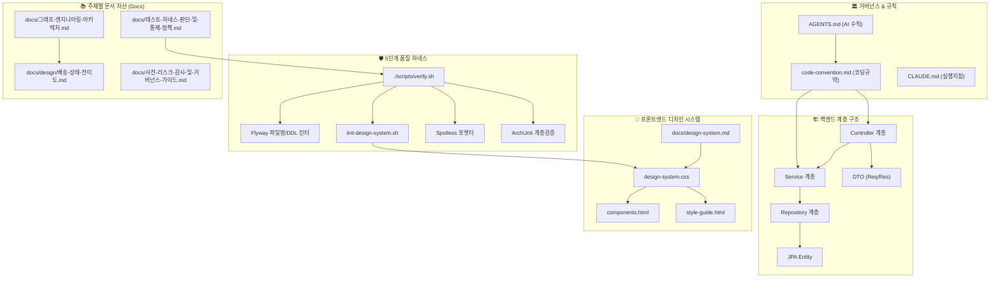

# 🗺️ Shinhan Delivery 전체 프로젝트 지식 그래프 인덱스 (Project Knowledge Graph)

> **프로젝트의 모든 문서(Docs), 아키텍처 계층, 하네스 검증기 및 DB 스키마 간의 종속성과 연관 관계를 시각화한 지식 네트워크 지도**

---

## 📑 목차
- [1. 전체 지식 그래프 시각화 (Overview Graph)](#1-전체-지식-그래프-시각화-overview-graph)
- [2. 영역별 노드 & 문서 연결 가이드](#2-영역별-노드--문서-연결-가이드)
- [3. 개발자 & AI 에이전트를 위한 컨텍스트 탐색법](#3-개발자--ai-에이전트를-위한-컨텍스트-탐색법)

---

## 1. 전체 지식 그래프 시각화 (Overview Graph)

---

## 2. 영역별 노드 & 문서 연결 가이드

### 1) 백엔드 아키텍처 노드 ➔ 연관 문서
- `Controller` / `Service` / `Repository` / `Entity`:
  - 📖 [**코딩 컨벤션 가이드 (code-convention.md)**](../code-convention.md)
  - 📜 [**ADR-0001: JWT 기반 무상태 인증 체계 (docs/adr/0001-무상태-JWT-인증-체계.md)**](./adr/0001-무상태-JWT-인증-체계.md)

### 2) 품질 및 검증 하네스 노드 ➔ 연관 문서
- `./scripts/verify.sh` 및 5대 린터:
  - 🛡️ [**테스트 하네스 구축 및 6대 통제 정책 가이드 (docs/테스트-하네스-판단-및-통제-정책.md)**](./테스트-하네스-판단-및-통제-정책.md)
  - 🤖 [**LLM 소프트웨어 엔지니어링 방법론 가이드 (docs/LLM-소프트웨어-엔지니어링-가이드.md)**](./LLM-소프트웨어-엔지니어링-가이드.md)

### 3) 디자인 시스템 & UI 노드 ➔ 연관 문서
- `/css/design-system.css`, `style-guide.html`:
  - 🎨 [**공통 디자인 시스템 가이드 (docs/design-system.md)**](./design-system.md)

### 4) 그래프 엔지니어링 & 도메인 상태 노드 ➔ 연관 문서
- 배송 상태 전이 및 에이전트 오케스트레이션:
  - 🕸️ [**그래프 엔지니어링 아키텍처 가이드 (docs/graph-engineering-architecture.md)**](./graph-engineering-architecture.md)
  - 📋 [**배송 도메인 상태 전이 그래프 명세서 (docs/design/delivery-state-graph.md)**](./design/delivery-state-graph.md)

---

## 3. 개발자 & AI 에이전트를 위한 컨텍스트 탐색법

신무 기능 개발 시 위 지식 그래프 노드를 따라 아래 순서로 탐색하시면 단 1개의 부작용(Side-effect) 없이 안전하게 구현을 완료할 수 있습니다:

1. **설계 단계:** `docs/design/` 및 `docs/graph-engineering-architecture.md` 참조
2. **코드 구현:** `code-convention.md` 단방향 의존성(`Controller -> Service -> Repository`) 사수
3. **UI 개발:** `design-system.css` 토큰 및 `components.html` Thymeleaf 프래그먼트 활용
4. **검증 단계:** `./scripts/verify.sh` 5단계 하네스 검증 실행 후 0 exit code 달성
