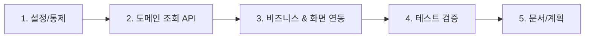

## 관련 이슈
* Closes #309

---

## 작업 개요
포인트 지갑의 최근 내역이 `sessionStorage` 기반 1회성 스냅샷에 의존하던 문제를 수정했습니다. 이제 지갑 화면은 서버에 저장된 실제 `PointHistory`를 조회하는 API를 통해 재진입 후에도 동일한 최근 내역을 안정적으로 표시합니다.

---

## [Reviewer 3-Minute Walkthrough] PR 리뷰어 3분 족보 가이드

### 1. 핵심 1분 서머리 (Executive Summary)
* **이 PR이 해결하는 문제 (WHY):** `point-wallet.html`의 최근 내역은 실제 포인트 이력 조회가 아니라 충전 직후 한 번만 남는 `sessionStorage.pointChargeSnapshot`을 읽고 바로 삭제하는 구조였습니다. 그 결과 화면을 벗어났다가 다시 들어오면 최근 충전 내역이 사라졌습니다.
* **변경 영향 범위 (Impact Scope):** `payment` 도메인의 조회 API, 포인트 지갑/충전 화면 템플릿, 관련 서비스/컨트롤러 테스트와 템플릿 회귀 테스트에만 영향을 줍니다. 기존 충전/사용/환불 API 계약은 유지했습니다.
* **검증 상태:** `./scripts/verify.sh` 필수 패스 완료 (Spotless, ArchUnit, 전체 테스트, 커버리지 게이트 통과)

---

### 2. 추천 파일 읽기 순서 (Recommended Reading Order)
리뷰 시간을 줄이기 위해 아래 **1 → 2 → 3 → 4 → 5 단계 순서**로 변경 파일을 확인하는 것을 권장합니다.

---

### 3. 파일별 1줄 핵심 체크포인트 (Key Highlights)

#### 1단계: 설정 & 통제 (Config)
* 별도 설정 변경은 없습니다. 기존 보안 컨텍스트와 예외 처리 흐름을 그대로 재사용합니다.

#### 2단계: 도메인 조회 API (Core)
* `PointHistoryRepository.java`: 회원 기준 최근 20건 이력을 최신순으로 조회하는 메서드를 추가했습니다.
* `PointHistoryItemResponse.java`: Entity 직접 반환을 피하기 위한 최근 이력 전용 응답 DTO를 추가했습니다.

#### 3단계: 비즈니스 & API (Service & Controller)
* `PaymentService.java`: 인증 회원의 지갑 존재를 확인한 뒤 최근 포인트 이력을 DTO로 변환해 반환하는 읽기 전용 유스케이스를 추가했습니다.
* `PointController.java`: `GET /api/v1/points/histories` 인증 사용자 기준 최근 이력 조회 API를 추가했습니다.
* `point-wallet.html`: `sessionStorage` 의존을 제거하고 `/api/v1/points/histories` 결과를 실제 최근 내역으로 렌더링하도록 변경했습니다.
* `point-charge.html`: 충전 후 임시 스냅샷 저장 코드를 제거하고 지갑 화면으로 바로 이동하도록 정리했습니다.

#### 4단계: 동작 증명 테스트 (Tests)
* `PointControllerTest.java`: 최근 이력 조회 API의 200 응답과 JSON 필드를 검증합니다.
* `PaymentServiceTest.java`: 최근 이력 DTO 매핑과 지갑 미존재 예외를 검증합니다.
* `PointWalletHistoryTemplateTest.java`: 템플릿이 더 이상 `pointChargeSnapshot`에 의존하지 않는지 회귀 검증합니다.

#### 5단계: 문서/계획 (Docs)
* `docs/harness/implementation_plan.md`: 이슈 #309 기준 구현 계획과 검증 전략으로 갱신했습니다.

---

### 4. 리뷰어용 1초 체크리스트 (Reviewer Verification Checklist)
- [ ] 최근 내역 조회가 `PointController -> PaymentService -> PointHistoryRepository` 단방향 의존으로만 구현되었는가?
- [ ] Controller가 `PointHistory` Entity를 직접 반환하지 않고 DTO로 변환하는가?
- [ ] 충전 후 최근 내역이 더 이상 `sessionStorage.pointChargeSnapshot`에 의존하지 않는가?
- [ ] 지갑 미존재 시 기존 `GlobalExceptionHandler` 체계에서 처리 가능한 예외 흐름을 유지하는가?
- [ ] 기존 포인트 충전 API(`POST /api/v1/points/charge`)의 요청/응답 계약이 깨지지 않았는가?
- [ ] `./scripts/verify.sh` 기준 회귀가 없는가?

---

### 5. Files changed 핀포인트 인라인 댓글 3개
* `PointController.java`
  이 라인은 인증 컨텍스트에서 회원 ID를 해석한 뒤 최근 이력 조회를 서비스에 위임합니다. Controller가 Repository나 Entity를 직접 다루지 않도록 계층 경계를 유지하는 핵심 포인트입니다.
* `PaymentService.java`
  최근 이력 조회 전에 `memberService.getById(memberId)`와 `findWalletByMemberOrThrow(memberId)`를 모두 거치도록 두어, 존재하지 않는 지갑을 빈 배열로 숨기지 않고 명시적 예외 흐름으로 처리합니다.
* `point-wallet.html`
  이 구간은 `MyPageApi.request("/api/v1/points/histories")` 결과만으로 최근 내역을 렌더링합니다. 이전의 `sessionStorage.removeItem("pointChargeSnapshot")` 기반 1회성 표시를 제거한 실질적인 버그 수정 지점입니다.
