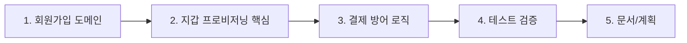

## 관련 이슈
* Closes #311

---

## 작업 개요
신규 회원이 포인트 지갑 화면을 한 번도 방문하지 않은 상태로 배송 신청 흐름에서 첫 충전을 시도하면 `POINT_WALLET_NOT_FOUND`로 실패하던 문제를 수정했습니다. 회원가입 시점에 서버가 `PointWallet` 생성을 보장하고, 충전/사용 유스케이스에서도 지갑이 없으면 복구 생성하도록 보강했습니다.

---

## [Reviewer 3-Minute Walkthrough] PR 리뷰어 3분 족보 가이드

### 1. 핵심 1분 서머리 (Executive Summary)
* **이 PR이 해결하는 문제 (WHY):** `PointWallet` 생성이 `/point-wallet` 또는 `/point-charge` 진입 시 클라이언트 로직에만 의존하고 있어, 신규 회원이 배송 신청 중 첫 충전을 시도하면 서버에서 지갑을 찾지 못해 404로 실패했습니다.
* **변경 영향 범위 (Impact Scope):** 회원가입 서비스, 포인트 지갑 프로비저닝 로직, 포인트 충전/사용 서비스의 방어 흐름, 그리고 회원가입/첫 충전 회귀 테스트에 영향을 줍니다. 기존 결제 API 계약은 유지했습니다.
* **검증 상태:** `./scripts/verify.sh` 필수 패스 완료 (Spotless, ArchUnit, 전체 테스트, 커버리지 게이트 통과)

---

### 2. 추천 파일 읽기 순서 (Recommended Reading Order)
리뷰 시간을 줄이기 위해 아래 **1 → 2 → 3 → 4 → 5 단계 순서**로 변경 파일을 확인하는 것을 권장합니다.

---

### 3. 파일별 1줄 핵심 체크포인트 (Key Highlights)

#### 1단계: 회원가입 도메인
* `MemberService.java`: 회원 생성 직후 `PointWallet`을 서버에서 즉시 보장하도록 연결했습니다.

#### 2단계: 지갑 프로비저닝 핵심 (Core)
* `PointWalletProvisioningService.java`: 회원 기준 지갑 존재를 멱등하게 보장하는 전용 서비스입니다.

#### 3단계: 비즈니스 & 결제 방어 (Service)
* `PaymentService.java`: 회원 기준 `chargePoint`/`usePoint`가 지갑 부재 시 먼저 `ensureWallet`을 호출해 첫 충전 실패를 막습니다.

#### 4단계: 동작 증명 테스트 (Tests)
* `MemberServiceTest.java`: 회원가입 시 지갑 생성 호출이 수행되는지 검증합니다.
* `MemberSecurityTest.java`: 보안 관련 회원가입 테스트도 새 의존성을 반영해 회귀를 방지합니다.
* `MemberServiceTransactionTest.java`: 배송원 회원가입 중 차량 저장이 실패하면 회원/지갑 모두 롤백되는지 검증합니다.
* `PaymentServiceTest.java`: 지갑 없는 회원의 첫 충전이 자동 생성 후 성공하는지 검증합니다.

#### 5단계: 문서/계획 (Docs)
* `docs/harness/implementation_plan.md`: 이슈 #311 기준 구현 계획과 검증 전략으로 갱신했습니다.

---

### 4. 리뷰어용 1초 체크리스트 (Reviewer Verification Checklist)
- [ ] 회원가입 완료 시 `MemberService -> PointWalletProvisioningService` 경로로 지갑이 생성되는가?
- [ ] `PaymentService`가 신규 회원 첫 충전 경로에서 지갑 부재를 복구할 수 있는가?
- [ ] `PointWallet` 생성 책임이 Controller나 프론트가 아니라 Service 계층에 머무르는가?
- [ ] 중복 생성 시 `PointWalletProvisioningService`가 멱등하게 기존 지갑을 반환하도록 되어 있는가?
- [ ] 기존 포인트 충전/사용 API 계약이 깨지지 않았는가?
- [ ] `./scripts/verify.sh` 기준 회귀가 없는가?

---

### 5. Files changed 핀포인트 인라인 댓글 3개
* `MemberService.java`
  회원가입 직후 `ensureWallet(created.getId())`를 호출하는 이 지점이 “회원은 지갑을 가진다”는 도메인 불변식을 서버에서 보장하는 핵심입니다.
* `PointWalletProvisioningService.java`
  `DataIntegrityViolationException`을 잡고 다시 조회하는 부분은 동시 생성 경쟁이 발생해도 회원당 지갑 1개 제약을 깨지 않도록 하는 멱등 처리 포인트입니다.
* `PaymentService.java`
  `chargePoint(memberId, ...)`에서 기존 이력 중복 확인 뒤 `ensureWallet(memberId)`를 호출해, 신규 회원 첫 충전과 재시도 시나리오를 동시에 안전하게 처리합니다.
